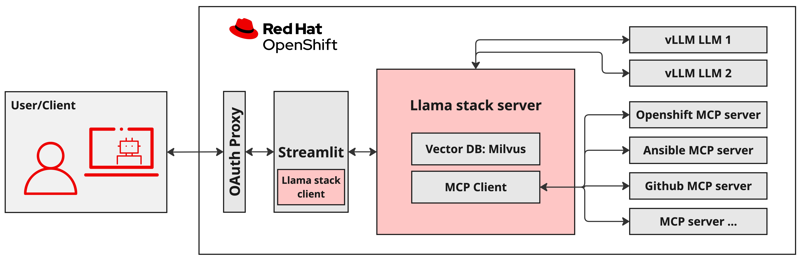

# Llama Stack Demos

This repo contains a collection of examples and demos for both cluster admins and AI developers to help them start building [Llama Stack](https://github.com/meta-llama/llama-stack) based apps on OpenShift or Kubernetes.

**For Cluster Admins**, please take a look at the [kubernetes/](./kubernetes/) directory of this repo. It contains useful documentation along with all the manifests required to deploy each of the components of a Llama Stack based app onto OpenShift or Kubernetes. That includes Llama Stack itself, as well as [vLLM](https://docs.vllm.ai/en/stable/index.html) model servers, [MCP](https://github.com/modelcontextprotocol) tool servers, an observability toolkit, and simple frontend apps for users to interact with the AI demos.

**For AI Developers**, please take a look at the [demos/](./demos/) directory of this repo. It contains useful documentation as well as all the notebooks, Containerfiles and application code needed to learn about developing AI applications with Llama Stack and deploying them on OpenShift or Kubernetes.

Current Demos:

* [RAG/Agentic](./demos/rag_agentic/)


## Example Architecture
The below diagram is an example architecture for a secure Llama Stack based application deployed on OpenShift (OCP) using both MCP tools and a [Milvus](https://milvus.io/) vectorDB for its agentic and RAG based workflows. This is the same architecture that has been implemented in the [RAG/Agentic](./demos/rag_agentic/) demos.



## Requirements
The following scenarios requires at minimum the following:

* OpenShift Cluster 4.17+
* 8 GPUs free (A100 or H100)

## Deploy
A `kustomization.yaml` file exists to launch all required Kubernetes objects for the scenarios defined in the repository. To create run the following.

```
oc new-project llama-serve
oc apply -k kubernetes
```
## Running Demos and Notebooks

This project uses `uv` as its package manager for the python based notebooks and demo scripts. You can quickly set up your working environment by following these steps:

1) `pip install uv`
2)  `uv sync`
3) `source .venv/bin/activate`

Once you are using the virtual environment, you should be good to run any of the scripts or notebooks in `demos/`.
