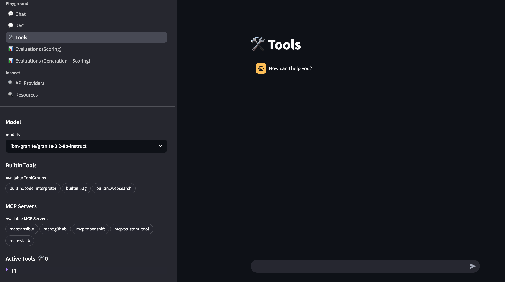

# RAG/Agentic/MCP Demo

## Try Out Llama Stack Tool Calling and RAG Agents!

Once your llama stack server is up and running you can deploy the llama stack playground to quickly test out interacting with agents that have access to tools, mcp servers and vectorDB's.

To deploy the playground locally, first build the ui image from the root directory using the provided [Makefile](../../Makefile).

```bash
make build_ui
```
Followed by setting the correct environment variables (*note: TAVILY_SEARCH_API_KEY is only needed for the web search tool and can be skipped if you do not intend to use that tool*).

```bash
export LLAMA_STACK_ENDPOINT=****
export TAVILY_SEARCH_API_KEY=****
make run_ui
```

Once the pod starts, you can open your browser and go to `http://localhost:8501`. There you will find the interactive llama stack playground shown below.


<div style="text-align: center;">

</div>

## Deep Dive into Implementing Llama Stack Tool Calling and RAG Agents!

If you would like to learn more about how to implement your own agents with Llama Stack, this demo directory offers a practical learning path for anyone interested in understanding and gaining hands-on experience with LlamaStack and AI agents. The notebooks are structured progressively, starting from foundational concepts and gradually advancing to more complex implementations, helping users build the skills needed to develop AI-powered applications!

1. **Level 1**: Understand foundational RAG concepts (Low difficulty)
2. **Level 2**: Try out simple agentic demo with single tool ussage. (Medium-low difficulty)
3. **Level 3**: Combine RAG with agentic capabilities (Medium difficulty)
4. **Level 4**: Explore advanced agentic + MCP (model context protocol) examples (Medium difficulty)


### Folder Structure
- [`notebooks/`](notebooks/): Jupyter notebooks for learning RAG and agent implementation
- [`src/`](src/): Python source files for production implementation
- [`frontend/`](frontend/): Containerfile for building the streamlit UI.

### Getting Started
### 1. [`notebooks/`](notebooks/): Start with notebooks in order
- [Level1_foundational_RAG.ipynb](notebooks/Level1_foundational_RAG.ipynb): Start here! Learn the basics of RAG.
- [Level2_simple_agentic_with_websearch.ipynb](notebooks/Level2_simple_agentic_with_websearch.ipynb): Add web search capabilities to your agent.
- [Level3_agentic_RAG.ipynb](notebooks/Level3_agentic_RAG.ipynb): Agentic RAG example, combining RAG with agentic capabilities.
- [Level4_agentic_and_mcp.ipynb](notebooks/Level4_agentic_and_mcp.ipynb): Advanced topics in agentic and MCP, showcasing  sequential tool calls and conditional logic within an agentic workflow.

#### 2. Review source code in [`src/`](src/)
Contains Python source files that implement the concepts from the notebooks. Good for future production stage.
Before running scripts, remember to set up your environment variables using [.env.example](src/.env.example) as a template

#### 3. Deploy and play with [`frontend/`](frontend/) Streamlit UI
This folder contains the containerfile to build a user interface based on the playground UI provided by llama-stack. The playground UI is a Streamlit application that provides an interactive interface for testing and experimenting with language models.
For more information, visit: https://llama-stack.readthedocs.io/en/latest/playground
