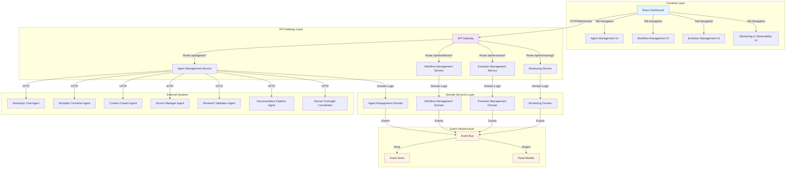
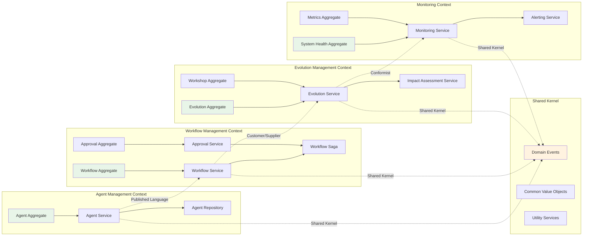
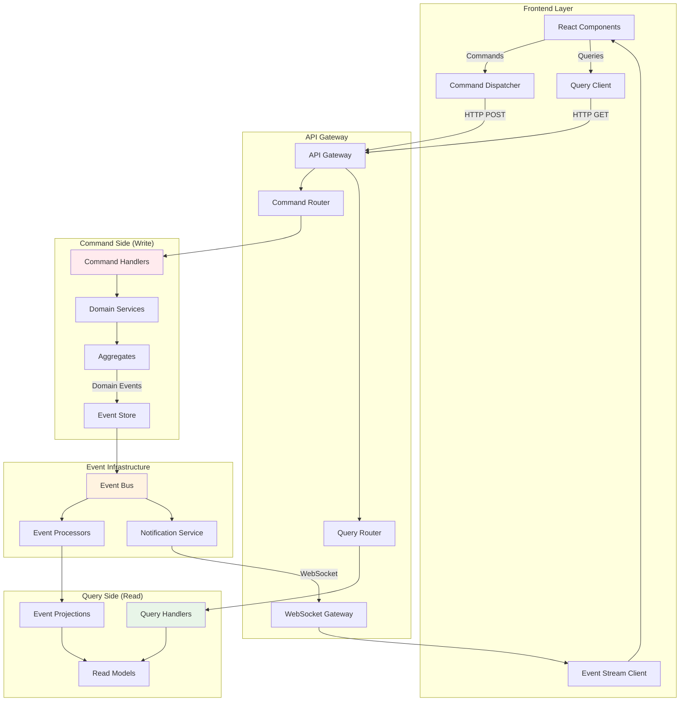
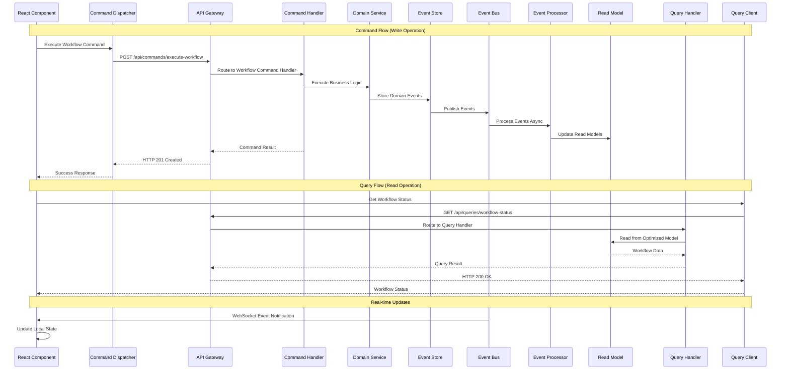
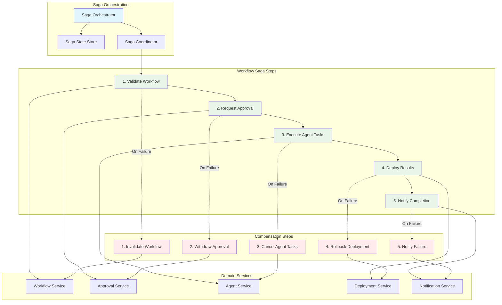
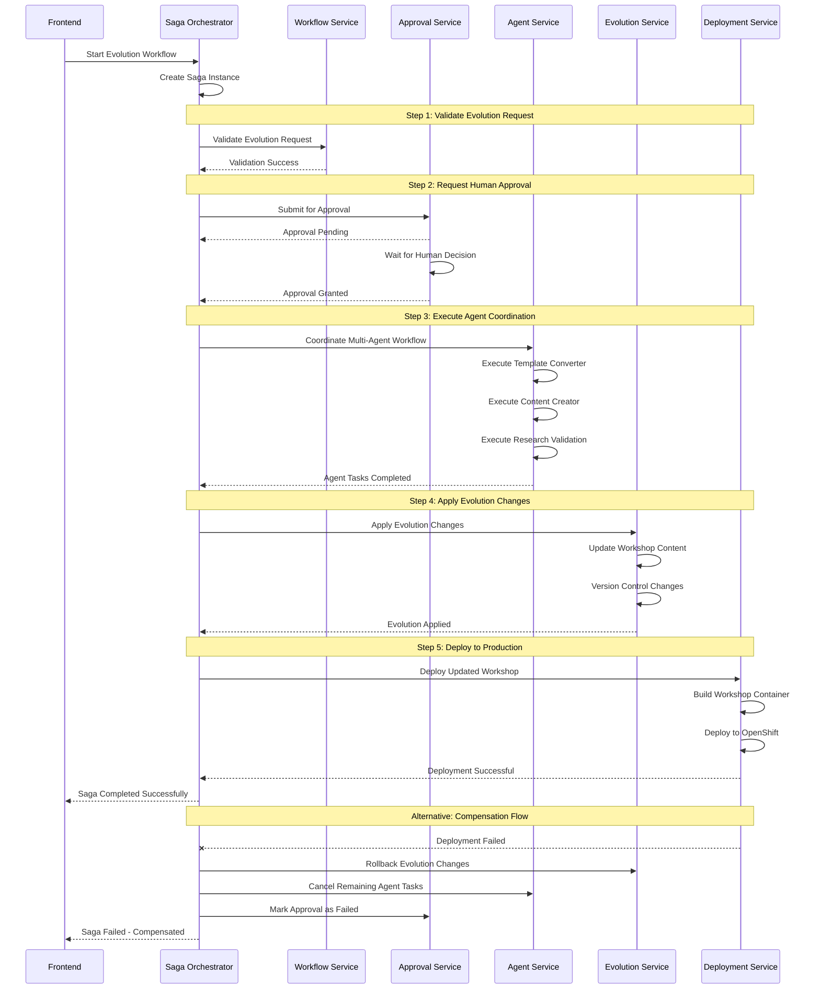
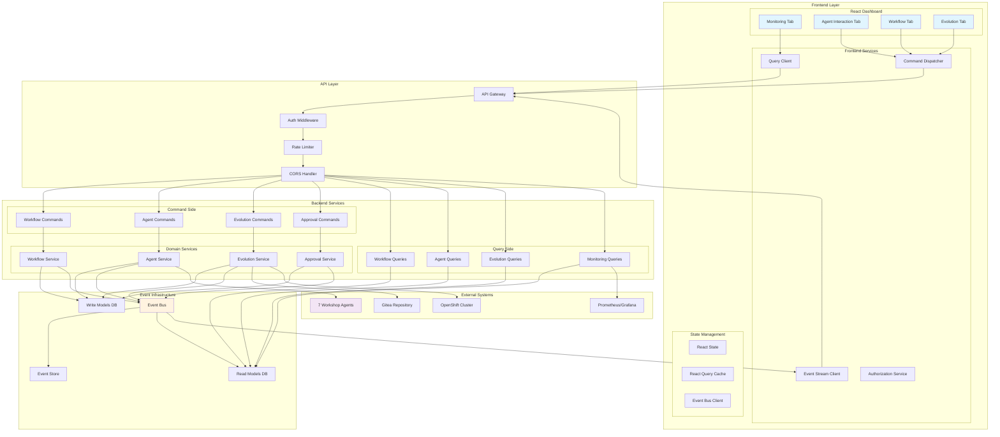
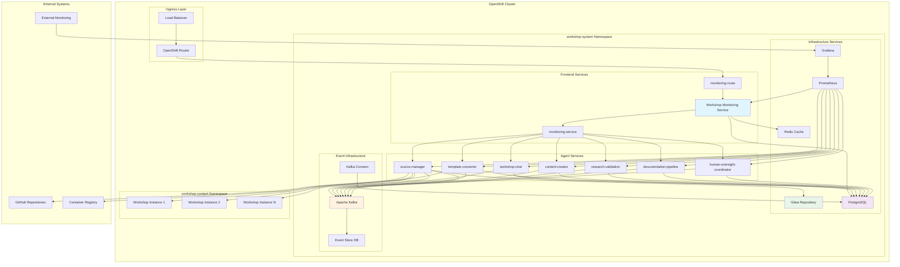
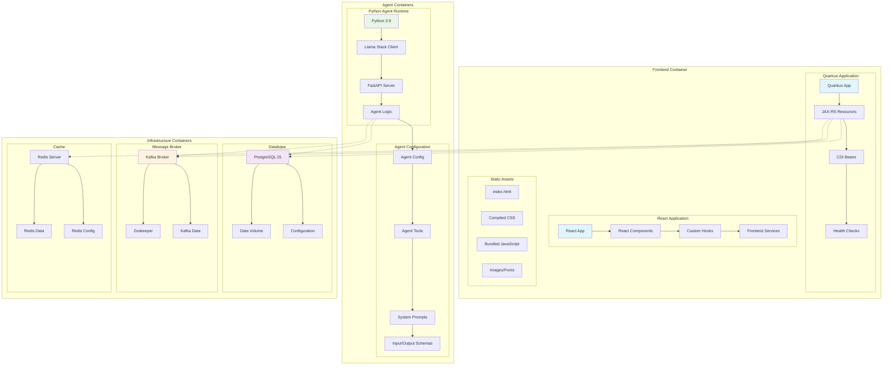

# ADR-0004: Domain-Driven Design Frontend-Backend Integration Architecture

## Status
Proposed

## Context

The Workshop Template System has evolved into a complex multi-agent system with sophisticated frontend-backend integration requirements. The current architecture includes:

### **Current System Components:**
- **7 Workshop Agents**: Each with distinct domain responsibilities
- **React Dashboard**: Multi-tab interface for monitoring and interaction
- **Quarkus Backend**: JAX-RS REST APIs for monitoring and coordination
- **Human-in-the-Loop Workflows**: Approval and oversight processes
- **Evolution Tracking**: Workshop lifecycle management
- **Agent Interaction**: Direct agent communication and workflow orchestration

### **Integration Challenges:**
- **Domain Boundaries**: Unclear separation between monitoring, agent interaction, and workflow management
- **Data Flow**: Complex data dependencies between frontend components and backend services
- **State Management**: Inconsistent state synchronization across different domain contexts
- **API Design**: Ad-hoc API endpoints without clear domain modeling
- **Error Handling**: Inconsistent error propagation across domain boundaries
- **Real-time Updates**: Multiple polling mechanisms without unified event architecture

### **Current Architecture Limitations:**
- **Tight Coupling**: Frontend components directly coupled to specific backend endpoints
- **Domain Mixing**: Business logic scattered across frontend and backend layers
- **Inconsistent Patterns**: Different integration patterns for similar domain operations
- **Scalability Issues**: Difficult to extend with new agents or workflow types
- **Testing Complexity**: Hard to test domain logic in isolation

## Decision

We will implement a **Domain-Driven Design (DDD) architecture** with clear domain boundaries, unified integration patterns, and consistent data flow across all frontend-backend interactions.

### **Core Architectural Decisions**

#### 1. Domain Modeling Strategy
- **Bounded Contexts**: Clear domain boundaries with explicit integration contracts
- **Ubiquitous Language**: Consistent terminology across frontend and backend
- **Domain Services**: Centralized business logic with clear responsibilities
- **Event-Driven Architecture**: Asynchronous communication between domains

#### 2. Frontend-Backend Integration Patterns
- **API Gateway Pattern**: Unified entry point for all domain operations
- **Command Query Responsibility Segregation (CQRS)**: Separate read and write operations
- **Event Sourcing**: Audit trail for all domain events
- **Saga Pattern**: Distributed transaction management across domains

#### 3. Data Flow Architecture
- **Domain Events**: Asynchronous communication between bounded contexts
- **Read Models**: Optimized data projections for frontend consumption
- **Command Handlers**: Centralized business logic execution
- **Event Stores**: Persistent event history for audit and replay

## Domain Architecture

### **System Overview Diagram**



### **Domain Boundaries and Context Map**



### **Bounded Context 1: Agent Management Domain**

#### **Domain Responsibilities:**
- Agent health monitoring and status tracking
- Agent capability discovery and registration
- Agent communication and coordination
- Agent lifecycle management

#### **Frontend Components:**
```typescript
// Domain Model
interface Agent {
  id: AgentId;
  name: string;
  capabilities: AgentCapability[];
  status: AgentStatus;
  endpoint: string;
  responseTime: number;
}

interface AgentCapability {
  name: string;
  description: string;
  inputSchema: JsonSchema;
  outputSchema: JsonSchema;
}

// React Components
- AgentStatusGrid: Display agent health and status
- AgentInteractionMenu: Direct agent communication interface
- AgentCapabilityExplorer: Discover and test agent capabilities
- AgentCoordinationPanel: Multi-agent workflow orchestration
```

#### **Backend Services:**
```java
// Domain Services
@ApplicationScoped
public class AgentManagementService {
    public List<Agent> getAllAgents();
    public AgentStatus checkAgentHealth(AgentId agentId);
    public AgentResponse invokeAgent(AgentId agentId, AgentCommand command);
    public WorkflowResult orchestrateWorkflow(WorkflowDefinition workflow);
}

// REST Resources
@Path("/api/agents")
public class AgentResource {
    @GET public Response getAgents();
    @GET @Path("/{id}/health") public Response getAgentHealth(@PathParam("id") String agentId);
    @POST @Path("/{id}/invoke") public Response invokeAgent(@PathParam("id") String agentId, AgentCommand command);
}

// Event Handlers
@ApplicationScoped
public class AgentEventHandler {
    @Observes AgentHealthChanged event;
    @Observes AgentCapabilityUpdated event;
    @Observes WorkflowCompleted event;
}
```

#### **Integration Contracts:**
```yaml
# Agent Management API Contract
/api/agents:
  GET:
    description: "Retrieve all registered agents"
    response: AgentList
    
/api/agents/{id}/health:
  GET:
    description: "Check specific agent health"
    response: AgentHealthStatus
    
/api/agents/{id}/invoke:
  POST:
    description: "Invoke agent capability"
    request: AgentCommand
    response: AgentResponse

# Domain Events
AgentHealthChanged:
  agentId: string
  previousStatus: AgentStatus
  currentStatus: AgentStatus
  timestamp: datetime
  
AgentCapabilityUpdated:
  agentId: string
  capabilities: AgentCapability[]
  timestamp: datetime
```

### **Bounded Context 2: Workflow Management Domain**

#### **Domain Responsibilities:**
- Workflow definition and execution
- Human-in-the-loop approval processes
- Workflow state management and tracking
- Workflow template management

#### **Frontend Components:**
```typescript
// Domain Model
interface Workflow {
  id: WorkflowId;
  name: string;
  definition: WorkflowDefinition;
  status: WorkflowStatus;
  steps: WorkflowStep[];
  approvals: ApprovalRequest[];
}

interface ApprovalRequest {
  id: ApprovalId;
  workflowId: WorkflowId;
  requester: string;
  approver: string;
  status: ApprovalStatus;
  submittedAt: datetime;
  decidedAt?: datetime;
}

// React Components
- WorkflowExecutionPanel: Execute and monitor workflows
- ApprovalQueue: Manage pending approvals
- WorkflowTemplateLibrary: Browse and select workflow templates
- WorkflowHistoryViewer: Track workflow execution history
```

#### **Backend Services:**
```java
// Domain Services
@ApplicationScoped
public class WorkflowManagementService {
    public WorkflowExecution executeWorkflow(WorkflowDefinition definition);
    public ApprovalRequest submitForApproval(WorkflowId workflowId, ApprovalRequest request);
    public void processApproval(ApprovalId approvalId, ApprovalDecision decision);
    public List<WorkflowExecution> getActiveWorkflows();
}

// Saga Orchestrator
@ApplicationScoped
public class WorkflowSaga {
    @SagaOrchestrationStart
    public void startWorkflow(WorkflowStartCommand command);
    
    @SagaOrchestrationStep
    public void executeStep(WorkflowStepCommand command);
    
    @SagaOrchestrationStep
    public void processApproval(ApprovalCommand command);
}

// REST Resources
@Path("/api/workflows")
public class WorkflowResource {
    @POST public Response executeWorkflow(WorkflowDefinition definition);
    @GET @Path("/active") public Response getActiveWorkflows();
    @POST @Path("/{id}/approve") public Response approveWorkflow(@PathParam("id") String workflowId);
}
```

### **Bounded Context 3: Evolution Management Domain**

#### **Domain Responsibilities:**
- Workshop evolution tracking and management
- Version control and rollback capabilities
- Impact assessment and change management
- Evolution metrics and analytics

#### **Frontend Components:**
```typescript
// Domain Model
interface Evolution {
  id: EvolutionId;
  workshopId: WorkshopId;
  type: EvolutionType;
  status: EvolutionStatus;
  changes: EvolutionChange[];
  impactAssessment: ImpactAssessment;
  approvals: ApprovalRequest[];
}

interface ImpactAssessment {
  riskLevel: RiskLevel;
  affectedComponents: string[];
  estimatedEffort: number;
  rollbackPlan: RollbackPlan;
}

// React Components
- EvolutionDashboard: Overview of all evolution activities
- EvolutionQueue: Manage pending evolution requests
- WorkshopVersionHistory: Track workshop version changes
- ImpactAssessmentViewer: Display evolution impact analysis
- EvolutionMetrics: Analytics and reporting
```

#### **Backend Services:**
```java
// Domain Services
@ApplicationScoped
public class EvolutionManagementService {
    public Evolution createEvolution(EvolutionRequest request);
    public ImpactAssessment assessImpact(EvolutionRequest request);
    public EvolutionResult executeEvolution(EvolutionId evolutionId);
    public void rollbackEvolution(EvolutionId evolutionId);
}

// Event Sourcing
@ApplicationScoped
public class EvolutionEventStore {
    public void appendEvent(EvolutionEvent event);
    public List<EvolutionEvent> getEvents(EvolutionId evolutionId);
    public Evolution rebuildFromEvents(EvolutionId evolutionId);
}

// REST Resources
@Path("/api/evolution")
public class EvolutionResource {
    @POST public Response createEvolution(EvolutionRequest request);
    @GET @Path("/active") public Response getActiveEvolutions();
    @POST @Path("/{id}/execute") public Response executeEvolution(@PathParam("id") String evolutionId);
}
```

### **Bounded Context 4: Monitoring and Observability Domain**

#### **Domain Responsibilities:**
- System health monitoring and alerting
- Performance metrics collection and analysis
- Audit logging and compliance tracking
- Dashboard data aggregation and presentation

#### **Frontend Components:**
```typescript
// Domain Model
interface SystemHealth {
  overallStatus: HealthStatus;
  components: ComponentHealth[];
  metrics: SystemMetrics;
  alerts: Alert[];
}

interface ComponentHealth {
  componentId: string;
  status: HealthStatus;
  responseTime: number;
  lastChecked: datetime;
  metrics: ComponentMetrics;
}

// React Components
- SystemHealthCard: Overall system status display
- ComponentHealthGrid: Individual component status
- MetricsDashboard: Performance metrics visualization
- AlertsPanel: System alerts and notifications
- AuditLogViewer: Compliance and audit trail
```

#### **Backend Services:**
```java
// Domain Services
@ApplicationScoped
public class MonitoringService {
    public SystemHealth getSystemHealth();
    public ComponentHealth checkComponentHealth(String componentId);
    public void recordMetric(MetricEvent event);
    public List<Alert> getActiveAlerts();
}

// Metrics Collector
@ApplicationScoped
public class MetricsCollector {
    @Scheduled(every = "30s")
    public void collectSystemMetrics();
    
    @Scheduled(every = "10s")
    public void collectComponentMetrics();
}

// REST Resources
@Path("/api/monitoring")
public class MonitoringResource {
    @GET @Path("/health") public Response getSystemHealth();
    @GET @Path("/metrics") public Response getMetrics();
    @GET @Path("/alerts") public Response getAlerts();
}
```

## Integration Patterns

### **CQRS and Event Sourcing Architecture**



### **Data Flow Patterns**



### **Pattern 1: Command Query Responsibility Segregation (CQRS)**

#### **Command Side (Write Operations):**
```typescript
// Frontend Command Dispatching
class CommandDispatcher {
  async dispatch<T>(command: Command): Promise<CommandResult<T>> {
    const response = await fetch(`/api/commands/${command.type}`, {
      method: 'POST',
      headers: { 'Content-Type': 'application/json' },
      body: JSON.stringify(command)
    });
    
    if (!response.ok) {
      throw new CommandError(await response.json());
    }
    
    return await response.json();
  }
}

// Usage in React Components
const executeWorkflow = async (definition: WorkflowDefinition) => {
  try {
    const result = await commandDispatcher.dispatch({
      type: 'ExecuteWorkflow',
      payload: definition
    });
    
    // Handle success
    setWorkflowResult(result);
  } catch (error) {
    // Handle error
    setError(error.message);
  }
};
```

#### **Query Side (Read Operations):**
```typescript
// Frontend Query Client
class QueryClient {
  async query<T>(queryName: string, params?: any): Promise<T> {
    const url = new URL(`/api/queries/${queryName}`, window.location.origin);
    if (params) {
      Object.entries(params).forEach(([key, value]) => {
        url.searchParams.append(key, String(value));
      });
    }
    
    const response = await fetch(url.toString());
    
    if (!response.ok) {
      throw new QueryError(await response.json());
    }
    
    return await response.json();
  }
}

// Usage with React Query
const useAgentStatus = (agentId: string) => {
  return useQuery({
    queryKey: ['agentStatus', agentId],
    queryFn: () => queryClient.query('GetAgentStatus', { agentId }),
    refetchInterval: 30000 // 30 seconds
  });
};
```

### **Pattern 2: Event-Driven Communication**

#### **Frontend Event Handling:**
```typescript
// Domain Event Bus
class DomainEventBus {
  private listeners: Map<string, EventListener[]> = new Map();
  
  subscribe<T>(eventType: string, listener: EventListener<T>): void {
    if (!this.listeners.has(eventType)) {
      this.listeners.set(eventType, []);
    }
    this.listeners.get(eventType)!.push(listener);
  }
  
  publish<T>(event: DomainEvent<T>): void {
    const listeners = this.listeners.get(event.type) || [];
    listeners.forEach(listener => listener(event));
  }
}

// WebSocket Integration
class EventStreamClient {
  private ws: WebSocket;
  private eventBus: DomainEventBus;
  
  connect(): void {
    this.ws = new WebSocket('/api/events/stream');
    
    this.ws.onmessage = (message) => {
      const event = JSON.parse(message.data);
      this.eventBus.publish(event);
    };
  }
}

// React Component Integration
const AgentStatusComponent = ({ agentId }: { agentId: string }) => {
  const [status, setStatus] = useState<AgentStatus>();
  
  useEffect(() => {
    const unsubscribe = eventBus.subscribe('AgentHealthChanged', (event) => {
      if (event.payload.agentId === agentId) {
        setStatus(event.payload.currentStatus);
      }
    });
    
    return unsubscribe;
  }, [agentId]);
  
  return <AgentStatusDisplay status={status} />;
};
```

### **Saga Pattern for Distributed Transactions**



### **Workflow Evolution Saga Example**



### **Pattern 3: Saga Pattern for Distributed Transactions**

#### **Frontend Saga Coordination:**
```typescript
// Saga State Management
interface SagaState {
  id: string;
  status: 'running' | 'completed' | 'failed' | 'compensating';
  steps: SagaStep[];
  currentStep: number;
  compensationSteps: SagaStep[];
}

class SagaManager {
  async executeSaga(sagaDefinition: SagaDefinition): Promise<SagaResult> {
    const sagaId = generateId();
    const saga = await this.startSaga(sagaId, sagaDefinition);
    
    try {
      for (const step of sagaDefinition.steps) {
        await this.executeStep(sagaId, step);
      }
      
      return await this.completeSaga(sagaId);
    } catch (error) {
      await this.compensateSaga(sagaId);
      throw error;
    }
  }
}

// Usage in Workflow Execution
const executeComplexWorkflow = async (workflow: WorkflowDefinition) => {
  const sagaDefinition: SagaDefinition = {
    steps: [
      { type: 'ValidateWorkflow', data: workflow },
      { type: 'RequestApproval', data: { workflowId: workflow.id } },
      { type: 'ExecuteAgentTasks', data: workflow.tasks },
      { type: 'DeployResults', data: { workflowId: workflow.id } }
    ],
    compensationSteps: [
      { type: 'RollbackDeployment' },
      { type: 'CancelAgentTasks' },
      { type: 'WithdrawApproval' },
      { type: 'InvalidateWorkflow' }
    ]
  };
  
  return await sagaManager.executeSaga(sagaDefinition);
};
```

## Data Flow Architecture

### **Complete System Data Flow**



### **Frontend Component Architecture**

```mermaid
graph TB
    subgraph "Dashboard Container"
        DC[Dashboard Component]
        TN[Tab Navigation]
        EB[Error Boundary]
    end

    subgraph "Monitoring Domain UI"
        SHC[System Health Card]
        ASG[Agent Status Grid]
        RTC[Response Time Chart]
        SIP[Service Info Panel]
    end

    subgraph "Agent Interaction UI"
        AIM[Agent Interaction Menu]
        ACE[Agent Capability Explorer]
        WTE[Workflow Template Engine]
        ACP[Agent Coordination Panel]
    end

    subgraph "Workflow Management UI"
        WEP[Workflow Execution Panel]
        AQ[Approval Queue]
        WTL[Workflow Template Library]
        WHV[Workflow History Viewer]
    end

    subgraph "Evolution Management UI"
        ED[Evolution Dashboard]
        EQ[Evolution Queue]
        WVH[Workshop Version History]
        EM[Evolution Metrics]
        IAV[Impact Assessment Viewer]
    end

    subgraph "Human Oversight UI"
        HOP[Human Oversight Panel]
        QAD[Quality Assurance Dashboard]
        CM[Compliance Monitor]
        ACC[Agent Coordination Controls]
    end

    subgraph "Shared Hooks"
        UM[useMonitoring]
        UA[useAuthorization]
        UE[useEvolution]
        UW[useWorkflow]
        UES[useEventStream]
    end

    subgraph "Shared Services"
        API[API Client]
        WS[WebSocket Client]
        AUTH[Auth Service]
        ERR[Error Handler]
        CACHE[Cache Manager]
    end

    %% Container Structure
    DC --> TN
    DC --> EB

    %% Tab Content
    TN --> SHC
    TN --> AIM
    TN --> WEP
    TN --> ED
    TN --> HOP

    %% Domain Components
    SHC --> ASG
    SHC --> RTC
    SHC --> SIP

    AIM --> ACE
    AIM --> WTE
    AIM --> ACP

    WEP --> AQ
    WEP --> WTL
    WEP --> WHV

    ED --> EQ
    ED --> WVH
    ED --> EM
    ED --> IAV

    HOP --> QAD
    HOP --> CM
    HOP --> ACC

    %% Hook Dependencies
    SHC --> UM
    AIM --> UA
    WEP --> UW
    ED --> UE
    HOP --> UES

    %% Service Dependencies
    UM --> API
    UA --> AUTH
    UW --> API
    UE --> API
    UES --> WS

    API --> ERR
    API --> CACHE
    WS --> ERR

    style DC fill:#e1f5fe
    style UM fill:#e8f5e8
    style API fill:#fff3e0
```



### **Read Path (Query Flow):**
```
Frontend Component
    ↓ (React Query)
Query Client
    ↓ (HTTP GET)
API Gateway
    ↓ (Route)
Query Handler
    ↓ (Read)
Read Model Store
    ↓ (Project)
Domain Events
```

### **Write Path (Command Flow):**
```
Frontend Component
    ↓ (Command)
Command Dispatcher
    ↓ (HTTP POST)
API Gateway
    ↓ (Route)
Command Handler
    ↓ (Execute)
Domain Service
    ↓ (Emit)
Domain Events
    ↓ (Store)
Event Store
    ↓ (Project)
Read Model Store
```

### **Event Flow (Real-time Updates):**
```
Domain Service
    ↓ (Emit)
Domain Events
    ↓ (Publish)
Event Bus
    ↓ (WebSocket)
Frontend Event Client
    ↓ (Notify)
React Components
    ↓ (Update)
UI State
```

## Deployment Architecture

### **OpenShift Deployment Topology**



### **Container and Service Architecture**



## Implementation Strategy

### **Phase 1: Domain Modeling and Boundaries (Week 1-2)**
1. Define bounded contexts and domain models
2. Establish ubiquitous language across teams
3. Create domain service interfaces
4. Design integration contracts

### **Phase 2: Backend Domain Services (Week 3-4)**
1. Implement domain services for each bounded context
2. Create command and query handlers
3. Set up event sourcing infrastructure
4. Implement saga orchestration

### **Phase 3: Frontend Domain Integration (Week 5-6)**
1. Create domain-specific React hooks
2. Implement command and query clients
3. Set up event-driven state management
4. Build domain-specific UI components

### **Phase 4: End-to-End Integration (Week 7-8)**
1. Integrate all bounded contexts
2. Implement cross-domain workflows
3. Set up monitoring and observability
4. Comprehensive testing and validation

## Benefits

### **Architectural Benefits:**
- **Clear Separation of Concerns**: Each domain has well-defined responsibilities
- **Scalability**: Easy to add new agents, workflows, or evolution types
- **Maintainability**: Domain logic centralized and testable in isolation
- **Consistency**: Unified patterns across all frontend-backend interactions

### **Development Benefits:**
- **Team Autonomy**: Teams can work independently on different domains
- **Testing**: Domain logic can be tested without UI or infrastructure dependencies
- **Documentation**: Clear contracts and interfaces for all integrations
- **Debugging**: Event sourcing provides complete audit trail

### **Operational Benefits:**
- **Monitoring**: Comprehensive observability across all domains
- **Performance**: Optimized read models for frontend consumption
- **Reliability**: Saga pattern ensures data consistency across distributed operations
- **Auditability**: Complete event history for compliance and debugging

## Risks and Mitigation

### **Complexity Risks:**
- **Over-engineering**: Start with simple implementations, evolve complexity as needed
- **Learning Curve**: Provide training and documentation for DDD patterns
- **Performance Overhead**: Monitor and optimize event processing and storage

### **Integration Risks:**
- **Event Ordering**: Implement event versioning and ordering guarantees
- **Network Failures**: Add retry mechanisms and circuit breakers
- **Data Consistency**: Use saga pattern for distributed transaction management

## Success Metrics

### **Technical Metrics:**
- **API Response Time**: <100ms for queries, <500ms for commands
- **Event Processing Latency**: <50ms for event propagation
- **System Availability**: 99.9% uptime across all domains
- **Error Rate**: <0.1% for all domain operations

### **Development Metrics:**
- **Code Coverage**: >90% for domain services
- **Integration Test Coverage**: >95% for cross-domain workflows
- **Documentation Coverage**: 100% for all public APIs
- **Team Velocity**: Consistent sprint completion rates

## API Design Standards

### **RESTful API Conventions**

#### **Resource Naming:**
```
/api/{domain}/{resource}
/api/{domain}/{resource}/{id}
/api/{domain}/{resource}/{id}/{sub-resource}

Examples:
/api/agents/workshop-chat
/api/workflows/evolution-requests
/api/evolution/workshops/123/versions
/api/monitoring/system/health
```

#### **HTTP Methods and Semantics:**
```yaml
GET /api/agents:
  description: "Retrieve all agents (Query)"
  response: AgentList
  caching: "30 seconds"

POST /api/workflows:
  description: "Create new workflow (Command)"
  request: WorkflowDefinition
  response: WorkflowCreated
  idempotency: "Required"

PUT /api/evolution/{id}:
  description: "Update evolution (Command)"
  request: EvolutionUpdate
  response: EvolutionUpdated
  idempotency: "Required"

DELETE /api/workflows/{id}:
  description: "Cancel workflow (Command)"
  response: WorkflowCancelled
  idempotency: "Required"
```

#### **Response Format Standards:**
```typescript
// Success Response
interface ApiResponse<T> {
  success: true;
  data: T;
  metadata: {
    timestamp: string;
    requestId: string;
    version: string;
  };
}

// Error Response
interface ApiError {
  success: false;
  error: {
    code: string;
    message: string;
    details?: any;
    correlationId: string;
  };
  metadata: {
    timestamp: string;
    requestId: string;
  };
}

// Paginated Response
interface PaginatedResponse<T> {
  success: true;
  data: T[];
  pagination: {
    page: number;
    pageSize: number;
    totalItems: number;
    totalPages: number;
    hasNext: boolean;
    hasPrevious: boolean;
  };
}
```

### **Event Schema Standards**

#### **Domain Event Structure:**
```typescript
interface DomainEvent<T = any> {
  eventId: string;
  eventType: string;
  aggregateId: string;
  aggregateType: string;
  eventVersion: number;
  timestamp: string;
  correlationId: string;
  causationId?: string;
  metadata: EventMetadata;
  payload: T;
}

interface EventMetadata {
  source: string;
  userId?: string;
  sessionId?: string;
  traceId: string;
  tags: Record<string, string>;
}
```

#### **Event Types by Domain:**
```yaml
# Agent Management Domain Events
AgentRegistered:
  aggregateType: "Agent"
  payload:
    agentId: string
    name: string
    capabilities: AgentCapability[]
    endpoint: string

AgentHealthChanged:
  aggregateType: "Agent"
  payload:
    agentId: string
    previousStatus: AgentStatus
    currentStatus: AgentStatus
    responseTime: number

# Workflow Management Domain Events
WorkflowStarted:
  aggregateType: "Workflow"
  payload:
    workflowId: string
    definition: WorkflowDefinition
    initiatedBy: string

WorkflowStepCompleted:
  aggregateType: "Workflow"
  payload:
    workflowId: string
    stepId: string
    result: StepResult
    nextStep?: string

ApprovalRequested:
  aggregateType: "Approval"
  payload:
    approvalId: string
    workflowId: string
    requester: string
    approver: string
    content: ApprovalContent

# Evolution Management Domain Events
EvolutionRequested:
  aggregateType: "Evolution"
  payload:
    evolutionId: string
    workshopId: string
    type: EvolutionType
    requestedBy: string
    changes: EvolutionChange[]

EvolutionCompleted:
  aggregateType: "Evolution"
  payload:
    evolutionId: string
    result: EvolutionResult
    deployedVersion: string
    rollbackPlan: RollbackPlan
```

## Error Handling Strategy

### **Frontend Error Handling:**

#### **Error Boundary Implementation:**
```typescript
class DomainErrorBoundary extends React.Component<Props, State> {
  constructor(props: Props) {
    super(props);
    this.state = { hasError: false, error: null };
  }

  static getDerivedStateFromError(error: Error): State {
    return { hasError: true, error };
  }

  componentDidCatch(error: Error, errorInfo: React.ErrorInfo) {
    // Log error to monitoring service
    errorReporter.reportError({
      error,
      errorInfo,
      domain: this.props.domain,
      component: this.props.componentName,
      userId: this.props.userId,
      timestamp: new Date().toISOString()
    });
  }

  render() {
    if (this.state.hasError) {
      return (
        <ErrorFallback
          error={this.state.error}
          domain={this.props.domain}
          onRetry={() => this.setState({ hasError: false, error: null })}
        />
      );
    }

    return this.props.children;
  }
}

// Usage
<DomainErrorBoundary domain="AgentManagement" componentName="AgentStatusGrid">
  <AgentStatusGrid agents={agents} />
</DomainErrorBoundary>
```

#### **API Error Handling:**
```typescript
class ApiErrorHandler {
  static handle(error: ApiError, context: ErrorContext): ErrorAction {
    switch (error.error.code) {
      case 'AGENT_UNAVAILABLE':
        return {
          type: 'RETRY_WITH_BACKOFF',
          retryAfter: 5000,
          maxRetries: 3
        };

      case 'APPROVAL_TIMEOUT':
        return {
          type: 'ESCALATE',
          escalateTo: 'supervisor',
          message: 'Approval request timed out'
        };

      case 'WORKFLOW_VALIDATION_FAILED':
        return {
          type: 'USER_ACTION_REQUIRED',
          message: error.error.message,
          suggestedActions: ['Fix validation errors', 'Contact support']
        };

      default:
        return {
          type: 'SHOW_ERROR',
          message: 'An unexpected error occurred. Please try again.'
        };
    }
  }
}
```

### **Backend Error Handling:**

#### **Domain Exception Hierarchy:**
```java
// Base Domain Exception
public abstract class DomainException extends RuntimeException {
    private final String errorCode;
    private final Map<String, Object> context;

    protected DomainException(String errorCode, String message, Map<String, Object> context) {
        super(message);
        this.errorCode = errorCode;
        this.context = context;
    }
}

// Agent Management Domain Exceptions
public class AgentUnavailableException extends DomainException {
    public AgentUnavailableException(String agentId) {
        super("AGENT_UNAVAILABLE",
              "Agent " + agentId + " is currently unavailable",
              Map.of("agentId", agentId));
    }
}

public class AgentCapabilityNotFoundException extends DomainException {
    public AgentCapabilityNotFoundException(String agentId, String capability) {
        super("CAPABILITY_NOT_FOUND",
              "Agent " + agentId + " does not support capability " + capability,
              Map.of("agentId", agentId, "capability", capability));
    }
}

// Workflow Management Domain Exceptions
public class WorkflowValidationException extends DomainException {
    public WorkflowValidationException(List<ValidationError> errors) {
        super("WORKFLOW_VALIDATION_FAILED",
              "Workflow validation failed",
              Map.of("validationErrors", errors));
    }
}

public class ApprovalTimeoutException extends DomainException {
    public ApprovalTimeoutException(String approvalId, Duration timeout) {
        super("APPROVAL_TIMEOUT",
              "Approval " + approvalId + " timed out after " + timeout,
              Map.of("approvalId", approvalId, "timeout", timeout.toString()));
    }
}
```

#### **Global Exception Handler:**
```java
@Provider
public class DomainExceptionMapper implements ExceptionMapper<DomainException> {

    @Override
    public Response toResponse(DomainException exception) {
        ApiError error = ApiError.builder()
            .success(false)
            .error(ErrorDetails.builder()
                .code(exception.getErrorCode())
                .message(exception.getMessage())
                .details(exception.getContext())
                .correlationId(getCorrelationId())
                .build())
            .metadata(ErrorMetadata.builder()
                .timestamp(Instant.now().toString())
                .requestId(getRequestId())
                .build())
            .build();

        int statusCode = mapErrorCodeToHttpStatus(exception.getErrorCode());

        // Log error for monitoring
        LOG.error("Domain exception occurred", exception);

        return Response.status(statusCode)
            .entity(error)
            .type(MediaType.APPLICATION_JSON)
            .build();
    }
}
```

## Security and Authorization

### **Domain-Based Authorization:**

#### **Permission Model:**
```typescript
interface Permission {
  domain: string;
  resource: string;
  action: string;
  conditions?: PermissionCondition[];
}

interface PermissionCondition {
  field: string;
  operator: 'equals' | 'in' | 'contains';
  value: any;
}

// Examples
const permissions: Permission[] = [
  {
    domain: 'AgentManagement',
    resource: 'Agent',
    action: 'read',
    conditions: []
  },
  {
    domain: 'WorkflowManagement',
    resource: 'Workflow',
    action: 'execute',
    conditions: [
      { field: 'workflowType', operator: 'in', value: ['standard', 'approved'] }
    ]
  },
  {
    domain: 'EvolutionManagement',
    resource: 'Evolution',
    action: 'approve',
    conditions: [
      { field: 'riskLevel', operator: 'equals', value: 'low' }
    ]
  }
];
```

#### **Frontend Authorization:**
```typescript
class AuthorizationService {
  async checkPermission(permission: Permission): Promise<boolean> {
    const response = await fetch('/api/auth/check-permission', {
      method: 'POST',
      headers: {
        'Content-Type': 'application/json',
        'Authorization': `Bearer ${this.getToken()}`
      },
      body: JSON.stringify(permission)
    });

    const result = await response.json();
    return result.authorized;
  }

  async getUserPermissions(): Promise<Permission[]> {
    const response = await fetch('/api/auth/permissions', {
      headers: {
        'Authorization': `Bearer ${this.getToken()}`
      }
    });

    return await response.json();
  }
}

// React Hook for Authorization
const useAuthorization = () => {
  const [permissions, setPermissions] = useState<Permission[]>([]);

  useEffect(() => {
    authService.getUserPermissions().then(setPermissions);
  }, []);

  const hasPermission = useCallback((domain: string, resource: string, action: string) => {
    return permissions.some(p =>
      p.domain === domain &&
      p.resource === resource &&
      p.action === action
    );
  }, [permissions]);

  return { hasPermission, permissions };
};

// Usage in Components
const AgentControlPanel = () => {
  const { hasPermission } = useAuthorization();

  if (!hasPermission('AgentManagement', 'Agent', 'control')) {
    return <UnauthorizedMessage />;
  }

  return <AgentControls />;
};
```

#### **Backend Authorization:**
```java
@ApplicationScoped
public class DomainAuthorizationService {

    public boolean hasPermission(String userId, Permission permission) {
        UserPermissions userPermissions = getUserPermissions(userId);

        return userPermissions.getPermissions().stream()
            .anyMatch(p -> matchesPermission(p, permission));
    }

    private boolean matchesPermission(Permission userPermission, Permission requestedPermission) {
        return userPermission.getDomain().equals(requestedPermission.getDomain()) &&
               userPermission.getResource().equals(requestedPermission.getResource()) &&
               userPermission.getAction().equals(requestedPermission.getAction()) &&
               evaluateConditions(userPermission.getConditions(), requestedPermission);
    }
}

// Authorization Interceptor
@Interceptor
@Secured
@Priority(Interceptor.Priority.PLATFORM_BEFORE)
public class AuthorizationInterceptor {

    @AroundInvoke
    public Object authorize(InvocationContext context) throws Exception {
        Secured secured = context.getMethod().getAnnotation(Secured.class);

        if (secured != null) {
            String userId = getCurrentUserId();
            Permission permission = Permission.builder()
                .domain(secured.domain())
                .resource(secured.resource())
                .action(secured.action())
                .build();

            if (!authorizationService.hasPermission(userId, permission)) {
                throw new UnauthorizedException("Insufficient permissions");
            }
        }

        return context.proceed();
    }
}

// Usage
@POST
@Path("/execute")
@Secured(domain = "WorkflowManagement", resource = "Workflow", action = "execute")
public Response executeWorkflow(WorkflowDefinition definition) {
    // Method implementation
}
```

## Testing Strategy

### **Domain Testing Approach:**

#### **Unit Testing (Domain Logic):**
```java
// Domain Service Testing
@QuarkusTest
class WorkflowManagementServiceTest {

    @Inject
    WorkflowManagementService workflowService;

    @Test
    void shouldExecuteSimpleWorkflow() {
        // Given
        WorkflowDefinition definition = WorkflowDefinition.builder()
            .name("Test Workflow")
            .steps(List.of(
                WorkflowStep.builder().type("agent-call").agentId("workshop-chat").build()
            ))
            .build();

        // When
        WorkflowExecution result = workflowService.executeWorkflow(definition);

        // Then
        assertThat(result.getStatus()).isEqualTo(WorkflowStatus.COMPLETED);
        assertThat(result.getSteps()).hasSize(1);
    }

    @Test
    void shouldHandleWorkflowValidationFailure() {
        // Given
        WorkflowDefinition invalidDefinition = WorkflowDefinition.builder()
            .name("")  // Invalid: empty name
            .steps(List.of())  // Invalid: no steps
            .build();

        // When & Then
        assertThatThrownBy(() -> workflowService.executeWorkflow(invalidDefinition))
            .isInstanceOf(WorkflowValidationException.class)
            .hasMessageContaining("Workflow validation failed");
    }
}
```

#### **Integration Testing (Cross-Domain):**
```java
@QuarkusTest
@TestProfile(IntegrationTestProfile.class)
class WorkflowEvolutionIntegrationTest {

    @Test
    void shouldTriggerEvolutionAfterWorkflowCompletion() {
        // Given
        WorkflowDefinition workflow = createEvolutionWorkflow();

        // When
        WorkflowExecution execution = workflowService.executeWorkflow(workflow);

        // Then
        await().atMost(Duration.ofSeconds(10))
            .untilAsserted(() -> {
                List<Evolution> evolutions = evolutionService.getActiveEvolutions();
                assertThat(evolutions).hasSize(1);
                assertThat(evolutions.get(0).getTriggeredBy()).isEqualTo(execution.getId());
            });
    }
}
```

#### **Frontend Testing (React Components):**
```typescript
// Component Testing with React Testing Library
describe('AgentStatusGrid', () => {
  it('should display agent status correctly', async () => {
    // Given
    const mockAgents: Agent[] = [
      {
        id: 'workshop-chat',
        name: 'Workshop Chat',
        status: 'HEALTHY',
        responseTime: 50,
        capabilities: []
      }
    ];

    // When
    render(<AgentStatusGrid agents={mockAgents} />);

    // Then
    expect(screen.getByText('Workshop Chat')).toBeInTheDocument();
    expect(screen.getByText('HEALTHY')).toBeInTheDocument();
    expect(screen.getByText('50ms')).toBeInTheDocument();
  });

  it('should handle agent interaction', async () => {
    // Given
    const mockOnInteract = jest.fn();
    render(<AgentStatusGrid agents={mockAgents} onInteract={mockOnInteract} />);

    // When
    fireEvent.click(screen.getByText('Interact'));

    // Then
    expect(mockOnInteract).toHaveBeenCalledWith('workshop-chat');
  });
});

// Hook Testing
describe('useAgentStatus', () => {
  it('should fetch and update agent status', async () => {
    // Given
    const mockApiResponse = { status: 'HEALTHY', responseTime: 45 };
    jest.spyOn(global, 'fetch').mockResolvedValue({
      ok: true,
      json: () => Promise.resolve(mockApiResponse)
    } as Response);

    // When
    const { result, waitForNextUpdate } = renderHook(() =>
      useAgentStatus('workshop-chat')
    );

    await waitForNextUpdate();

    // Then
    expect(result.current.status).toEqual('HEALTHY');
    expect(result.current.responseTime).toEqual(45);
  });
});
```

#### **End-to-End Testing (Cypress):**
```typescript
// E2E Workflow Testing
describe('Workshop Evolution Workflow', () => {
  it('should complete full evolution workflow', () => {
    // Given
    cy.login('evolution-manager');
    cy.visit('/dashboard');

    // When - Navigate to Evolution tab
    cy.get('[data-testid="evolution-tab"]').click();

    // And - Create new evolution
    cy.get('[data-testid="create-evolution"]').click();
    cy.get('[data-testid="workshop-selector"]').select('test-workshop');
    cy.get('[data-testid="evolution-type"]').select('content-update');
    cy.get('[data-testid="submit-evolution"]').click();

    // Then - Evolution should be created and pending approval
    cy.get('[data-testid="evolution-status"]').should('contain', 'Pending Approval');

    // When - Approve evolution
    cy.get('[data-testid="approvals-tab"]').click();
    cy.get('[data-testid="approve-button"]').first().click();
    cy.get('[data-testid="approval-comment"]').type('Approved for testing');
    cy.get('[data-testid="confirm-approval"]').click();

    // Then - Evolution should be approved and executing
    cy.get('[data-testid="evolution-tab"]').click();
    cy.get('[data-testid="evolution-status"]').should('contain', 'Executing');

    // And - Eventually complete
    cy.get('[data-testid="evolution-status"]', { timeout: 30000 })
      .should('contain', 'Completed');
  });
});
```

### **Performance Testing:**

#### **Load Testing (JMeter/K6):**
```javascript
// K6 Load Test Script
import http from 'k6/http';
import { check, sleep } from 'k6';

export let options = {
  stages: [
    { duration: '2m', target: 10 },   // Ramp up
    { duration: '5m', target: 50 },   // Stay at 50 users
    { duration: '2m', target: 0 },    // Ramp down
  ],
  thresholds: {
    http_req_duration: ['p(95)<500'],  // 95% of requests under 500ms
    http_req_failed: ['rate<0.01'],    // Error rate under 1%
  },
};

export default function() {
  // Test Agent Status Endpoint
  let agentResponse = http.get('http://localhost:8080/api/agents');
  check(agentResponse, {
    'agent status is 200': (r) => r.status === 200,
    'agent response time < 100ms': (r) => r.timings.duration < 100,
  });

  // Test Workflow Execution
  let workflowPayload = {
    name: 'Load Test Workflow',
    steps: [
      { type: 'agent-call', agentId: 'workshop-chat', input: 'test message' }
    ]
  };

  let workflowResponse = http.post(
    'http://localhost:8080/api/workflows',
    JSON.stringify(workflowPayload),
    { headers: { 'Content-Type': 'application/json' } }
  );

  check(workflowResponse, {
    'workflow creation is 201': (r) => r.status === 201,
    'workflow response time < 500ms': (r) => r.timings.duration < 500,
  });

  sleep(1);
}
```

## Monitoring and Observability

### **Domain Metrics:**

#### **Business Metrics:**
```yaml
# Agent Management Domain
agent_health_status:
  type: gauge
  labels: [agent_id, agent_name]
  description: "Current health status of agents (0=unhealthy, 1=healthy)"

agent_response_time:
  type: histogram
  labels: [agent_id]
  description: "Response time distribution for agent calls"

agent_capability_usage:
  type: counter
  labels: [agent_id, capability_name]
  description: "Number of times each agent capability is used"

# Workflow Management Domain
workflow_executions_total:
  type: counter
  labels: [workflow_type, status]
  description: "Total number of workflow executions by type and status"

workflow_duration:
  type: histogram
  labels: [workflow_type]
  description: "Workflow execution duration distribution"

approval_processing_time:
  type: histogram
  labels: [approval_type, approver_role]
  description: "Time taken to process approval requests"

# Evolution Management Domain
evolution_requests_total:
  type: counter
  labels: [evolution_type, status]
  description: "Total number of evolution requests by type and status"

evolution_success_rate:
  type: gauge
  labels: [evolution_type]
  description: "Success rate of evolution deployments"

workshop_version_changes:
  type: counter
  labels: [workshop_id, change_type]
  description: "Number of version changes per workshop"
```

#### **Technical Metrics:**
```yaml
# API Performance
http_request_duration:
  type: histogram
  labels: [method, endpoint, status_code]
  description: "HTTP request duration distribution"

http_requests_total:
  type: counter
  labels: [method, endpoint, status_code]
  description: "Total HTTP requests"

# Event Processing
domain_events_processed:
  type: counter
  labels: [event_type, domain, status]
  description: "Number of domain events processed"

event_processing_duration:
  type: histogram
  labels: [event_type, handler]
  description: "Event processing duration"

# Database Performance
database_query_duration:
  type: histogram
  labels: [query_type, table]
  description: "Database query execution time"

database_connections_active:
  type: gauge
  description: "Number of active database connections"
```

### **Distributed Tracing:**

#### **OpenTelemetry Integration:**
```java
// Backend Tracing
@ApplicationScoped
public class TracingService {

    private final Tracer tracer = GlobalOpenTelemetry.getTracer("workshop-template-system");

    public <T> T traceWorkflowExecution(String workflowId, Supplier<T> operation) {
        Span span = tracer.spanBuilder("workflow.execute")
            .setAttribute("workflow.id", workflowId)
            .setAttribute("domain", "WorkflowManagement")
            .startSpan();

        try (Scope scope = span.makeCurrent()) {
            return operation.get();
        } catch (Exception e) {
            span.setStatus(StatusCode.ERROR, e.getMessage());
            throw e;
        } finally {
            span.end();
        }
    }
}

// Usage in Domain Services
@ApplicationScoped
public class WorkflowManagementService {

    @Inject
    TracingService tracingService;

    public WorkflowExecution executeWorkflow(WorkflowDefinition definition) {
        return tracingService.traceWorkflowExecution(
            definition.getId(),
            () -> doExecuteWorkflow(definition)
        );
    }
}
```

#### **Frontend Tracing:**
```typescript
// Frontend Tracing with OpenTelemetry
import { trace, context } from '@opentelemetry/api';

class FrontendTracingService {
  private tracer = trace.getTracer('workshop-dashboard');

  traceUserAction<T>(actionName: string, operation: () => Promise<T>): Promise<T> {
    const span = this.tracer.startSpan(`user.${actionName}`, {
      attributes: {
        'user.action': actionName,
        'component.type': 'frontend',
        'session.id': this.getSessionId()
      }
    });

    return context.with(trace.setSpan(context.active(), span), async () => {
      try {
        const result = await operation();
        span.setStatus({ code: SpanStatusCode.OK });
        return result;
      } catch (error) {
        span.setStatus({
          code: SpanStatusCode.ERROR,
          message: error.message
        });
        throw error;
      } finally {
        span.end();
      }
    });
  }
}

// Usage in React Components
const WorkflowExecutionPanel = () => {
  const tracingService = useTracingService();

  const executeWorkflow = async (definition: WorkflowDefinition) => {
    return tracingService.traceUserAction('execute-workflow', async () => {
      const response = await fetch('/api/workflows', {
        method: 'POST',
        headers: { 'Content-Type': 'application/json' },
        body: JSON.stringify(definition)
      });

      if (!response.ok) {
        throw new Error(`Workflow execution failed: ${response.status}`);
      }

      return await response.json();
    });
  };
};
```

### **Alerting Rules:**

#### **Prometheus Alerting:**
```yaml
# Agent Health Alerts
- alert: AgentUnhealthy
  expr: agent_health_status == 0
  for: 1m
  labels:
    severity: critical
    domain: AgentManagement
  annotations:
    summary: "Agent {{ $labels.agent_name }} is unhealthy"
    description: "Agent {{ $labels.agent_name }} has been unhealthy for more than 1 minute"

- alert: AgentHighResponseTime
  expr: histogram_quantile(0.95, agent_response_time) > 1000
  for: 2m
  labels:
    severity: warning
    domain: AgentManagement
  annotations:
    summary: "High response time for agent {{ $labels.agent_id }}"
    description: "95th percentile response time is {{ $value }}ms"

# Workflow Alerts
- alert: WorkflowFailureRate
  expr: rate(workflow_executions_total{status="failed"}[5m]) / rate(workflow_executions_total[5m]) > 0.1
  for: 3m
  labels:
    severity: warning
    domain: WorkflowManagement
  annotations:
    summary: "High workflow failure rate"
    description: "Workflow failure rate is {{ $value | humanizePercentage }}"

# Evolution Alerts
- alert: EvolutionDeploymentFailed
  expr: increase(evolution_requests_total{status="failed"}[1h]) > 0
  for: 0m
  labels:
    severity: critical
    domain: EvolutionManagement
  annotations:
    summary: "Evolution deployment failed"
    description: "{{ $value }} evolution deployments failed in the last hour"
```

## Documentation Standards

### **API Documentation (OpenAPI):**
```yaml
# OpenAPI Specification Example
openapi: 3.0.3
info:
  title: Workshop Template System API
  description: Domain-driven API for workshop management
  version: 1.0.0

paths:
  /api/agents:
    get:
      summary: List all workshop agents
      tags: [Agent Management]
      responses:
        '200':
          description: List of agents
          content:
            application/json:
              schema:
                type: object
                properties:
                  success:
                    type: boolean
                    example: true
                  data:
                    type: array
                    items:
                      $ref: '#/components/schemas/Agent'

  /api/workflows:
    post:
      summary: Execute a workflow
      tags: [Workflow Management]
      requestBody:
        required: true
        content:
          application/json:
            schema:
              $ref: '#/components/schemas/WorkflowDefinition'
      responses:
        '201':
          description: Workflow execution started
          content:
            application/json:
              schema:
                $ref: '#/components/schemas/WorkflowExecution'

components:
  schemas:
    Agent:
      type: object
      required: [id, name, status, endpoint]
      properties:
        id:
          type: string
          description: Unique agent identifier
          example: "workshop-chat"
        name:
          type: string
          description: Human-readable agent name
          example: "Workshop Chat Assistant"
        status:
          type: string
          enum: [HEALTHY, DEGRADED, UNHEALTHY, UNKNOWN]
          description: Current agent health status
        endpoint:
          type: string
          format: uri
          description: Agent service endpoint
          example: "http://workshop-chat-agent:80"
        capabilities:
          type: array
          items:
            $ref: '#/components/schemas/AgentCapability'
```

### **Domain Model Documentation:**
```markdown
# Agent Management Domain

## Overview
The Agent Management domain is responsible for managing the lifecycle, health, and capabilities of all workshop agents in the system.

## Core Entities

### Agent
Represents a workshop agent with specific capabilities and responsibilities.

**Attributes:**
- `id: AgentId` - Unique identifier for the agent
- `name: string` - Human-readable name
- `capabilities: AgentCapability[]` - List of supported capabilities
- `status: AgentStatus` - Current health status
- `endpoint: string` - Service endpoint URL
- `responseTime: number` - Latest response time in milliseconds

**Invariants:**
- Agent ID must be unique across the system
- Agent must have at least one capability
- Endpoint must be a valid URL
- Response time must be non-negative

### AgentCapability
Represents a specific capability that an agent can perform.

**Attributes:**
- `name: string` - Capability identifier
- `description: string` - Human-readable description
- `inputSchema: JsonSchema` - Expected input format
- `outputSchema: JsonSchema` - Expected output format

**Business Rules:**
- Capability names must be unique within an agent
- Input and output schemas must be valid JSON Schema
- Capabilities cannot be removed if they are referenced by active workflows
```

## Review and Evolution

- **Architecture Review**: Monthly review of domain boundaries and integration patterns
- **Performance Assessment**: Weekly monitoring of system metrics and optimization opportunities
- **Domain Model Evolution**: Quarterly review of domain models and ubiquitous language
- **Integration Pattern Refinement**: Continuous improvement based on usage patterns and feedback

---

**Date**: 2025-06-29
**Participants**: Workshop Template System Architecture Team
**Review Date**: 2025-09-29 (3 months)
**Dependencies**: ADR-0001 (Workshop Template Strategy), ADR-0002 (Human-in-the-Loop Integration), ADR-0003 (Agent-Pipeline Integration)
