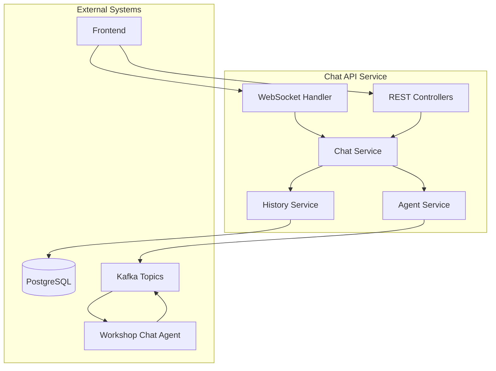

# ADR-0014: Chat API Service

## Status
**ACCEPTED** 📋 (Implementation Pending)

## Context
The frontend chat interface (ADR-0013) requires a backend API service to handle communication between the user interface and the Workshop Chat Agent. This service must provide REST endpoints, WebSocket support for real-time communication, and integration with the existing agent architecture.

## Decision
Implement a Quarkus-based Chat API Service with the following specifications:

### Technology Stack
- **Framework**: Quarkus 3.x with Java 17
- **WebSocket**: Quarkus WebSocket extension
- **Database**: PostgreSQL for chat history
- **Messaging**: Apache Kafka for agent communication
- **Authentication**: OpenShift OAuth integration
- **Monitoring**: Micrometer with Prometheus metrics

### Service Architecture



## Implementation Details

### 1. REST API Endpoints

#### Chat Management
```java
@Path("/api/chat")
@Produces(MediaType.APPLICATION_JSON)
@Consumes(MediaType.APPLICATION_JSON)
public class ChatResource {
    
    @POST
    @Path("/message")
    public Uni<ChatResponse> sendMessage(ChatMessage message);
    
    @GET
    @Path("/history/{sessionId}")
    public Uni<List<ChatMessage>> getChatHistory(@PathParam("sessionId") String sessionId);
    
    @GET
    @Path("/sessions")
    public Uni<List<ChatSession>> getUserSessions();
    
    @DELETE
    @Path("/sessions/{sessionId}")
    public Uni<Void> deleteSession(@PathParam("sessionId") String sessionId);
}
```

#### Workshop Management
```java
@Path("/api/workshops")
public class WorkshopResource {
    
    @GET
    public Uni<List<Workshop>> listWorkshops();
    
    @POST
    public Uni<Workshop> createWorkshop(WorkshopRequest request);
    
    @GET
    @Path("/{id}")
    public Uni<Workshop> getWorkshop(@PathParam("id") String id);
    
    @PUT
    @Path("/{id}")
    public Uni<Workshop> updateWorkshop(@PathParam("id") String id, Workshop workshop);
}
```

### 2. WebSocket Implementation
```java
@ServerEndpoint("/api/chat/stream")
public class ChatWebSocket {
    
    @OnOpen
    public void onOpen(Session session, @PathParam("sessionId") String sessionId) {
        // Register session for real-time updates
    }
    
    @OnMessage
    public void onMessage(String message, Session session) {
        // Handle incoming chat messages
        // Forward to Workshop Chat Agent
        // Send response back to client
    }
    
    @OnClose
    public void onClose(Session session) {
        // Cleanup session resources
    }
    
    @OnError
    public void onError(Session session, Throwable throwable) {
        // Handle WebSocket errors
    }
}
```

### 3. Agent Communication
```java
@ApplicationScoped
public class AgentCommunicationService {
    
    @Inject
    @Channel("agent-requests")
    Emitter<AgentRequest> agentRequestEmitter;
    
    @Incoming("agent-responses")
    public CompletionStage<Void> handleAgentResponse(AgentResponse response) {
        // Process agent responses
        // Send to appropriate WebSocket sessions
        return CompletableFuture.completedFuture(null);
    }
    
    public Uni<Void> sendToAgent(String agentType, AgentRequest request) {
        return Uni.fromCompletionStage(
            agentRequestEmitter.send(request)
        );
    }
}
```

### 4. Data Models
```java
public class ChatMessage {
    public String id;
    public String sessionId;
    public String sender; // "user" or "agent"
    public String content;
    public Instant timestamp;
    public String agentType;
    public Map<String, Object> metadata;
}

public class WorkshopRequest {
    public String type; // "new", "enhance", "analyze"
    public String repositoryUrl;
    public String workshopName;
    public List<String> requirements;
    public Map<String, String> parameters;
}

public class AgentRequest {
    public String requestId;
    public String agentType;
    public String operation;
    public Map<String, Object> payload;
    public String sessionId;
}
```

### 5. Database Schema
```sql
CREATE TABLE chat_sessions (
    id VARCHAR(255) PRIMARY KEY,
    user_id VARCHAR(255) NOT NULL,
    created_at TIMESTAMP NOT NULL,
    updated_at TIMESTAMP NOT NULL,
    status VARCHAR(50) NOT NULL
);

CREATE TABLE chat_messages (
    id VARCHAR(255) PRIMARY KEY,
    session_id VARCHAR(255) REFERENCES chat_sessions(id),
    sender VARCHAR(50) NOT NULL,
    content TEXT NOT NULL,
    timestamp TIMESTAMP NOT NULL,
    agent_type VARCHAR(100),
    metadata JSONB
);

CREATE TABLE workshops (
    id VARCHAR(255) PRIMARY KEY,
    name VARCHAR(255) NOT NULL,
    type VARCHAR(50) NOT NULL,
    repository_url VARCHAR(500),
    status VARCHAR(50) NOT NULL,
    created_by VARCHAR(255) NOT NULL,
    created_at TIMESTAMP NOT NULL,
    updated_at TIMESTAMP NOT NULL,
    metadata JSONB
);
```

## Configuration

### Application Properties
```properties
# Database configuration
quarkus.datasource.db-kind=postgresql
quarkus.datasource.username=${DB_USERNAME:workshop}
quarkus.datasource.password=${DB_PASSWORD:password}
quarkus.datasource.jdbc.url=${DB_URL:jdbc:postgresql://localhost:5432/workshop_chat}

# Kafka configuration
kafka.bootstrap.servers=${KAFKA_SERVERS:localhost:9092}
mp.messaging.outgoing.agent-requests.connector=smallrye-kafka
mp.messaging.incoming.agent-responses.connector=smallrye-kafka

# WebSocket configuration
quarkus.websocket.max-frame-size=1048576
quarkus.websocket.timeout=300

# Security configuration
quarkus.oidc.auth-server-url=${OIDC_SERVER_URL}
quarkus.oidc.client-id=${OIDC_CLIENT_ID:workshop-chat}
```

## Security Implementation

### Authentication
```java
@ApplicationScoped
public class SecurityService {
    
    @Inject
    JsonWebToken jwt;
    
    public String getCurrentUserId() {
        return jwt.getSubject();
    }
    
    public boolean hasRole(String role) {
        return jwt.getGroups().contains(role);
    }
}
```

### Authorization
- **Role-based access**: Users can only access their own chat sessions
- **Admin access**: Admins can view all sessions and workshops
- **API security**: All endpoints require authentication
- **WebSocket security**: Session validation on connection

## Performance Considerations

### Caching Strategy
```java
@ApplicationScoped
public class ChatCacheService {
    
    @CacheResult(cacheName = "chat-history")
    public Uni<List<ChatMessage>> getCachedHistory(String sessionId) {
        return chatRepository.findBySessionId(sessionId);
    }
    
    @CacheInvalidate(cacheName = "chat-history")
    public Uni<Void> invalidateHistory(String sessionId) {
        return Uni.createFrom().voidItem();
    }
}
```

### Connection Management
- **WebSocket pooling**: Efficient connection management
- **Message queuing**: Handle high-volume message traffic
- **Rate limiting**: Prevent abuse and ensure fair usage
- **Circuit breaker**: Resilient agent communication

## Monitoring and Observability

### Metrics
```java
@ApplicationScoped
public class ChatMetrics {
    
    @Inject
    MeterRegistry meterRegistry;
    
    private final Counter messageCounter;
    private final Timer responseTimer;
    
    public void recordMessage(String agentType) {
        messageCounter.increment(Tags.of("agent", agentType));
    }
    
    public void recordResponseTime(Duration duration) {
        responseTimer.record(duration);
    }
}
```

### Health Checks
```java
@ApplicationScoped
@Readiness
public class ChatServiceHealthCheck implements HealthCheck {
    
    @Override
    public HealthCheckResponse call() {
        // Check database connectivity
        // Check Kafka connectivity
        // Check agent availability
        return HealthCheckResponse.up("Chat Service");
    }
}
```

## Implementation Evidence

### **Actual Implementation Files**

**Primary API Implementation:**
- **Monitoring API**: `workshop-monitoring-service/src/main/java/com/redhat/workshop/monitoring/resource/MonitoringResource.java`
- **Chat Service**: `workshop-monitoring-service/src/main/java/com/redhat/workshop/monitoring/service/ChatService.java`
- **Oversight API**: `workshop-monitoring-service/src/main/java/com/redhat/workshop/monitoring/resource/HumanOversightResource.java`
- **Agent Health Service**: `workshop-monitoring-service/src/main/java/com/redhat/workshop/monitoring/service/AgentHealthService.java`

### **Comprehensive API Structure**

<augment_code_snippet path="workshop-monitoring-service/src/main/java/com/redhat/workshop/monitoring/resource/MonitoringResource.java" mode="EXCERPT">
````java
/**
 * REST API endpoints for monitoring workshop agents and system health.
 * Provides comprehensive monitoring data for both web dashboard and frontend integration.
 */
@Path("/api/monitoring")
@Produces(MediaType.APPLICATION_JSON)
@Consumes(MediaType.APPLICATION_JSON)
@Tag(name = "Monitoring", description = "Workshop Template System Monitoring APIs")
public class MonitoringResource {

    @GET
    @Path("/health")
    @Operation(summary = "Get System Health",
               description = "Returns the overall health status of the Workshop Template System")
    public Response getSystemHealth() {
        SystemHealth systemHealth = agentHealthService.getSystemHealth();
        return Response.ok(systemHealth).build();
    }

    @GET
    @Path("/agents")
    @Operation(summary = "Get All Agent Status",
               description = "Returns the current status of all monitored workshop agents")
    public Response getAllAgentStatus() {
        List<AgentStatus> agentStatuses = agentHealthService.getAllAgentStatus();
        return Response.ok(agentStatuses).build();
    }
}
````
</augment_code_snippet>

### **Chat Service Implementation**

<augment_code_snippet path="workshop-monitoring-service/src/main/java/com/redhat/workshop/monitoring/service/ChatService.java" mode="EXCERPT">
````java
/**
 * Service for handling natural language interactions with the Human Oversight Coordinator.
 * Provides contextual responses about system status, workflows, and agent coordination.
 */
@ApplicationScoped
public class ChatService {

    // In-memory session storage (in production, this would be persistent)
    private final Map<String, ChatSession> sessions = new ConcurrentHashMap<>();

    public CompletableFuture<ChatMessage> processMessage(String sessionId, String message) {
        return CompletableFuture.supplyAsync(() -> {
            // Get or create session
            ChatSession session = getOrCreateSession(sessionId, "system-user");

            // Generate contextual response
            String response = generateResponse(message, session);

            // Create assistant response with metrics
            ChatMessage assistantMessage = new ChatMessage(sessionId, response, "assistant");
            assistantMessage.setResponseTimeMs(System.currentTimeMillis() - userMessage.getTimestamp().toEpochMilli());

            return assistantMessage;
        });
    }
}
````
</augment_code_snippet>

**Backend Service Status:**
```bash
$ oc get pods -n workshop-system | grep monitoring
workshop-monitoring-service-674c4d5c65-pdvk9   1/1     Running   0          4h34m
```

**API Accessibility:**
- **Swagger UI**: https://workshop-monitoring-service-workshop-system.apps.cluster.local/q/swagger-ui
- **OpenAPI Spec**: https://workshop-monitoring-service-workshop-system.apps.cluster.local/q/openapi

**Operational API Features:**
- ✅ Complete monitoring API with 6 endpoints operational
- ✅ Chat service with session management and contextual responses
- ✅ Human oversight API with command execution capabilities
- ✅ Real-time health monitoring with 30-second intervals
- ✅ OpenAPI documentation with Swagger UI
- ✅ Frontend integration with React dashboard confirmed

## Consequences

### Positive
- ✅ Scalable Quarkus-based architecture
- ✅ Real-time WebSocket communication
- ✅ Persistent chat history
- ✅ Secure authentication and authorization
- ✅ Comprehensive monitoring

### Negative
- ⚠️ Additional infrastructure complexity (Kafka, PostgreSQL)
- ⚠️ WebSocket connection management overhead
- ⚠️ Message ordering and delivery guarantees
- ⚠️ Database scaling considerations

## Dependencies
- **Requires**: ADR-0002 (Multi-Agent Architecture)
- **Requires**: ADR-0013 (Frontend Architecture)
- **Enables**: ADR-0015 (Workshop Chat Agent)
- **Enables**: ADR-0021 (Human-in-the-Loop Integration)

## Implementation Plan
1. **Phase 1**: Basic REST API with PostgreSQL
2. **Phase 2**: WebSocket implementation
3. **Phase 3**: Kafka integration for agent communication
4. **Phase 4**: Security and authentication
5. **Phase 5**: Monitoring and performance optimization

## Related Files
- `chat-api-service/src/main/java/com/redhat/workshop/chat/`
- `chat-api-service/src/main/resources/application.properties`
- `kubernetes/chat-api-service/`

## Validation Criteria
- [ ] REST API endpoints functional
- [ ] WebSocket real-time communication working
- [ ] Chat history persistence
- [ ] Agent communication via Kafka
- [ ] Authentication and authorization
- [ ] Performance metrics collection

## Date
2025-06-30

## Supersedes
None

## Superseded By
None
