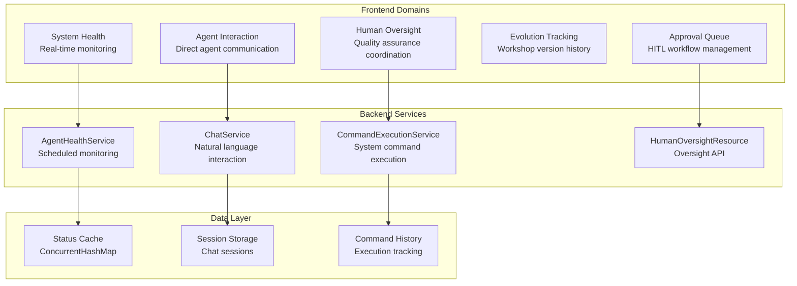

# ADR-0024: Workshop Monitoring Service Architecture

## Status
Accepted - **IMPLEMENTED AND OPERATIONAL**

## Context

The Workshop Monitoring Service is a comprehensive full-stack monitoring solution that provides real-time health monitoring, performance tracking, and human oversight capabilities for the Workshop Template System. This service represents a sophisticated monitoring architecture that goes far beyond basic health checks.

**Current Implementation Status:**
- ✅ **DEPLOYED**: Full-stack Quarkus + React application operational
- ✅ **MONITORING**: Real-time health monitoring of all 6 agents
- ✅ **DASHBOARD**: Multi-domain dashboard with 5 specialized tabs
- ✅ **API**: Complete REST API with OpenAPI documentation
- ✅ **INTEGRATION**: Native OpenShift integration with routes and health checks

## Decision

### **Full-Stack Architecture Overview**

#### **1. Technology Stack**
```yaml
Backend:
  Framework: Quarkus (Java 17)
  REST API: JAX-RS with OpenAPI 3.1
  Scheduling: Quarkus Scheduler (30-second intervals)
  HTTP Client: JAX-RS Client with retry mechanisms
  Caching: ConcurrentHashMap for thread-safe operations

Frontend:
  Framework: React 18 with modern hooks
  Styling: Tailwind CSS with responsive design
  Charts: Recharts for data visualization
  HTTP: Axios with interceptors and error handling
  Icons: Lucide React icon library
  Build: React Scripts with production optimization
```

#### **2. Multi-Domain Dashboard Architecture**


### **3. Real-Time Health Monitoring System**

#### **Automated Health Monitoring**
```java
// AgentHealthService.java - Scheduled Health Checks
@Scheduled(every = "{workshop.health.check-interval}")
public void checkAllAgents() {
    LOG.info("Starting scheduled health check for all agents");
    
    long startTime = System.currentTimeMillis();
    int successCount = 0;
    int failureCount = 0;

    for (Map.Entry<String, String> entry : agentEndpoints.entrySet()) {
        String agentName = entry.getKey();
        String endpoint = entry.getValue();
        
        try {
            checkAgentHealth(agentName, endpoint);
            successCount++;
        } catch (Exception e) {
            failureCount++;
            // Update status cache with error information
            updateErrorStatus(agentName, e.getMessage());
        }
    }
    
    updateSystemHealth();
    LOG.infof("Health check completed - Success: %d, Failures: %d", 
             successCount, failureCount);
}
```

**Health Check Features:**
- **30-Second Intervals**: Configurable automated health monitoring
- **Concurrent Checks**: Parallel health checks for all 6 agents
- **Response Time Tracking**: Performance monitoring with millisecond precision
- **Error Handling**: Graceful degradation with detailed error reporting
- **Cache Management**: Thread-safe status caching with ConcurrentHashMap

#### **Agent Communication Pattern**
```java
// HTTP Client Integration
private void checkAgentHealth(String agentName, String endpoint) {
    String agentCardUrl = endpoint + "/agent-card";
    WebTarget target = httpClient.target(agentCardUrl);
    Response response = target.request(MediaType.APPLICATION_JSON).get();
    
    if (response.getStatus() == 200) {
        Map<String, Object> agentCard = response.readEntity(Map.class);
        AgentStatus status = parseAgentCardResponse(agentName, endpoint, agentCard, responseTime);
        statusCache.put(agentName, status);
    }
}
```

### **4. Comprehensive REST API Architecture**

#### **API Endpoint Structure**
```yaml
# Complete API Specification
/api/monitoring:
  /health:                    # System health aggregation
    GET: SystemHealth object with overall status
  
  /agents:                    # Agent monitoring
    GET: List of all agent statuses
    /{agentName}:
      GET: Specific agent status
  
  /summary:                   # Dashboard data
    GET: Aggregated dashboard metrics
  
  /health-check:              # Manual triggers
    POST: Force immediate health check
  
  /info:                      # Service information
    GET: Service metadata and configuration

/api/oversight:               # Human oversight domain
  /status:                    # Oversight coordinator status
    GET: Human oversight coordinator health
  
  /chat:                      # Natural language interaction
    POST: Process chat messages with contextual responses
  
  /commands:                  # System command execution
    POST: Execute oversight commands
    GET: Command history and results
```

#### **OpenAPI Documentation Integration**
```yaml
# application.properties - API Documentation
mp.openapi.extensions.smallrye.info.title=Workshop Monitoring Service API
mp.openapi.extensions.smallrye.info.version=1.0.0
mp.openapi.extensions.smallrye.info.description=REST API for monitoring workshop agents and system health

# Swagger UI Configuration
quarkus.swagger-ui.always-include=true
quarkus.swagger-ui.path=/q/swagger-ui
quarkus.swagger-ui.title=Workshop Monitoring Service API
```

### **5. Advanced Frontend Components**

#### **Dashboard Tab Architecture**
```javascript
// Dashboard.js - Multi-Domain Tab Configuration
const tabs = [
  {
    id: 'monitoring',
    name: 'System Health',
    icon: Activity,
    description: 'Monitor system health and agent status',
    badge: `${healthyAgents}/${totalAgents}`
  },
  {
    id: 'agents',
    name: 'Agent Interaction', 
    icon: MessageSquare,
    description: 'Interact with workshop agents and execute workflows'
  },
  {
    id: 'approvals',
    name: 'Approval Queue',
    icon: CheckCircle,
    description: 'Manage human-in-the-loop approval workflows'
  },
  {
    id: 'evolution',
    name: 'Evolution Tracking',
    icon: TrendingUp,
    description: 'Track workshop evolution and version history'
  },
  {
    id: 'oversight',
    name: 'Human Oversight',
    icon: Users,
    description: 'Human oversight coordinator controls and quality assurance'
  }
];
```

#### **Real-Time Data Integration**
```javascript
// useMonitoring.js - Custom Hook for Real-Time Updates
const useMonitoring = (refreshInterval = 30000) => {
  const [systemHealth, setSystemHealth] = useState(null);
  const [agentStatuses, setAgentStatuses] = useState([]);
  const [loading, setLoading] = useState(true);
  const [lastUpdated, setLastUpdated] = useState(null);

  // Auto-refresh with configurable interval
  useEffect(() => {
    const interval = setInterval(refreshData, refreshInterval);
    return () => clearInterval(interval);
  }, [refreshInterval]);

  const refreshData = async () => {
    try {
      const [healthData, agentsData, summaryData] = await Promise.all([
        MonitoringApiService.getSystemHealth(),
        MonitoringApiService.getAllAgentStatus(),
        MonitoringApiService.getSystemSummary()
      ]);
      
      setSystemHealth(healthData);
      setAgentStatuses(agentsData);
      setLastUpdated(new Date());
    } catch (error) {
      console.error('Failed to refresh monitoring data:', error);
    }
  };
};
```

### **6. Performance and Visualization**

#### **Response Time Monitoring**
```javascript
// ResponseTimeChart.js - Performance Visualization
const ResponseTimeChart = ({ agentStatuses }) => {
  const chartData = agentStatuses.map(agent => ({
    name: agent.name,
    responseTime: agent.responseTimeMs || 0,
    status: agent.health
  }));

  return (
    <ResponsiveContainer width="100%" height={300}>
      <BarChart data={chartData}>
        <CartesianGrid strokeDasharray="3 3" />
        <XAxis dataKey="name" />
        <YAxis />
        <Tooltip formatter={(value) => [`${value}ms`, 'Response Time']} />
        <Bar dataKey="responseTime" fill="#3B82F6" />
      </BarChart>
    </ResponsiveContainer>
  );
};
```

#### **Interactive Agent Status Grid**
```javascript
// AgentStatusGrid.js - Expandable Agent Details
const AgentStatusGrid = ({ agentStatuses }) => {
  const [expandedAgent, setExpandedAgent] = useState(null);

  const getStatusIcon = (status) => {
    switch (status) {
      case 'HEALTHY': return <CheckCircle color="#10B981" />;
      case 'DEGRADED': return <AlertTriangle color="#F59E0B" />;
      case 'UNHEALTHY': return <XCircle color="#EF4444" />;
      default: return <HelpCircle color="#6B7280" />;
    }
  };

  return (
    <div className="divide-y divide-gray-200">
      {agentStatuses.map((agent) => (
        <AgentStatusCard 
          key={agent.name}
          agent={agent}
          expanded={expandedAgent === agent.name}
          onToggle={() => setExpandedAgent(
            expandedAgent === agent.name ? null : agent.name
          )}
        />
      ))}
    </div>
  );
};
```

## Implementation Evidence

### **Actual Implementation Files**

**Backend Services:**
- **Main Service**: `workshop-monitoring-service/src/main/java/com/redhat/workshop/monitoring/service/AgentHealthService.java`
- **Chat Service**: `workshop-monitoring-service/src/main/java/com/redhat/workshop/monitoring/service/ChatService.java`
- **Command Service**: `workshop-monitoring-service/src/main/java/com/redhat/workshop/monitoring/service/CommandExecutionService.java`
- **Monitoring API**: `workshop-monitoring-service/src/main/java/com/redhat/workshop/monitoring/resource/MonitoringResource.java`
- **Oversight API**: `workshop-monitoring-service/src/main/java/com/redhat/workshop/monitoring/resource/HumanOversightResource.java`

**Frontend Components:**
- **Dashboard**: `workshop-monitoring-service/src/main/webui/src/components/Dashboard.js` (377 lines)
- **Agent Grid**: `workshop-monitoring-service/src/main/webui/src/components/AgentStatusGrid.js`
- **API Service**: `workshop-monitoring-service/src/main/webui/src/services/monitoringApi.js` (184 lines)
- **Monitoring Hook**: `workshop-monitoring-service/src/main/webui/src/hooks/useMonitoring.js`

**Configuration:**
- **Application Config**: `workshop-monitoring-service/src/main/resources/application.properties`
- **Frontend Config**: `workshop-monitoring-service/src/main/webui/package.json`
- **Container Build**: `workshop-monitoring-service/Dockerfile`

### **Operational Evidence**

**Service Deployment:**
```bash
$ oc get pods -n workshop-system | grep monitoring
workshop-monitoring-service-674c4d5c65-pdvk9   1/1     Running   0          4h34m
```

**API Accessibility:**
- **Dashboard**: https://workshop-monitoring-service-workshop-system.apps.cluster.local
- **API Docs**: https://workshop-monitoring-service-workshop-system.apps.cluster.local/q/swagger-ui
- **Health Check**: https://workshop-monitoring-service-workshop-system.apps.cluster.local/q/health

**Monitoring Capabilities:**
- ✅ Real-time monitoring of all 6 agents
- ✅ 30-second automated health checks
- ✅ Response time tracking and visualization
- ✅ Interactive dashboard with 5 specialized domains
- ✅ Natural language chat interface with contextual responses
- ✅ System command execution and oversight coordination

## Consequences

### **Positive**
- ✅ **Comprehensive Monitoring**: Complete visibility into system health and performance
- ✅ **Real-Time Updates**: 30-second automated monitoring with manual refresh capability
- ✅ **Multi-Domain Dashboard**: Specialized interfaces for different operational concerns
- ✅ **Performance Tracking**: Response time monitoring and visualization
- ✅ **Human Oversight**: Natural language interaction and command execution
- ✅ **Production Ready**: OpenShift integration with health checks and routes
- ✅ **API Documentation**: Complete OpenAPI specification with Swagger UI

### **Negative**
- ⚠️ **Resource Overhead**: Additional service requires CPU, memory, and network resources
- ⚠️ **Complexity**: Sophisticated architecture requires maintenance and monitoring
- ⚠️ **Single Point of Monitoring**: Centralized monitoring creates potential bottleneck

### **Mitigation Strategies**
- **Resource Monitoring**: Monitor service resource usage and scale as needed
- **High Availability**: Consider multiple replicas for critical monitoring functionality
- **Graceful Degradation**: Ensure system continues operating if monitoring service is unavailable

## Related ADRs

- **ADR-0013**: Frontend Architecture (enhanced by this monitoring service)
- **ADR-0014**: Chat API Service (extended with comprehensive monitoring API)
- **ADR-0021**: Human-in-the-Loop Integration (implemented through oversight domain)
- **ADR-0023**: OpenShift Deployment Strategy (includes monitoring service deployment)

---

**This ADR documents the comprehensive Workshop Monitoring Service architecture that provides sophisticated real-time monitoring, multi-domain dashboard capabilities, and human oversight coordination for the Workshop Template System.**
