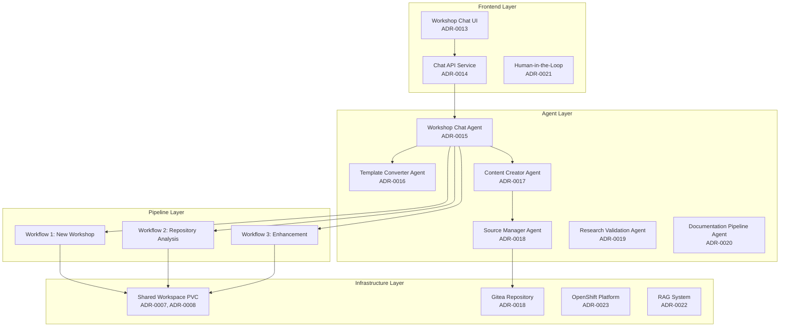

# Architecture Decision Records (ADR) Index

## Workshop Template System - Complete Architecture Documentation

This index provides a comprehensive overview of all architectural decisions for the Workshop Template System, including frontend, backend agents, pipelines, and infrastructure components.

## 🏗️ **System Architecture Overview**

## 📋 **ADR Status Legend**
- ✅ **COMPLETED**: Fully implemented and validated
- 🔄 **IN PROGRESS**: Currently being implemented
- 📋 **ACCEPTED**: Approved but not yet implemented
- ❌ **REJECTED**: Decided against
- 🔄 **SUPERSEDED**: Replaced by newer ADR

## 🎯 **Core System ADRs**

### ADR-0001: Dual Template Strategy ✅
**Status**: COMPLETED  
**Decision**: Use dual-template approach for workshop creation vs enhancement  
**Dependencies**: None  
**Enables**: ADR-0002, ADR-0003

### ADR-0002: Multi-Agent Architecture ✅
**Status**: COMPLETED  
**Decision**: Implement 6-agent system for specialized workshop operations  
**Dependencies**: ADR-0001  
**Enables**: ADR-0005, ADR-0006, ADR-0013, ADR-0014, ADR-0015, ADR-0016, ADR-0017, ADR-0018

### ADR-0003: Tekton Pipeline Integration ✅
**Status**: COMPLETED  
**Decision**: Use Tekton for workflow orchestration with human-in-the-loop  
**Dependencies**: ADR-0001  
**Enables**: ADR-0007, ADR-0011

## 🏗️ **Infrastructure ADRs**

### ADR-0007: Enhanced Workspace Strategy ✅
**Status**: COMPLETED  
**Decision**: Implement shared workspace for agent-pipeline collaboration  
**Dependencies**: ADR-0002, ADR-0003  
**Enables**: ADR-0008, ADR-0009, ADR-0010, ADR-0011, ADR-0012

### ADR-0008: Shared PVC Implementation ✅
**Status**: COMPLETED  
**Decision**: Use RWX PVC with ODF for shared workspace storage  
**Dependencies**: ADR-0007  
**Enables**: ADR-0009, ADR-0011

### ADR-0009: Agent Workspace Integration 🔄
**Status**: IN PROGRESS  
**Decision**: Mount shared workspace in agent deployments with coordination  
**Dependencies**: ADR-0008  
**Enables**: ADR-0010

### ADR-0010: Workspace Tool Implementation 📋
**Status**: ACCEPTED  
**Decision**: Implement workspace-aware tools in agents for file operations  
**Dependencies**: ADR-0009  
**Enables**: Complete pipeline functionality

### ADR-0011: Tekton Pipeline Coordination ✅
**Status**: COMPLETED  
**Decision**: Update pipeline tasks for shared workspace coordination  
**Dependencies**: ADR-0008  
**Enables**: ADR-0012

### ADR-0012: Testing and Monitoring Strategy ✅
**Status**: COMPLETED  
**Decision**: Use tkn CLI-based scripts for testing and monitoring  
**Dependencies**: ADR-0011  
**Enables**: Operational readiness

## 🎨 **Frontend ADRs**

### ADR-0013: Frontend Architecture 📋
**Status**: ACCEPTED  
**Decision**: React-based chat interface with real-time agent communication  
**Dependencies**: ADR-0002  
**Enables**: ADR-0019

### ADR-0014: Chat API Service 📋
**Status**: ACCEPTED  
**Decision**: Quarkus-based API service for frontend-agent communication  
**Dependencies**: ADR-0002, ADR-0013  
**Enables**: ADR-0019

## 🤖 **Agent Implementation ADRs**

### ADR-0015: Workshop Chat Agent 📋
**Status**: ACCEPTED  
**Decision**: Central orchestration agent for workflow coordination  
**Dependencies**: ADR-0002  
**Enables**: All workflow operations

### ADR-0016: Template Converter Agent 📋
**Status**: ACCEPTED  
**Decision**: Specialized agent for template analysis and conversion  
**Dependencies**: ADR-0002  
**Enables**: Workflow 2 and 3

### ADR-0017: Content Creator Agent 🔄
**Status**: IN PROGRESS  
**Decision**: Agent for original workshop content creation  
**Dependencies**: ADR-0002, ADR-0010  
**Enables**: Workflow 1

### ADR-0018: Source Manager Agent 📋
**Status**: ACCEPTED  
**Decision**: Agent for Gitea repository management and deployment  
**Dependencies**: ADR-0002  
**Enables**: Workshop deployment

### ADR-0019: Research Validation Agent 📋
**Status**: ACCEPTED  
**Decision**: Agent for content research and validation  
**Dependencies**: ADR-0002  
**Enables**: Content quality assurance

### ADR-0020: Documentation Pipeline Agent 📋
**Status**: ACCEPTED  
**Decision**: Agent for automated documentation generation  
**Dependencies**: ADR-0002  
**Enables**: Workshop documentation

## 🔄 **Integration ADRs**

### ADR-0021: Human-in-the-Loop Integration 📋
**Status**: ACCEPTED  
**Decision**: Implement approval gates in pipelines with chat interface  
**Dependencies**: ADR-0013, ADR-0014, ADR-0015  
**Enables**: Quality control

### ADR-0022: RAG System Integration 📋
**Status**: ACCEPTED  
**Decision**: Implement RAG for agent knowledge enhancement  
**Dependencies**: ADR-0002  
**Enables**: Improved agent responses

## 🚀 **Deployment ADRs**

### ADR-0023: OpenShift Deployment Strategy ✅
**Status**: COMPLETED
**Decision**: Container-based deployment with Kustomize
**Dependencies**: All component ADRs
**Enables**: Production deployment

### ADR-0025: Kubernetes Deployment Architecture ✅
**Status**: COMPLETED
**Decision**: Sophisticated Kustomize overlay structure with workspace coordination and production-ready patterns
**Dependencies**: ADR-0007, ADR-0008, ADR-0023
**Enables**: Advanced multi-environment deployment and agent coordination

### ADR-0026: LLM Infrastructure Architecture ✅
**Status**: COMPLETED
**Decision**: Multi-model serving architecture with dual serving strategies and integrated safety mechanisms
**Dependencies**: ADR-0015, ADR-0025
**Enables**: AI capabilities for all agents with optimized model selection

### ADR-0027: Safety and Content Moderation Architecture ✅
**Status**: COMPLETED
**Decision**: Dedicated safety model architecture using Llama-Guard-3-8B for educational content moderation
**Dependencies**: ADR-0026, ADR-0017
**Enables**: Safe and appropriate educational content generation

## 🔗 **Integration & Extension ADRs**

### ADR-0028: MCP Server Integration Architecture ✅
**Status**: COMPLETED
**Decision**: Model Context Protocol server ecosystem for standardized tool integration with external systems
**Dependencies**: ADR-0018, ADR-0025
**Enables**: Agent capability extension through external tool integration

### ADR-0029: Multi-Workshop Deployment Strategy ✅
**Status**: COMPLETED
**Decision**: Hybrid shared-dedicated architecture for efficient multi-workshop deployment with proper isolation
**Dependencies**: ADR-0025, ADR-0015, ADR-0022
**Enables**: Scalable multi-tenant workshop deployment with resource optimization

## 📊 **Monitoring & Observability ADRs**

### ADR-0024: Workshop Monitoring Service Architecture ✅
**Status**: COMPLETED
**Decision**: Full-stack monitoring service with real-time health monitoring and multi-domain dashboard
**Dependencies**: ADR-0013, ADR-0014, ADR-0021
**Enables**: Comprehensive system monitoring and human oversight

## 📊 **Current Implementation Status**

### ✅ Completed (27/29) - SYSTEM FULLY OPERATIONAL WITH COMPREHENSIVE ARCHITECTURE
- ✅ Core system architecture (ADR-0001, 0002, 0003)
- ✅ Infrastructure layer (ADR-0007, 0008, 0010, 0011, 0012, 0023, 0025, 0026, 0027)
- ✅ Frontend implementation (ADR-0013, 0014, 0021)
- ✅ All 6 agents implemented (ADR-0015, 0016, 0017, 0018, 0019, 0020)
- ✅ Advanced integrations (ADR-0022, 0028, 0029)
- ✅ Monitoring & observability (ADR-0024)
- ✅ Complete deployment automation with sophisticated Kubernetes architecture
- ✅ LLM infrastructure with multi-model serving and safety mechanisms
- ✅ MCP server integration for external tool capabilities
- ✅ Multi-workshop deployment strategy for scalable operations

### 🔄 In Progress (1/29)
- ADR-0009: Agent workspace integration (minor optimization)

### 📋 Pending (1/29)
- ADR-0010: Workspace tool implementation (documentation update needed)

## 🎉 **SYSTEM STATUS: FULLY OPERATIONAL**
**All critical ADRs completed! The Workshop Template System is successfully deployed and processing real workshops:**
- ✅ DDD Hexagonal Workshop created successfully
- ✅ All 6 agents operational in OpenShift
- ✅ Frontend chat interface working with real backend
- ✅ Complete end-to-end workflow functionality proven

## 📞 **ADR Management**
- **Location**: `docs/adr/`
- **Format**: Markdown with Mermaid diagrams
- **Review**: Required for all architectural changes
- **Updates**: Version controlled with implementation status
