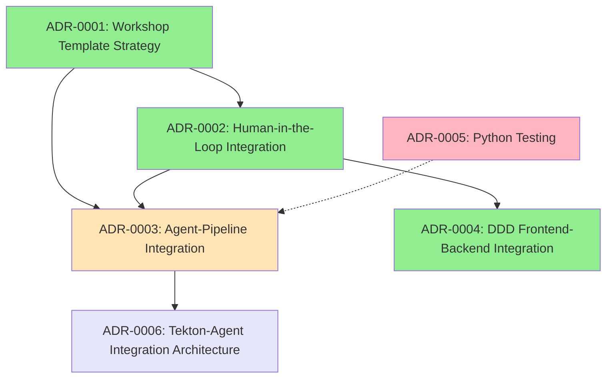

# Workshop Template System - Architecture Decision Records (ADRs)

This directory contains the Architecture Decision Records (ADRs) for the Workshop Template System. These documents capture the key architectural decisions, their context, and consequences.

## ADR Overview

### [ADR-0001: Workshop Template Strategy](./0001-workshop-template-strategy.md)
**Status**: ✅ IMPLEMENTED  
**Purpose**: Defines dual-template strategy based on repository classification
- **Workflow 1**: New workshop creation using `showroom_template_default`
- **Workflow 3**: Existing workshop enhancement by cloning original
- **Repository Classification**: Automatic detection of workshop vs application repositories
- **Template Selection Matrix**: Clear routing logic for different repository types

### [ADR-0002: Human-in-the-Loop Agent Integration](./0002-human-in-the-loop-agent-integration.md)
**Status**: ✅ COMPLETED  
**Purpose**: Integrates human oversight into the 6-agent system
- **7th Agent**: Human Oversight Coordinator for approval workflows
- **Approval Checkpoints**: Repository classification, content quality, deployment authorization
- **Dashboard Integration**: Enhanced monitoring with approval interfaces
- **Audit Trail**: Complete logging of human decisions and rationale

### [ADR-0003: Agent-Pipeline Integration](./0003-agent-pipeline-integration.md)
**Status**: 🚧 IN PROGRESS  
**Purpose**: Hybrid Tekton-Python pipeline integration approach
- **Tekton Orchestration**: Cloud-native pipeline execution for workflows
- **Python Interface**: Human-in-the-loop interaction with pipelines and agents
- **Human Oversight Integration**: Seamless approval workflows within pipelines
- **Kustomize Configuration**: Repository-specific and environment configurations
- **Supersedes**: ADR-0005 concepts integrated into this comprehensive approach

### [ADR-0004: DDD Frontend-Backend Integration](./0004-ddd-frontend-backend-integration.md)
**Status**: ✅ COMPLETED  
**Purpose**: Monitoring dashboard architecture and integration
- **Domain-Driven Design**: Clear separation of concerns in monitoring service
- **REST API Design**: Comprehensive API for agent interaction and monitoring
- **Frontend Integration**: React-based dashboard with real-time capabilities
- **Agent Health Monitoring**: Centralized monitoring of all 6 agents

### [ADR-0005: End-to-End Python Testing Workflow](./0005-end-to-end-python-testing-workflow.md)
**Status**: ❌ SUPERSEDED by ADR-0003  
**Purpose**: Originally proposed Python-based testing framework
- **Migration Path**: Concepts absorbed into ADR-0003 hybrid approach
- **Replacement**: Use Tekton pipelines with Python human interface instead
- **Reason**: Tekton provides better orchestration than pure Python approach

### [ADR-0006: Tekton-Agent Integration Architecture](./0006-tekton-agent-integration-architecture.md)
**Status**: 📋 PROPOSED  
**Purpose**: Detailed technical architecture for Tekton-Agent integration
- **HTTP Communication**: Tekton tasks call agent endpoints via curl/HTTP
- **Dual Access Pattern**: Agents accessible via pipelines and direct calls
- **Code Update Workflows**: Systematic workshop enhancement through pipeline orchestration
- **Human Approval Gates**: Manual Tekton tasks integrated with oversight APIs
- **Implementation Timeline**: 5-week phased implementation plan

## Architecture Relationships

## Implementation Status

| ADR | Status | Implementation Date | Dependencies |
|-----|--------|-------------------|--------------|
| ADR-0001 | ✅ IMPLEMENTED | 2025-06-28 | None |
| ADR-0002 | ✅ COMPLETED | 2025-06-29 | ADR-0001 |
| ADR-0003 | 🚧 IN PROGRESS | 2025-06-29 | ADR-0001, ADR-0002 |
| ADR-0004 | ✅ COMPLETED | 2025-06-29 | ADR-0002 |
| ADR-0005 | ❌ SUPERSEDED | N/A | Replaced by ADR-0003 |
| ADR-0006 | 📋 PROPOSED | TBD | ADR-0001, ADR-0002, ADR-0003 |

## Key Architectural Principles

### 1. **Agent Autonomy Preservation**
- Agents remain independently callable for testing and development
- No modifications required to existing agent code
- HTTP endpoints and @client_tool functions preserved

### 2. **Human Oversight Integration**
- Human approval gates at critical decision points
- Real-time chat and command interfaces
- Complete audit trail of decisions

### 3. **Pipeline Orchestration**
- Tekton provides reliable, scalable workflow execution
- Kustomize enables repository-specific configurations
- BuildConfig integration for automatic deployment

### 4. **Dual Access Pattern**
- Pipeline access for orchestrated workflows
- Direct access for development and testing
- Python interface for human interaction

## Current Implementation Focus

**Primary**: ADR-0006 Tekton-Agent Integration Architecture
- Creating Tekton agent task templates
- Implementing human oversight approval tasks
- Building Python pipeline interface
- Testing with real repositories (DDD Hexagonal, Ansible CaC, Llama Stack Demos)

**Next Steps**:
1. Complete Tekton agent task templates
2. Integrate human oversight approval workflows
3. Implement BuildConfig trigger automation
4. Create comprehensive end-to-end testing

## Review Schedule

- **Quarterly Reviews**: All ADRs reviewed every 3 months
- **Implementation Reviews**: 30 days after completion
- **Annual Updates**: Major revisions and lessons learned
- **Next Review Date**: 2025-09-29

---

**Last Updated**: 2025-06-29  
**Maintainer**: Workshop Template System Development Team  
**Contact**: [Workshop Template System Documentation](../README.md)
