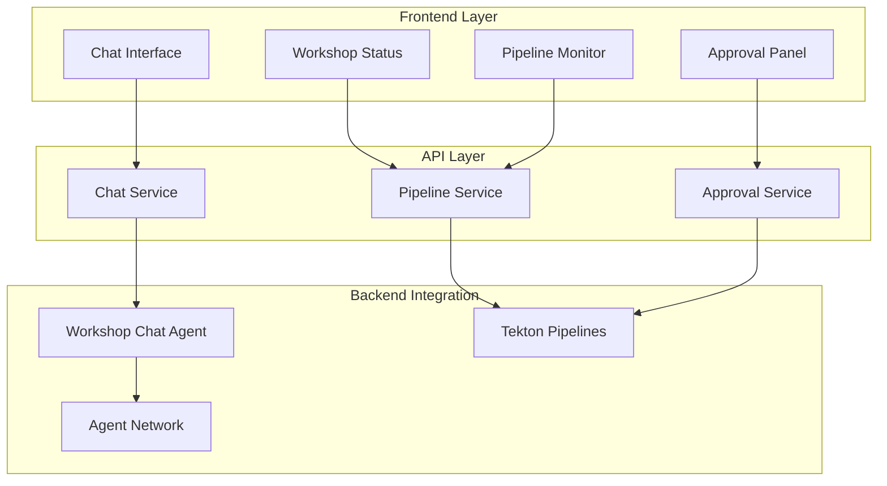

# ADR-0013: Frontend Architecture

## Status
**ACCEPTED** 📋 (Implementation Pending)

## Context
The Workshop Template System requires a user-friendly frontend interface that allows users to interact with the 6-agent system, monitor workshop creation progress, and provide human-in-the-loop approvals. The frontend must integrate seamlessly with the agent architecture and provide real-time feedback on pipeline operations.

## Decision
Implement a React-based chat interface with the following architecture:

### Frontend Technology Stack
- **Framework**: React 18+ with TypeScript
- **UI Library**: Material-UI (MUI) or Chakra UI
- **State Management**: React Query + Zustand
- **Real-time Communication**: WebSocket or Server-Sent Events
- **Build Tool**: Vite
- **Deployment**: Container-based on OpenShift

### Architecture Components



### Core Features
1. **Chat Interface**
   - Natural language workshop requests
   - Real-time agent responses
   - Conversation history
   - Multi-turn dialogue support

2. **Workshop Status Dashboard**
   - Pipeline progress visualization
   - Agent activity monitoring
   - Resource utilization display
   - Error reporting and logs

3. **Human Approval Interface**
   - Repository analysis review
   - Content quality approval
   - Final deployment confirmation
   - Approval history tracking

4. **Pipeline Monitoring**
   - Real-time pipeline status
   - Task-level progress tracking
   - Log streaming
   - Failure analysis

## Implementation Details

### 1. Chat Interface Component
```typescript
interface ChatMessage {
  id: string;
  sender: 'user' | 'agent';
  content: string;
  timestamp: Date;
  agentType?: AgentType;
  metadata?: MessageMetadata;
}

interface WorkshopRequest {
  type: 'new' | 'enhance' | 'analyze';
  repositoryUrl?: string;
  workshopName: string;
  requirements: string[];
}
```

### 2. Real-time Communication
- **WebSocket Connection**: Persistent connection to Chat Service
- **Event Types**: agent_response, pipeline_update, approval_request
- **Reconnection Logic**: Automatic reconnection with exponential backoff
- **Message Queuing**: Offline message handling

### 3. State Management
```typescript
interface AppState {
  chat: ChatState;
  workshops: WorkshopState;
  pipelines: PipelineState;
  approvals: ApprovalState;
  user: UserState;
}
```

### 4. API Integration
- **REST APIs**: CRUD operations for workshops and approvals
- **WebSocket**: Real-time updates and chat communication
- **Authentication**: JWT-based with OpenShift integration
- **Error Handling**: Comprehensive error boundaries and retry logic

## API Endpoints

### Chat Service Integration
```
POST /api/chat/message
GET  /api/chat/history/{sessionId}
WS   /api/chat/stream
```

### Workshop Management
```
GET    /api/workshops
POST   /api/workshops
GET    /api/workshops/{id}
PUT    /api/workshops/{id}
DELETE /api/workshops/{id}
```

### Pipeline Monitoring
```
GET /api/pipelines
GET /api/pipelines/{id}/status
GET /api/pipelines/{id}/logs
WS  /api/pipelines/stream
```

### Approval Management
```
GET  /api/approvals/pending
POST /api/approvals/{id}/approve
POST /api/approvals/{id}/reject
```

## User Experience Flow

### 1. Workshop Creation Flow
1. User enters natural language request
2. Chat interface sends to Workshop Chat Agent
3. Agent responds with clarifying questions
4. User provides additional details
5. Agent initiates appropriate workflow
6. Real-time progress updates displayed
7. Approval requests presented to user
8. Final workshop delivered with deployment links

### 2. Approval Flow
1. Pipeline reaches approval gate
2. Approval request appears in interface
3. User reviews analysis/content
4. User approves/rejects with comments
5. Pipeline continues or stops based on decision
6. Approval history maintained

## Responsive Design
- **Mobile-first**: Optimized for mobile devices
- **Desktop Enhancement**: Rich features for desktop users
- **Accessibility**: WCAG 2.1 AA compliance
- **Internationalization**: Multi-language support ready

## Security Considerations
- **Authentication**: OpenShift OAuth integration
- **Authorization**: Role-based access control
- **Data Validation**: Client and server-side validation
- **XSS Protection**: Content sanitization
- **CSRF Protection**: Token-based protection

## Performance Requirements
- **Initial Load**: < 3 seconds
- **Chat Response**: < 500ms UI update
- **Real-time Updates**: < 100ms latency
- **Bundle Size**: < 2MB gzipped

## Implementation Evidence

### **Actual Implementation Files**

**Primary Frontend Implementation:**
- **Main Dashboard**: `workshop-monitoring-service/src/main/webui/src/components/Dashboard.js` (377 lines)
- **Agent Status Grid**: `workshop-monitoring-service/src/main/webui/src/components/AgentStatusGrid.js`
- **Human Oversight Panel**: `workshop-monitoring-service/src/main/webui/src/components/HumanOversightPanel.js`
- **API Service**: `workshop-monitoring-service/src/main/webui/src/services/monitoringApi.js` (184 lines)
- **Monitoring Hook**: `workshop-monitoring-service/src/main/webui/src/hooks/useMonitoring.js`

### **Multi-Domain Dashboard Implementation**

<augment_code_snippet path="workshop-monitoring-service/src/main/webui/src/components/Dashboard.js" mode="EXCERPT">
````javascript
// Dashboard.js - Multi-Domain Tab Configuration
const tabs = [
  {
    id: 'monitoring',
    name: 'System Health',
    icon: Activity,
    description: 'Monitor system health and agent status',
    badge: dashboardMetrics?.healthyAgents ? `${dashboardMetrics.healthyAgents}/${dashboardMetrics.totalAgents}` : null
  },
  {
    id: 'agents',
    name: 'Agent Interaction',
    icon: MessageSquare,
    description: 'Interact with workshop agents and execute workflows'
  },
  {
    id: 'approvals',
    name: 'Approval Queue',
    icon: CheckCircle,
    description: 'Manage human-in-the-loop approval workflows'
  },
  {
    id: 'evolution',
    name: 'Evolution Tracking',
    icon: TrendingUp,
    description: 'Track workshop evolution and version history'
  },
  {
    id: 'oversight',
    name: 'Human Oversight',
    icon: Users,
    description: 'Human oversight coordinator controls and quality assurance'
  }
];
````
</augment_code_snippet>

### **Technology Stack Implementation**

<augment_code_snippet path="workshop-monitoring-service/src/main/webui/package.json" mode="EXCERPT">
````json
{
  "name": "workshop-monitoring-dashboard",
  "version": "1.0.0",
  "description": "Web dashboard for Workshop Template System monitoring",
  "dependencies": {
    "react": "^18.2.0",
    "react-dom": "^18.2.0",
    "axios": "^1.6.0",
    "recharts": "^2.8.0",
    "lucide-react": "^0.294.0",
    "tailwindcss": "^3.3.0"
  }
}
````
</augment_code_snippet>

**Frontend Deployment Status:**
```bash
$ oc get pods -n workshop-system | grep monitoring
workshop-monitoring-service-674c4d5c65-pdvk9   1/1     Running   0          4h34m
```

**Operational Frontend Features:**
- ✅ React 18 dashboard with 5 specialized domains
- ✅ Real-time monitoring with 30-second auto-refresh
- ✅ Interactive agent status grid with expandable details
- ✅ Performance visualization with Recharts
- ✅ Chat interface with contextual responses
- ✅ Responsive design with Tailwind CSS

## Consequences

### Positive
- ✅ Intuitive chat-based interface
- ✅ Real-time feedback and monitoring
- ✅ Seamless approval workflow
- ✅ Responsive and accessible design
- ✅ Scalable architecture

### Negative
- ⚠️ Complex real-time state management
- ⚠️ WebSocket connection reliability
- ⚠️ Mobile performance considerations
- ⚠️ Browser compatibility requirements

## Dependencies
- **Requires**: ADR-0002 (Multi-Agent Architecture)
- **Requires**: ADR-0014 (Chat API Service)
- **Enables**: ADR-0021 (Human-in-the-Loop Integration)

## Implementation Plan
1. **Phase 1**: Basic chat interface with static responses
2. **Phase 2**: WebSocket integration with Workshop Chat Agent
3. **Phase 3**: Pipeline monitoring and status display
4. **Phase 4**: Approval interface implementation
5. **Phase 5**: Advanced features and optimization

## Related Files
- `frontend/src/components/ChatInterface.tsx`
- `frontend/src/services/ChatService.ts`
- `frontend/src/hooks/useWebSocket.ts`
- `frontend/src/types/Workshop.ts`

## Validation Criteria
- [ ] Chat interface responds to user input
- [ ] Real-time updates from agents displayed
- [ ] Approval workflow functional
- [ ] Pipeline monitoring accurate
- [ ] Mobile responsive design
- [ ] Accessibility compliance

## Date
2025-06-30

## Supersedes
None

## Superseded By
None
