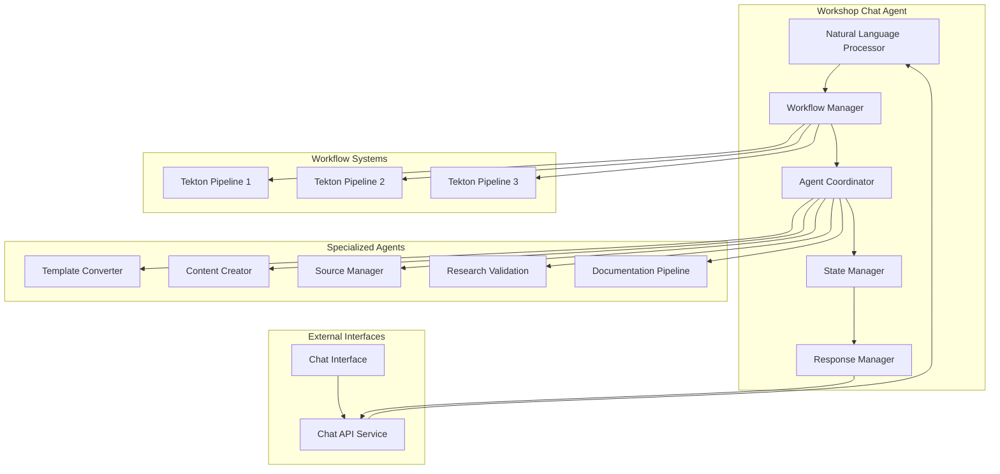

# ADR-0015: Workshop Chat Agent

## Status
**ACCEPTED** 📋 (Implementation Pending)

## Context
The Workshop Template System requires a central orchestration agent that can understand natural language requests from users, coordinate with specialized agents, and manage the execution of workshop creation workflows. This agent serves as the primary interface between the frontend chat system and the backend agent network.

## Decision
Implement a Workshop Chat Agent as the central orchestrator with natural language processing capabilities, workflow management, and multi-agent coordination.

### Agent Architecture



## Core Capabilities

### 1. Natural Language Understanding
```python
class WorkshopRequestParser:
    def parse_user_intent(self, message: str) -> WorkshopIntent:
        """Parse user message to extract workshop intent"""
        intents = {
            "create_new": ["create", "new", "build", "make"],
            "enhance_existing": ["enhance", "improve", "update", "modify"],
            "analyze_repository": ["analyze", "review", "examine", "check"]
        }
        
        # Extract key information
        intent_type = self._classify_intent(message, intents)
        repository_url = self._extract_repository_url(message)
        workshop_name = self._extract_workshop_name(message)
        requirements = self._extract_requirements(message)
        
        return WorkshopIntent(
            type=intent_type,
            repository_url=repository_url,
            workshop_name=workshop_name,
            requirements=requirements,
            confidence=self._calculate_confidence()
        )
```

### 2. Workflow Orchestration
```python
class WorkflowOrchestrator:
    def __init__(self):
        self.workflows = {
            "create_new": Workflow1NewWorkshop(),
            "enhance_existing": Workflow3Enhancement(),
            "analyze_repository": Workflow2Analysis()
        }
    
    async def execute_workflow(self, intent: WorkshopIntent, session_id: str) -> WorkflowExecution:
        """Execute appropriate workflow based on user intent"""
        workflow = self.workflows[intent.type]
        
        # Create workflow execution context
        context = WorkflowContext(
            session_id=session_id,
            intent=intent,
            workspace_path=f"/workspace/shared-data/pipelines/{session_id}",
            agents=self.agent_registry
        )
        
        # Execute workflow with human-in-the-loop checkpoints
        execution = await workflow.execute(context)
        
        return execution
```

### 3. Agent Coordination
```python
class AgentCoordinator:
    def __init__(self):
        self.agents = {
            "template_converter": TemplateConverterClient(),
            "content_creator": ContentCreatorClient(),
            "source_manager": SourceManagerClient(),
            "research_validation": ResearchValidationClient(),
            "documentation_pipeline": DocumentationPipelineClient()
        }
    
    async def coordinate_agents(self, workflow_step: WorkflowStep) -> AgentResponse:
        """Coordinate multiple agents for a workflow step"""
        responses = {}
        
        # Execute agents in parallel where possible
        if workflow_step.parallel_execution:
            tasks = []
            for agent_name in workflow_step.required_agents:
                task = self._call_agent(agent_name, workflow_step.agent_requests[agent_name])
                tasks.append(task)
            
            responses = await asyncio.gather(*tasks)
        else:
            # Sequential execution for dependent operations
            for agent_name in workflow_step.required_agents:
                response = await self._call_agent(agent_name, workflow_step.agent_requests[agent_name])
                responses[agent_name] = response
                
                # Pass response to next agent if needed
                if workflow_step.chain_responses:
                    workflow_step.update_next_request(agent_name, response)
        
        return AgentResponse.combine(responses)
```

### 4. Conversation Management
```python
class ConversationManager:
    def __init__(self):
        self.sessions = {}
        self.context_memory = ContextMemory()
    
    async def handle_message(self, message: str, session_id: str) -> ChatResponse:
        """Handle incoming chat message with context awareness"""
        session = self.get_or_create_session(session_id)
        
        # Parse message with conversation context
        intent = self.parser.parse_with_context(message, session.context)
        
        # Handle different message types
        if intent.type == "clarification_request":
            return await self._handle_clarification(intent, session)
        elif intent.type == "approval_response":
            return await self._handle_approval(intent, session)
        elif intent.type == "workshop_request":
            return await self._handle_workshop_request(intent, session)
        else:
            return await self._handle_general_query(intent, session)
    
    async def _handle_workshop_request(self, intent: WorkshopIntent, session: ChatSession) -> ChatResponse:
        """Handle workshop creation/enhancement requests"""
        # Validate request completeness
        if not intent.is_complete():
            missing_info = intent.get_missing_information()
            return ChatResponse.ask_for_clarification(missing_info)
        
        # Start workflow execution
        workflow_execution = await self.orchestrator.execute_workflow(intent, session.id)
        
        # Update session state
        session.current_workflow = workflow_execution
        session.state = "workflow_executing"
        
        return ChatResponse.workflow_started(workflow_execution)
```

## Workflow Implementations

### Workflow 1: New Workshop Creation
```python
class Workflow1NewWorkshop(WorkflowBase):
    async def execute(self, context: WorkflowContext) -> WorkflowExecution:
        steps = [
            WorkflowStep("initialize_workspace", required_agents=[]),
            WorkflowStep("clone_template", required_agents=["content_creator"]),
            WorkflowStep("create_content", required_agents=["content_creator"]),
            WorkflowStep("validate_content", required_agents=["research_validation"]),
            WorkflowStep("deploy_workshop", required_agents=["source_manager"]),
            WorkflowStep("generate_docs", required_agents=["documentation_pipeline"])
        ]
        
        execution = WorkflowExecution(context, steps)
        
        for step in steps:
            # Execute step with human approval checkpoints
            if step.requires_approval:
                approval = await self._request_human_approval(step, context)
                if not approval.approved:
                    execution.status = "cancelled"
                    break
            
            result = await self._execute_step(step, context)
            execution.add_result(step.name, result)
            
            # Update user with progress
            await self._send_progress_update(context.session_id, step, result)
        
        return execution
```

### Human-in-the-Loop Integration
```python
class HumanApprovalManager:
    async def request_approval(self, approval_request: ApprovalRequest) -> ApprovalResponse:
        """Request human approval with context and options"""
        # Send approval request to frontend
        await self.chat_service.send_approval_request(
            session_id=approval_request.session_id,
            title=approval_request.title,
            description=approval_request.description,
            options=approval_request.options,
            artifacts=approval_request.artifacts
        )
        
        # Wait for human response (with timeout)
        response = await self._wait_for_approval_response(
            approval_request.id,
            timeout=approval_request.timeout
        )
        
        return response
    
    async def _wait_for_approval_response(self, request_id: str, timeout: int) -> ApprovalResponse:
        """Wait for human approval response with timeout handling"""
        start_time = time.time()
        
        while time.time() - start_time < timeout:
            response = await self.approval_store.get_response(request_id)
            if response:
                return response
            
            await asyncio.sleep(1)
        
        # Timeout - use default action or escalate
        return ApprovalResponse.timeout(request_id)
```

## Integration Points

### Chat API Service Integration
```python
class ChatServiceClient:
    async def send_message(self, session_id: str, message: str, agent_type: str = "workshop_chat"):
        """Send message to chat service"""
        await self.websocket.send_json({
            "type": "agent_message",
            "session_id": session_id,
            "agent_type": agent_type,
            "content": message,
            "timestamp": datetime.utcnow().isoformat()
        })
    
    async def send_progress_update(self, session_id: str, workflow_step: str, progress: float):
        """Send workflow progress update"""
        await self.websocket.send_json({
            "type": "progress_update",
            "session_id": session_id,
            "workflow_step": workflow_step,
            "progress": progress,
            "timestamp": datetime.utcnow().isoformat()
        })
```

### Tekton Pipeline Integration
```python
class TektonPipelineManager:
    async def start_pipeline(self, workflow_type: str, parameters: dict) -> PipelineRun:
        """Start Tekton pipeline for workflow execution"""
        pipeline_run = await self.tekton_client.create_pipeline_run(
            pipeline_name=f"workflow-{workflow_type}",
            parameters=parameters,
            workspaces=[
                {
                    "name": "shared-data",
                    "persistentVolumeClaim": {
                        "claimName": "shared-workspace-storage"
                    }
                }
            ]
        )
        
        return pipeline_run
    
    async def monitor_pipeline(self, pipeline_run_name: str, session_id: str):
        """Monitor pipeline execution and send updates"""
        while True:
            status = await self.tekton_client.get_pipeline_run_status(pipeline_run_name)
            
            await self.chat_service.send_progress_update(
                session_id=session_id,
                workflow_step=status.current_task,
                progress=status.completion_percentage
            )
            
            if status.is_complete():
                break
            
            await asyncio.sleep(10)
```

## Error Handling and Recovery

### Graceful Degradation
```python
class ErrorRecoveryManager:
    async def handle_agent_failure(self, agent_name: str, error: Exception, context: WorkflowContext):
        """Handle agent failure with recovery strategies"""
        recovery_strategies = {
            "content_creator": self._fallback_to_template_only,
            "source_manager": self._manual_deployment_instructions,
            "research_validation": self._skip_validation_with_warning
        }
        
        if agent_name in recovery_strategies:
            await recovery_strategies[agent_name](error, context)
        else:
            await self._escalate_to_human(agent_name, error, context)
```

## Consequences

### Positive
- ✅ Central orchestration point for all workflows
- ✅ Natural language interface for users
- ✅ Coordinated multi-agent operations
- ✅ Human-in-the-loop integration
- ✅ Comprehensive error handling

### Negative
- ⚠️ Single point of failure for orchestration
- ⚠️ Complex state management
- ⚠️ Natural language processing challenges
- ⚠️ Coordination overhead

## Dependencies
- **Requires**: ADR-0002 (Multi-Agent Architecture)
- **Requires**: ADR-0014 (Chat API Service)
- **Requires**: ADR-0010 (Workspace Tool Implementation)
- **Enables**: ADR-0021 (Human-in-the-Loop Integration)
- **Enables**: Complete system functionality

## Implementation Plan
1. **Phase 1**: Basic chat message handling and intent parsing
2. **Phase 2**: Workflow orchestration framework
3. **Phase 3**: Agent coordination and communication
4. **Phase 4**: Human-in-the-loop integration
5. **Phase 5**: Advanced NLP and context management

## Related Files
- `agents/workshop-chat/src/orchestrator/`
- `agents/workshop-chat/src/nlp/`
- `agents/workshop-chat/src/workflows/`
- `agents/workshop-chat/src/coordination/`

## Validation Criteria
- [ ] Natural language intent parsing functional
- [ ] Workflow orchestration working
- [ ] Agent coordination successful
- [ ] Human approval integration
- [ ] Error recovery mechanisms

## Date
2025-06-30

## Supersedes
None

## Superseded By
None
