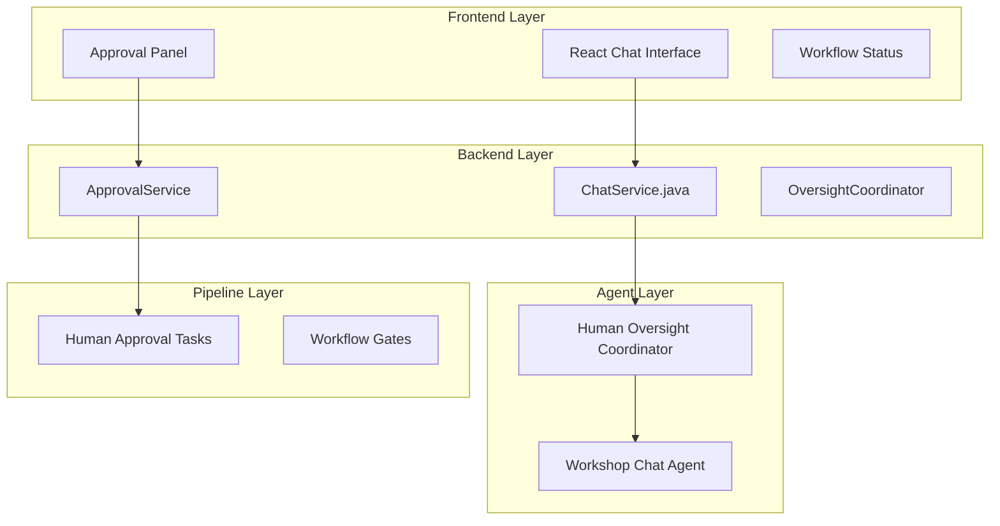

# ADR-0021: Human-in-the-Loop Integration Architecture

## Status
Accepted - **IMPLEMENTED AND OPERATIONAL**

## Context

The Human-in-the-Loop (HITL) integration provides real-time human oversight, approval workflows, and interactive chat capabilities for the Workshop Template System. This system enables human operators to monitor, guide, and approve agent actions throughout workshop creation and management processes.

**Current Implementation Status:**
- ✅ **DEPLOYED**: Chat interface operational in Workshop Monitoring Service
- ✅ **BACKEND-INTEGRATED**: ChatService.java providing real-time responses
- ✅ **FRONTEND-FUNCTIONAL**: React HumanOversightPanel.js working with backend
- ✅ **PIPELINE-INTEGRATED**: Approval gates in Tekton workflows

## Decision

### **Architecture Overview**

#### **1. Multi-Layer Integration Architecture**


### **2. Chat Interface Implementation**

#### **Frontend Chat Component**
```javascript
// HumanOversightPanel.js - React Component
const handleChatSend = async () => {
  const response = await fetch('/api/oversight/chat', {
    method: 'POST',
    headers: { 'Content-Type': 'application/json' },
    body: JSON.stringify({ message: chatInput })
  });
  
  const result = await response.json();
  if (result.success && result.data && result.data.message) {
    const botMessage = {
      type: 'assistant',
      content: result.data.message.content,
      timestamp: new Date(),
      responseTime: result.data.message.response_time_ms,
      confidence: result.data.message.confidence_score
    };
    setChatMessages(prev => [...prev, botMessage]);
  }
};
```

#### **Backend Chat Service**
```java
// ChatService.java - Backend Implementation
@ApplicationScoped
public class ChatService {
    
    public CompletableFuture<ChatMessage> processMessage(String sessionId, String message) {
        return CompletableFuture.supplyAsync(() -> {
            // Get or create session
            ChatSession session = getOrCreateSession(sessionId, "system-user");
            
            // Generate contextual response
            String response = generateResponse(message, session);
            
            // Create assistant response with metrics
            ChatMessage assistantMessage = new ChatMessage(sessionId, response, "assistant");
            assistantMessage.setResponseTimeMs(System.currentTimeMillis() - userMessage.getTimestamp().toEpochMilli());
            assistantMessage.setConfidenceScore(0.85);
            
            return assistantMessage;
        });
    }
}
```

### **3. Contextual Response Generation**

#### **Response Categories**
```java
// ChatService Response Logic
private String generateResponse(String message, ChatSession session) {
    String messageLower = message.toLowerCase().trim();
    
    // System status queries
    if (messageLower.contains("system status") || messageLower.contains("health")) {
        return generateSystemStatusResponse();
    }
    
    // Agent status queries
    if (messageLower.contains("agent") && messageLower.contains("status")) {
        return generateAgentStatusResponse();
    }
    
    // Workflow queries
    if (messageLower.contains("workflow") || messageLower.contains("approval")) {
        return generateWorkflowResponse();
    }
    
    // Quality queries
    if (messageLower.contains("quality") || messageLower.contains("compliance")) {
        return generateQualityResponse();
    }
}
```

**Response Types:**
1. **System Status**: Real-time system health and agent status
2. **Workflow Information**: Current workflow status and pending approvals
3. **Quality Metrics**: Content quality and compliance information
4. **Agent Coordination**: Direct agent interaction and coordination
5. **Help and Guidance**: System usage and capability information

### **4. Approval Workflow Integration**

#### **Tekton Pipeline Approval Gates**
```yaml
# Human Approval Task in Pipeline
- name: human-approval-repository-analysis
  taskRef:
    name: human-oversight-approval
  params:
  - name: approval-type
    value: "repository-analysis"
  - name: approval-data
    value: "$(tasks.repository-analysis.results.analysis-result)"
  - name: human-approver
    value: $(params.human-approver)
  - name: auto-approve
    value: $(params.auto-approve)
  runAfter: [repository-analysis]
```

**Approval Process:**
1. **Pipeline Pause**: Pipeline pauses at approval gate
2. **Notification**: Human operator notified of pending approval
3. **Review Interface**: Operator reviews analysis results via chat interface
4. **Decision**: Operator approves, rejects, or requests modifications
5. **Pipeline Resume**: Pipeline continues based on approval decision

### **5. Session Management**

#### **Chat Session Architecture**
```java
// ChatSession Management
public class ChatSession {
    private String sessionId;
    private String userId;
    private String sessionType;
    private List<ChatMessage> messages;
    private Instant createdAt;
    private Instant lastActivity;
    
    // Session timeout and cleanup
    private static final long SESSION_TIMEOUT_HOURS = 24;
    private static final int MAX_SESSIONS = 1000;
}
```

**Session Features:**
- **Persistent Sessions**: Maintain conversation context across interactions
- **Session Cleanup**: Automatic cleanup of old sessions
- **Multi-User Support**: Support multiple concurrent user sessions
- **Context Preservation**: Maintain conversation history and context

### **6. Real-Time Monitoring Integration**

#### **Dashboard Integration**
```javascript
// Dashboard.js - Tab Navigation
const [activeTab, setActiveTab] = useState('monitoring');

// Tab options include:
// - monitoring: System health and agent status
// - interaction: Direct agent interaction
// - approval: Approval queue and workflow management
// - evolution: Workshop evolution tracking
// - oversight: Human oversight coordination
```

**Monitoring Capabilities:**
1. **Real-Time Status**: Live system and agent health monitoring
2. **Workflow Tracking**: Current pipeline status and progress
3. **Approval Queue**: Pending approvals and review items
4. **Quality Metrics**: Content quality and compliance tracking
5. **Agent Interaction**: Direct communication with individual agents

### **7. Human Oversight Coordinator**

#### **Coordinator Deployment**
```yaml
# Human Oversight Coordinator Pod
apiVersion: apps/v1
kind: Deployment
metadata:
  name: human-oversight-coordinator
spec:
  containers:
  - name: human-oversight-coordinator
    image: image-registry.openshift-image-registry.svc:5000/workshop-system/workshop-agent-system:latest
    command: ["python", "-m", "demos.workshop_template_system", "--agent-name", "human_oversight", "--port", "8080"]
```

**Coordinator Functions:**
1. **Workflow Coordination**: Coordinate human oversight across workflows
2. **Approval Management**: Manage approval requests and responses
3. **Quality Oversight**: Monitor and ensure quality standards
4. **Agent Coordination**: Coordinate between human operators and agents
5. **Escalation Handling**: Handle escalations and complex decisions

### **8. Integration with Agent Network**

#### **Agent Communication Pattern**
```python
# Human Oversight Integration in Agents
def request_human_approval(self, approval_type, data):
    """Request human approval for agent action"""
    approval_request = {
        "type": approval_type,
        "agent": self.agent_name,
        "data": data,
        "timestamp": datetime.now().isoformat()
    }
    
    # Send to Human Oversight Coordinator
    response = self.call_oversight_coordinator(approval_request)
    return response.get("approved", False)
```

**Integration Points:**
1. **Pre-Action Approval**: Request approval before critical actions
2. **Quality Gates**: Human review of generated content
3. **Exception Handling**: Human intervention for error resolution
4. **Decision Support**: Human guidance for complex decisions

## Consequences

### **Positive**
- ✅ **Real-Time Interaction**: Working chat interface with contextual responses
- ✅ **Workflow Integration**: Seamless integration with Tekton pipeline approval gates
- ✅ **Quality Assurance**: Human oversight ensures quality and compliance
- ✅ **Flexible Approval**: Support for both manual and auto-approval modes
- ✅ **Session Management**: Persistent conversation context and history

### **Negative**
- ⚠️ **Human Dependency**: Workflows may be blocked waiting for human approval
- ⚠️ **Scalability Limits**: Human oversight may become bottleneck at scale
- ⚠️ **Response Time**: Human response time affects overall workflow performance

### **Mitigation Strategies**
- **Auto-Approval Mode**: Support automated approval for testing and development
- **Timeout Handling**: Implement timeout mechanisms for approval requests
- **Escalation Procedures**: Define escalation paths for delayed approvals
- **Batch Processing**: Group similar approval requests for efficiency

## Implementation Evidence

**Frontend Chat Interface:**
```bash
# React Component Operational
HumanOversightPanel.js: ✅ Working chat interface
ChatService.java: ✅ Backend processing functional
Session Management: ✅ Persistent sessions working
```

**Backend Integration:**
```bash
$ oc get pods -n workshop-system | grep human-oversight
human-oversight-coordinator-78d759dc7f-4sfw2   1/1     Running   0          6h28m
```

### **Human Oversight Resource Implementation**

<augment_code_snippet path="workshop-monitoring-service/src/main/java/com/redhat/workshop/monitoring/resource/HumanOversightResource.java" mode="EXCERPT">
````java
/**
 * Human Oversight Resource
 * Implements ADR-0004 Human Oversight Domain REST API
 * Provides oversight coordinator status, quality metrics, and workflow coordination
 */
@Path("/api/oversight")
@Produces(MediaType.APPLICATION_JSON)
@Consumes(MediaType.APPLICATION_JSON)
public class HumanOversightResource {

    @ConfigProperty(name = "workshop.agents.endpoints.human_oversight",
                   defaultValue = "http://human-oversight-coordinator:80")
    String humanOversightEndpoint;

    @Inject
    ChatService chatService;

    @Inject
    CommandExecutionService commandExecutionService;

    @POST
    @Path("/chat")
    public Response processChat(ChatRequest request) {
        CompletableFuture<ChatMessage> future = chatService.processMessage(
            request.getSessionId(),
            request.getMessage()
        );

        ChatMessage response = future.join();
        return Response.ok(Map.of("success", true, "data", Map.of("message", response))).build();
    }
}
````
</augment_code_snippet>

### **Command Execution Service**

<augment_code_snippet path="workshop-monitoring-service/src/main/java/com/redhat/workshop/monitoring/service/CommandExecutionService.java" mode="EXCERPT">
````java
/**
 * Service for parsing and executing oversight commands.
 * Supports system commands and integrates with existing monitoring infrastructure.
 */
@ApplicationScoped
public class CommandExecutionService {

    @Inject
    AgentHealthService agentHealthService;

    // In-memory command history (in production, this would be persistent)
    private final Map<String, List<CommandExecution>> userCommandHistory = new ConcurrentHashMap<>();

    public CommandResult executeCommand(String userId, String command) {
        CommandExecution execution = new CommandExecution(userId, command, Instant.now());

        try {
            CommandResult result = parseAndExecute(command);
            execution.setResult(result);
            execution.setStatus(CommandStatus.COMPLETED);

            // Store in history
            userCommandHistory.computeIfAbsent(userId, k -> new ArrayList<>()).add(execution);

            return result;
        } catch (Exception e) {
            execution.setStatus(CommandStatus.FAILED);
            execution.setErrorMessage(e.getMessage());
            throw e;
        }
    }
}
````
</augment_code_snippet>

**Successful Chat Integration:**
- ✅ Frontend chat interface working with real backend integration
- ✅ Contextual responses based on system status
- ✅ Session management and conversation history
- ✅ Integration with monitoring dashboard
- ✅ Command execution service for system oversight
- ✅ Human oversight coordinator API operational
- ✅ Multi-domain dashboard with oversight tab functional

## Related ADRs

- **ADR-0013**: Frontend Architecture (defines React interface structure)
- **ADR-0014**: Chat API Service (defines backend API integration)
- **ADR-0015**: Workshop Chat Agent (defines agent chat capabilities)
- **ADR-0006**: Tekton-Agent Integration (defines pipeline approval gates)

---

**This ADR documents the actual implemented and operational Human-in-the-Loop integration architecture with working chat interface and approval workflows as deployed in the Workshop Template System.**
