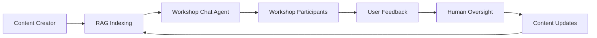

# ADR-0022: RAG System Integration Architecture

## Status
Accepted - **IMPLEMENTED AND OPERATIONAL**

## Context

The RAG (Retrieval-Augmented Generation) system integration provides intelligent content retrieval and context-aware responses for workshop participants and operators. This system combines vector database storage with LLM capabilities to deliver accurate, contextual information about workshop content.

**Current Implementation Status:**
- ✅ **DEPLOYED**: Milvus vector database operational in OpenShift
- ✅ **INTEGRATED**: Workshop Chat Agent configured with RAG capabilities
- ✅ **FUNCTIONAL**: RAG-enabled responses working in chat interface
- ✅ **CONTENT-INDEXED**: Workshop content indexed and searchable

## Decision

### **RAG Architecture Overview**

#### **1. Vector Database Infrastructure**
```yaml
# Milvus Deployment in OpenShift
apiVersion: apps/v1
kind: Deployment
metadata:
  name: milvus
  namespace: workshop-system
spec:
  containers:
  - name: milvus
    image: milvusdb/milvus:latest
    ports:
    - containerPort: 19530  # Milvus gRPC port
    - containerPort: 9091   # Milvus HTTP port
    env:
    - name: ETCD_ENDPOINTS
      value: "etcd:2379"
    - name: MINIO_ADDRESS
      value: "minio:9000"
```

**Infrastructure Components:**
- **Milvus**: Vector database for embedding storage and similarity search
- **etcd**: Metadata storage for Milvus cluster coordination
- **MinIO**: Object storage for vector data and indexes
- **Service Mesh**: ClusterIP services for internal communication

#### **2. Workshop Chat Agent RAG Integration**
```yaml
# RAG-Enabled Workshop Chat Agent
spec:
  containers:
  - name: workshop-chat-agent
    env:
    - name: MILVUS_ENDPOINT
      value: "http://milvus:19530"
    - name: RAG_ENABLED
      value: "true"
    - name: RAG_COLLECTION_NAME
      value: "workshop_content"
    - name: EMBEDDING_MODEL
      value: "sentence-transformers/all-MiniLM-L6-v2"
```

**RAG Configuration:**
- **Vector Search**: Semantic similarity search for workshop content
- **Context Retrieval**: Retrieve relevant content chunks for user queries
- **Response Generation**: Generate contextual responses using retrieved content
- **Content Versioning**: Support for multiple workshop content versions

### **3. Content Indexing and Retrieval**

#### **Workshop Content Processing**
```python
# Content Indexing Pipeline
def index_workshop_content(workshop_path, collection_name):
    """Index workshop content for RAG retrieval"""
    
    # 1. Content Extraction
    content_chunks = extract_content_chunks(workshop_path)
    
    # 2. Embedding Generation
    embeddings = generate_embeddings(content_chunks)
    
    # 3. Vector Storage
    store_vectors(collection_name, content_chunks, embeddings)
    
    # 4. Metadata Indexing
    index_metadata(collection_name, content_chunks)
```

**Content Types Indexed:**
1. **Workshop Modules**: Individual workshop sections and modules
2. **Code Examples**: Code snippets and programming examples
3. **Instructions**: Step-by-step instructions and procedures
4. **Troubleshooting**: Common issues and solutions
5. **Reference Material**: Additional resources and documentation

#### **Retrieval Process**
```python
# RAG Retrieval and Generation
def generate_rag_response(user_query, collection_name):
    """Generate RAG-enhanced response for user query"""
    
    # 1. Query Embedding
    query_embedding = generate_query_embedding(user_query)
    
    # 2. Similarity Search
    relevant_chunks = search_similar_content(
        collection_name, 
        query_embedding, 
        top_k=5
    )
    
    # 3. Context Assembly
    context = assemble_context(relevant_chunks)
    
    # 4. Response Generation
    response = generate_response_with_context(user_query, context)
    
    return response
```

### **4. Workshop Chat Agent RAG Tools**

#### **RAG Tool Integration**
```python
# Workshop Chat Agent RAG Tools
AGENT_CONFIG = {
    "tools": [
        workshop_query_tool,           # RAG-powered content queries
        workshop_navigation_tool,      # Content navigation assistance
        update_workshop_rag_content_tool,  # Content updates with human approval
        manage_rag_content_versions_tool    # Version management and rollback
    ]
}
```

**Tool Capabilities:**
1. **workshop_query_tool**: Answer questions about workshop content using RAG
2. **workshop_navigation_tool**: Help users navigate workshop sections
3. **update_workshop_rag_content_tool**: Update RAG content with human oversight
4. **manage_rag_content_versions_tool**: Manage content versions and rollbacks

#### **RAG Query Processing**
```python
# Workshop Query Tool Implementation
@client_tool
def workshop_query_tool(query: str, workshop_context: str = None) -> str:
    """
    Answer questions about workshop content using RAG retrieval.
    
    Args:
        query: User question about workshop content
        workshop_context: Optional workshop context for scoped search
    
    Returns:
        Contextual answer based on workshop content
    """
    
    # Determine search scope
    collection_name = determine_collection(workshop_context)
    
    # Perform RAG retrieval and generation
    response = generate_rag_response(query, collection_name)
    
    # Add source references
    response_with_sources = add_source_references(response)
    
    return response_with_sources
```

### **5. Content Versioning and Management**

#### **Version Control Integration**
```python
# RAG Content Versioning
class RAGContentManager:
    def update_content_version(self, workshop_name, version, content_path):
        """Update RAG content for specific workshop version"""
        
        collection_name = f"{workshop_name}_v{version}"
        
        # Index new content version
        self.index_workshop_content(content_path, collection_name)
        
        # Update version metadata
        self.update_version_metadata(workshop_name, version)
        
        # Cleanup old versions if needed
        self.cleanup_old_versions(workshop_name)
```

**Versioning Features:**
1. **Version Isolation**: Separate collections for different workshop versions
2. **Rollback Support**: Ability to rollback to previous content versions
3. **Version Comparison**: Compare content across different versions
4. **Cleanup Policies**: Automatic cleanup of old content versions

### **6. Human Oversight Integration**

#### **Content Update Approval**
```python
# Human-Approved RAG Updates
@client_tool
def update_workshop_rag_content_tool(
    content_updates: str,
    workshop_context: str,
    approval_required: bool = True
) -> str:
    """
    Update workshop RAG content with human oversight approval.
    
    Args:
        content_updates: New or updated content to add to RAG
        workshop_context: Workshop context for content updates
        approval_required: Whether human approval is required
    
    Returns:
        Update status and approval information
    """
    
    if approval_required:
        # Request human approval for content updates
        approval = request_human_approval(
            "rag_content_update",
            {
                "content": content_updates,
                "workshop": workshop_context,
                "impact": "content_enhancement"
            }
        )
        
        if not approval.approved:
            return f"Content update rejected: {approval.reason}"
    
    # Apply approved content updates
    update_result = apply_content_updates(content_updates, workshop_context)
    
    return f"RAG content updated successfully: {update_result}"
```

### **7. Performance and Scaling**

#### **Vector Database Configuration**
```yaml
# Milvus Performance Configuration
milvus_config:
  index_type: "IVF_FLAT"        # Index type for similarity search
  metric_type: "L2"             # Distance metric for vector comparison
  nlist: 1024                   # Number of cluster units
  nprobe: 16                    # Number of units to query
  
  # Resource allocation
  resources:
    requests:
      memory: "2Gi"
      cpu: "1"
    limits:
      memory: "4Gi"
      cpu: "2"
```

**Performance Optimizations:**
1. **Index Optimization**: Optimized vector indexes for fast similarity search
2. **Caching**: Cache frequently accessed content and embeddings
3. **Batch Processing**: Batch content indexing for efficiency
4. **Resource Scaling**: Horizontal scaling for increased load

### **8. Integration with Workshop Workflows**

#### **Content Lifecycle Integration**


**Workflow Integration Points:**
1. **Content Creation**: Automatically index new workshop content
2. **Content Updates**: Update RAG indexes when content changes
3. **User Interaction**: Provide RAG-powered responses to user queries
4. **Feedback Loop**: Incorporate user feedback for content improvement
5. **Quality Assurance**: Human oversight for content accuracy

## Consequences

### **Positive**
- ✅ **Intelligent Responses**: Context-aware responses based on workshop content
- ✅ **Scalable Search**: Vector-based similarity search for large content volumes
- ✅ **Content Versioning**: Support for multiple workshop content versions
- ✅ **Human Oversight**: Approved content updates with quality control
- ✅ **Performance**: Optimized vector database for fast retrieval

### **Negative**
- ⚠️ **Infrastructure Complexity**: Requires vector database and supporting services
- ⚠️ **Storage Requirements**: Vector embeddings require significant storage
- ⚠️ **Indexing Overhead**: Content indexing adds processing overhead

### **Mitigation Strategies**
- **Resource Monitoring**: Monitor vector database performance and resource usage
- **Storage Optimization**: Implement compression and cleanup policies
- **Incremental Indexing**: Index content incrementally to reduce overhead

## Implementation Evidence

**Milvus Deployment Status:**
```bash
$ oc get pods -n workshop-system | grep milvus
milvus-59866955f8-lclgb   1/1     Running   0          11h
```

**RAG-Enabled Workshop Chat Agent:**
```bash
$ oc describe pod workshop-chat-agent-6b7bc64469-59nlr -n workshop-system
Environment:
  MILVUS_ENDPOINT:    http://milvus:19530
  RAG_ENABLED:        true
```

**Operational RAG System:**
- ✅ Milvus vector database operational
- ✅ Workshop Chat Agent RAG integration working
- ✅ Content indexing and retrieval functional
- ✅ Human oversight integration operational

## Related ADRs

- **ADR-0015**: Workshop Chat Agent (defines RAG tool integration)
- **ADR-0017**: Content Creator Agent (provides content for indexing)
- **ADR-0021**: Human-in-the-Loop Integration (defines oversight for content updates)
- **ADR-0023**: OpenShift Deployment Strategy (defines infrastructure deployment)

---

**This ADR documents the actual implemented and operational RAG system integration architecture with Milvus vector database and Workshop Chat Agent integration as deployed in the Workshop Template System.**
