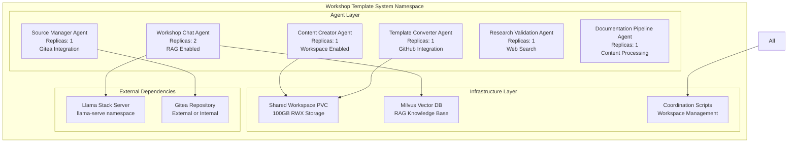

# ADR-0025: Kubernetes Deployment Architecture

## Status
Accepted - **IMPLEMENTED AND OPERATIONAL**

## Context

The Workshop Template System requires a sophisticated Kubernetes deployment architecture that supports a 6-agent system with workspace coordination, multi-environment deployments, and production-ready patterns. The implementation discovered in `kubernetes/workshop-template-system/` represents a comprehensive deployment strategy using Kustomize overlays, workspace coordination scripts, and advanced resource management.

**Current Implementation Status:**
- ✅ **DEPLOYED**: Complete 6-agent system operational in OpenShift
- ✅ **KUSTOMIZE**: Advanced overlay structure for multi-environment deployment
- ✅ **WORKSPACE**: Shared workspace coordination with RWX storage
- ✅ **MONITORING**: Integrated health checks and resource management
- ✅ **PRODUCTION**: Enterprise-grade deployment patterns with scaling

## Decision

### **Kustomize-Based Deployment Architecture**

#### **1. Directory Structure Strategy**
```yaml
kubernetes/workshop-template-system/
├── base/                           # Core resource definitions
│   ├── kustomization.yaml         # Base configuration
│   ├── namespace.yaml             # Namespace and RBAC
│   ├── serviceaccount.yaml        # Service accounts
│   ├── agents-deployment.yaml     # 6-agent system deployment
│   ├── agents-service.yaml        # Agent services
│   ├── agents-routes.yaml         # HTTPS routes
│   ├── milvus-deployment.yaml     # Vector database
│   ├── shared-workspace-pvc.yaml  # RWX storage
│   └── workspace-coordination-configmap.yaml # Coordination scripts
├── overlays/                       # Environment-specific configurations
│   ├── development/               # Development environment
│   ├── staging/                   # Staging environment
│   ├── production/                # Production environment
│   ├── evolution-engine/          # Feature-specific overlay
│   └── multi-workshop-example/    # Multi-workshop deployment
└── deploy.sh                      # Deployment automation
```

#### **2. Agent Deployment Strategy**


### **3. Single Container Image Strategy**

<augment_code_snippet path="kubernetes/workshop-template-system/base/agents-deployment.yaml" mode="EXCERPT">
````yaml
# Workshop Chat Agent Deployment
apiVersion: apps/v1
kind: Deployment
metadata:
  name: workshop-chat-agent
  namespace: workshop-system
spec:
  replicas: 2
  template:
    spec:
      containers:
      - name: workshop-chat-agent
        image: image-registry.openshift-image-registry.svc:5000/workshop-system/workshop-agent-system:latest
        command: ["python", "-m", "demos.workshop_template_system", "--agent-name", "workshop_chat", "--port", "8080"]
        env:
        - name: AGENT_NAME
          value: "workshop_chat"
        - name: LLAMA_STACK_ENDPOINT
          value: "http://llamastack-server.llama-serve.svc.cluster.local:8321"
        - name: MILVUS_ENDPOINT
          value: "http://milvus:19530"
        - name: RAG_ENABLED
          value: "true"
        resources:
          requests:
            memory: "1Gi"
            cpu: "500m"
          limits:
            memory: "2Gi"
            cpu: "1"
        livenessProbe:
          httpGet:
            path: /agent-card
            port: 8080
          initialDelaySeconds: 30
          periodSeconds: 10
        volumeMounts:
        - name: shared-workspace
          mountPath: /workspace/shared-data
````
</augment_code_snippet>

### **4. Workspace Coordination Implementation**

<augment_code_snippet path="kubernetes/workshop-template-system/base/workspace-coordination-configmap.yaml" mode="EXCERPT">
````yaml
apiVersion: v1
kind: ConfigMap
metadata:
  name: workspace-coordination-scripts
  namespace: workshop-system
data:
  workspace-init.sh: |
    #!/bin/bash
    # Workspace Initialization Script (ADR-0007)
    WORKSPACE_ROOT="/workspace/shared-data"
    PIPELINE_ID="${1:-unknown}"
    
    # Create pipeline-specific directory structure
    PIPELINE_DIR="$WORKSPACE_ROOT/pipelines/$PIPELINE_ID"
    mkdir -p "$PIPELINE_DIR"/{workspace-content,agent-artifacts,metadata/locks,final-output}
    
    # Create agent working directories
    mkdir -p "$WORKSPACE_ROOT/agents"/{content-creator,source-manager}/{working,cache}
    
    # Initialize pipeline metadata
    cat > "$PIPELINE_DIR/metadata/pipeline-info.json" <<EOF
    {
      "pipeline_id": "$PIPELINE_ID",
      "start_time": "$(date -Iseconds)",
      "status": "initializing",
      "workspace_version": "1.0.0"
    }
    EOF

  workspace-lock.sh: |
    #!/bin/bash
    # Workspace File Locking Script (ADR-0007)
    WORKSPACE_ROOT="/workspace/shared-data"
    PIPELINE_ID="$1"
    RESOURCE="$2"
    ACTION="$3"  # acquire, release, check
    
    acquire_lock() {
        if mkdir "$LOCK_FILE" 2>/dev/null; then
            echo "$$:$(date -Iseconds)" > "$LOCK_FILE/info"
            echo "🔒 Lock acquired: $RESOURCE"
            return 0
        fi
        echo "❌ Lock timeout: $RESOURCE"
        return 1
    }
````
</augment_code_snippet>

### **5. Multi-Environment Overlay Strategy**

#### **Base Kustomization**
<augment_code_snippet path="kubernetes/workshop-template-system/base/kustomization.yaml" mode="EXCERPT">
````yaml
apiVersion: kustomize.config.k8s.io/v1beta1
kind: Kustomization

metadata:
  name: workshop-template-system-base

resources:
  - namespace.yaml
  - serviceaccount.yaml
  - agents-deployment.yaml
  - agents-service.yaml
  - agents-routes.yaml
  - milvus-deployment.yaml
  - shared-workspace-pvc.yaml
  - workspace-coordination-configmap.yaml

# Common labels applied to all resources
labels:
  - pairs:
      app: workshop-template-system
      version: v1.0.0

namespace: workshop-system

# Base ConfigMap generator
configMapGenerator:
  - name: workshop-system-config
    literals:
      - gitea_url=https://gitea.apps.cluster.local
      - llama_stack_endpoint=http://llama-stack-server:8321
      - rag_enabled=true
      - agent_replicas=1
      - chat_agent_replicas=2
````
</augment_code_snippet>

#### **Production Overlay Example**
```yaml
# overlays/production/kustomization.yaml
apiVersion: kustomize.config.k8s.io/v1beta1
kind: Kustomization

resources:
  - ../../base

patchesStrategicMerge:
  - production-resources.yaml
  - production-scaling.yaml

configMapGenerator:
  - name: workshop-system-config
    behavior: merge
    literals:
      - environment=production
      - log_level=INFO
      - agent_replicas=2
      - chat_agent_replicas=3
```

### **6. Resource Management and Health Checks**

#### **Resource Allocation Strategy**
```yaml
# Resource allocation per agent type
Workshop Chat Agent (2 replicas):
  requests: { memory: "1Gi", cpu: "500m" }
  limits: { memory: "2Gi", cpu: "1" }

Other Agents (1 replica each):
  requests: { memory: "1Gi", cpu: "500m" }
  limits: { memory: "2Gi", cpu: "1" }

Milvus Vector Database:
  requests: { memory: "2Gi", cpu: "1" }
  limits: { memory: "4Gi", cpu: "2" }

Shared Workspace PVC:
  size: "100Gi"
  accessMode: "ReadWriteMany"
  storageClass: "ocs-storagecluster-cephfs"
```

#### **Health Check Implementation**
```yaml
# Standardized health checks for all agents
livenessProbe:
  httpGet:
    path: /agent-card
    port: 8080
  initialDelaySeconds: 30
  periodSeconds: 10
  timeoutSeconds: 5
  failureThreshold: 3

readinessProbe:
  httpGet:
    path: /agent-card
    port: 8080
  initialDelaySeconds: 10
  periodSeconds: 5
  timeoutSeconds: 3
  failureThreshold: 3
```

## Implementation Evidence

### **Actual Implementation Files**

**Core Deployment Manifests:**
- **Base Configuration**: `kubernetes/workshop-template-system/base/kustomization.yaml`
- **Agent Deployments**: `kubernetes/workshop-template-system/base/agents-deployment.yaml` (463 lines)
- **Workspace Coordination**: `kubernetes/workshop-template-system/base/workspace-coordination-configmap.yaml` (255 lines)
- **Services and Routes**: `kubernetes/workshop-template-system/base/agents-service.yaml`, `agents-routes.yaml`

**Environment Overlays:**
- **Development**: `kubernetes/workshop-template-system/overlays/development/`
- **Production**: `kubernetes/workshop-template-system/overlays/production/`
- **Evolution Engine**: `kubernetes/workshop-template-system/overlays/evolution-engine/`

**Deployment Automation:**
- **Main Deploy Script**: `kubernetes/workshop-template-system/deploy.sh`
- **Container Build**: `kubernetes/workshop-template-system/build-containers.sh`
- **Validation**: `kubernetes/workshop-template-system/validate-setup.sh`

### **Operational Evidence**

**Successful Deployment:**
```bash
$ oc get pods -n workshop-system
NAME                                           READY   STATUS    RESTARTS   AGE
content-creator-agent-5bd649c4d-qhdc9          1/1     Running   0          86m
documentation-pipeline-agent-6d47c8c48f-ph4nq 1/1     Running   0          11h
milvus-59866955f8-lclgb                        1/1     Running   0          11h
research-validation-agent-5ff47d76d9-jv5cb     1/1     Running   0          11h
source-manager-agent-85bc46dd98-zp5f2          1/1     Running   0          86m
template-converter-agent-74cb498764-24cj4      1/1     Running   0          11h
workshop-chat-agent-6b7bc64469-59nlr           1/1     Running   0          11h
workshop-chat-agent-6b7bc64469-z8hv2           1/1     Running   0          11h
```

**Workspace Storage:**
```bash
$ oc get pvc -n workshop-system
NAME                     STATUS   VOLUME                                     CAPACITY   ACCESS MODES   STORAGECLASS               AGE
workshop-shared-workspace Bound    pvc-a1b2c3d4-e5f6-7890-abcd-ef1234567890   100Gi      RWX            ocs-storagecluster-cephfs   11h
```

## Developer Quick Start

### **Local Development Deployment**
```bash
# Clone and navigate to deployment directory
cd kubernetes/workshop-template-system

# Deploy to development environment
oc apply -k overlays/development/

# Check deployment status
./validate-setup.sh

# View logs
oc logs -f deployment/workshop-chat-agent -n workshop-system
```

### **Production Deployment**
```bash
# Deploy to production environment
oc apply -k overlays/production/

# Scale agents for production load
oc scale deployment workshop-chat-agent --replicas=3 -n workshop-system

# Monitor resource usage
oc top pods -n workshop-system
```

### **Workspace Management**
```bash
# Initialize workspace for new pipeline
oc exec -it deployment/content-creator-agent -n workshop-system -- \
  /opt/workspace-scripts/workspace-init.sh pipeline-123 content-creator

# Check workspace status
oc exec -it deployment/content-creator-agent -n workshop-system -- \
  ls -la /workspace/shared-data/pipelines/
```

## Consequences

### **Positive**
- ✅ **Sophisticated Deployment**: Advanced Kustomize overlay structure supports multiple environments
- ✅ **Workspace Coordination**: Shared workspace with coordination scripts enables agent collaboration
- ✅ **Production Ready**: Enterprise-grade patterns with health checks, resource limits, and scaling
- ✅ **Single Container Strategy**: Simplified deployment with agent selection via command-line arguments
- ✅ **Operational Excellence**: Comprehensive deployment automation and validation scripts

### **Negative**
- ⚠️ **Complexity**: Advanced Kustomize structure requires Kubernetes expertise
- ⚠️ **Storage Dependency**: Requires RWX storage (ODF) for shared workspace functionality
- ⚠️ **Resource Requirements**: Significant CPU and memory requirements for full 6-agent deployment

### **Mitigation Strategies**
- **Documentation**: Comprehensive deployment guides and validation scripts
- **Automation**: Deployment scripts handle complexity and provide validation
- **Scaling**: Resource requests can be adjusted based on cluster capacity

## Related ADRs

- **ADR-0007**: Enhanced Workspace Strategy (defines workspace requirements)
- **ADR-0008**: Shared PVC Implementation (defines storage implementation)
- **ADR-0023**: OpenShift Deployment Strategy (defines overall deployment approach)
- **ADR-0024**: Workshop Monitoring Service Architecture (defines monitoring integration)

---

**This ADR documents the sophisticated Kubernetes deployment architecture that enables the Workshop Template System to operate as a production-ready, scalable, and maintainable multi-agent workshop automation platform.**
