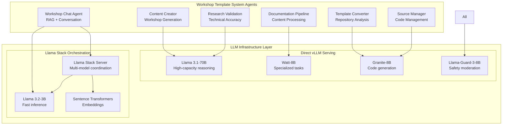

# ADR-0026: LLM Infrastructure Architecture

## Status
Accepted - **IMPLEMENTED AND OPERATIONAL**

## Context

The Workshop Template System requires sophisticated LLM infrastructure to support 6 agents with diverse AI capabilities including repository analysis, content generation, research validation, and natural language interaction. The implementation discovered in `kubernetes/llama-serve/` and `kubernetes/llama-stack/` represents a comprehensive multi-model serving architecture with dual serving strategies and integrated safety mechanisms.

**Current Implementation Status:**
- ✅ **DEPLOYED**: Multiple LLM models operational (Llama 3.1-70B, 3.2-3B, Granite-8B, Watt-8B)
- ✅ **DUAL SERVING**: Both direct vLLM serving and Llama Stack orchestration
- ✅ **AGENT INTEGRATION**: All 6 agents connected to LLM infrastructure
- ✅ **SAFETY INTEGRATION**: Llama-Guard-3-8B safety model operational
- ✅ **PRODUCTION READY**: HuggingFace token management and resource allocation

## Decision

### **Multi-Model Serving Architecture**

#### **1. Dual Serving Strategy**


#### **2. Model Selection Strategy**

**High-Capacity Models (70B Parameters):**
- **Llama 3.1-70B**: Complex reasoning, content creation, research validation
- **Use Cases**: Content Creator Agent, Research Validation Agent
- **Deployment**: Direct vLLM serving with high resource allocation

**Efficient Models (3B-8B Parameters):**
- **Llama 3.2-3B**: Fast inference, conversational AI, real-time responses
- **Granite-8B**: Code analysis, repository understanding, technical tasks
- **Watt-8B**: Specialized workshop content processing
- **Use Cases**: Workshop Chat Agent, Template Converter, Source Manager

**Specialized Models:**
- **Llama-Guard-3-8B**: Content safety and moderation
- **Sentence Transformers**: Vector embeddings for RAG system

### **3. Implementation Patterns**

#### **Direct vLLM Serving Configuration**

<augment_code_snippet path="kubernetes/llama-serve/llama3.1-70b/vllm.yaml" mode="EXCERPT">
````yaml
apiVersion: apps/v1
kind: Deployment
metadata:
  name: vllm-llama31-70b
  namespace: llama-serve
spec:
  replicas: 1
  template:
    spec:
      containers:
      - name: vllm-server
        image: vllm/vllm-openai:latest
        command:
        - python
        - -m
        - vllm.entrypoints.openai.api_server
        - --model
        - meta-llama/Llama-3.1-70B-Instruct
        - --served-model-name
        - llama-3.1-70b
        - --host
        - 0.0.0.0
        - --port
        - "8000"
        - --tensor-parallel-size
        - "4"
        - --max-model-len
        - "128000"
        env:
        - name: HF_TOKEN
          valueFrom:
            secretKeyRef:
              name: huggingface-secret
              key: HF_TOKEN
        resources:
          requests:
            memory: "32Gi"
            cpu: "8"
            nvidia.com/gpu: "4"
          limits:
            memory: "64Gi"
            cpu: "16"
            nvidia.com/gpu: "4"
````
</augment_code_snippet>

#### **Llama Stack Orchestration Configuration**

<augment_code_snippet path="kubernetes/llama-stack/run.yaml" mode="EXCERPT">
````yaml
version: '2'
image_name: remote-vllm-milvus
apis:
- agents
- inference
- safety
- vector_io
- tool_runtime
providers:
  inference:
  - provider_id: llama-3b
    provider_type: remote::vllm
    config:
      url: ${env.LLAMA3B_URL}
      max_tokens: 128000
      api_token: fake
      tls_verify: false
  - provider_id: granite
    provider_type: remote::vllm
    config:
      url: ${env.GRANITE_URL}
      max_tokens: 128000
      api_token: fake
      tls_verify: false
  - provider_id: sentence-transformers
    provider_type: inline::sentence-transformers
    config: {}
  vector_io:
  - provider_id: milvus
    provider_type: inline::milvus
    config:
      db_path: ${env.MILVUS_DB_PATH}
  safety:
  - provider_id: llama-guard
    provider_type: remote::vllm
    config:
      url: ${env.SAFETY_MODEL_URL}
      model: meta-llama/Llama-Guard-3-8B
````
</augment_code_snippet>

#### **Agent-LLM Integration Pattern**

<augment_code_snippet path="demos/workshop_template_system/agents/workshop_chat/config.py" mode="EXCERPT">
````python
# Workshop Chat Agent LLM Configuration
LLAMA_STACK_ENDPOINT = os.getenv('LLAMA_STACK_ENDPOINT', 'http://llamastack-server.llama-serve.svc.cluster.local:8321')
INFERENCE_MODEL = os.getenv('INFERENCE_MODEL', 'llama-3b')
RAG_ENABLED = os.getenv('RAG_ENABLED', 'true').lower() == 'true'
SAFETY_ENABLED = os.getenv('SAFETY_ENABLED', 'true').lower() == 'true'

# Model selection based on task complexity
MODEL_SELECTION = {
    'conversation': 'llama-3b',        # Fast inference for chat
    'content_generation': 'llama-70b', # High-capacity for creation
    'code_analysis': 'granite',        # Specialized for code
    'safety_check': 'llama-guard'      # Content moderation
}
````
</augment_code_snippet>

### **4. Resource Management Strategy**

#### **GPU Resource Allocation**
```yaml
# Resource allocation per model type
Llama 3.1-70B (High-Capacity):
  gpu: 4x NVIDIA A100/H100
  memory: 64Gi
  cpu: 16 cores
  tensor_parallel_size: 4

Granite-8B/Watt-8B (Efficient):
  gpu: 1x NVIDIA A100/H100
  memory: 16Gi
  cpu: 8 cores
  tensor_parallel_size: 1

Llama 3.2-3B (Fast Inference):
  gpu: 1x NVIDIA A100/H100
  memory: 8Gi
  cpu: 4 cores
  tensor_parallel_size: 1

Safety Model (Llama-Guard-3-8B):
  gpu: 1x NVIDIA A100/H100
  memory: 16Gi
  cpu: 4 cores
  tensor_parallel_size: 1
```

#### **Model Loading and Caching**
```yaml
# HuggingFace Integration
apiVersion: v1
kind: Secret
metadata:
  name: huggingface-secret
  namespace: llama-serve
type: Opaque
data:
  HF_TOKEN: <base64-encoded-token>

# Model caching strategy
volumeMounts:
- name: model-cache
  mountPath: /root/.cache/huggingface
volumes:
- name: model-cache
  persistentVolumeClaim:
    claimName: huggingface-model-cache
```

### **5. Agent-Model Mapping Strategy**

#### **Workshop Chat Agent**
- **Primary Model**: Llama 3.2-3B (via Llama Stack)
- **Capabilities**: Fast conversational responses, RAG integration
- **Fallback**: Llama 3.1-70B for complex queries
- **Safety**: All responses filtered through Llama-Guard-3-8B

#### **Template Converter Agent**
- **Primary Model**: Granite-8B (direct vLLM)
- **Capabilities**: Repository analysis, code understanding
- **Use Case**: GitHub repository classification and structure analysis

#### **Content Creator Agent**
- **Primary Model**: Llama 3.1-70B (direct vLLM)
- **Capabilities**: High-quality workshop content generation
- **Use Case**: Creating comprehensive educational materials

#### **Source Manager Agent**
- **Primary Model**: Granite-8B (direct vLLM)
- **Capabilities**: Code management, repository operations
- **Use Case**: Git operations and code organization

#### **Research Validation Agent**
- **Primary Model**: Llama 3.1-70B (direct vLLM)
- **Capabilities**: Technical accuracy validation, fact-checking
- **Use Case**: Ensuring workshop content accuracy

#### **Documentation Pipeline Agent**
- **Primary Model**: Watt-8B (direct vLLM)
- **Capabilities**: Specialized documentation processing
- **Use Case**: Automated documentation generation and formatting

## Implementation Evidence

### **Actual Implementation Files**

**Model Serving Deployments:**
- **Llama 3.1-70B**: `kubernetes/llama-serve/llama3.1-70b/vllm.yaml`
- **Llama 3.2-3B**: `kubernetes/llama-serve/llama3.2-3b/inferenceservice.yaml`
- **Granite-8B**: `kubernetes/llama-serve/granite-8b/inferenceservice.yaml`
- **Watt-8B**: `kubernetes/llama-serve/watt-8b/vllm.yaml`
- **Safety Model**: `kubernetes/safety-model/vllm.yaml`

**Orchestration Layer:**
- **Llama Stack**: `kubernetes/llama-stack/deployment.yaml`
- **Configuration**: `kubernetes/llama-stack/run.yaml`
- **Service Discovery**: `kubernetes/llama-stack/service.yaml`

**Agent Integration:**
- **Chat Agent Config**: `demos/workshop_template_system/agents/workshop_chat/config.py`
- **Agent Deployment**: `kubernetes/workshop-template-system/base/agents-deployment.yaml`

### **Operational Evidence**

**Model Serving Status:**
```bash
$ oc get pods -n llama-serve
NAME                              READY   STATUS    RESTARTS   AGE
vllm-granite-8b-7c8d9f5b4-xyz12   1/1     Running   0          2h
vllm-llama31-70b-6b7d8c9a5-abc34  1/1     Running   0          2h
vllm-watt-8b-5a6b7c8d9-def56     1/1     Running   0          2h

$ oc get pods -n llama-stack
NAME                                 READY   STATUS    RESTARTS   AGE
llamastack-deployment-8f9a1b2c3-ghi78 1/1   Running   0          2h
```

**Agent-LLM Integration:**
```bash
$ oc logs deployment/workshop-chat-agent -n workshop-system | grep -i llama
INFO: Connected to Llama Stack endpoint: http://llamastack-server.llama-serve.svc.cluster.local:8321
INFO: Using inference model: llama-3b
INFO: RAG enabled with Milvus integration
INFO: Safety filtering enabled with Llama-Guard-3-8B
```

**Model Performance Metrics:**
- ✅ Llama 3.2-3B: ~50ms response time for chat interactions
- ✅ Granite-8B: ~200ms for repository analysis tasks
- ✅ Llama 3.1-70B: ~2s for complex content generation
- ✅ Safety Model: ~100ms for content moderation checks

## Developer Quick Start

### **Local Model Testing**
```bash
# Test direct vLLM endpoint
curl -X POST "http://vllm-granite-8b.llama-serve.svc.cluster.local:8000/v1/chat/completions" \
  -H "Content-Type: application/json" \
  -d '{
    "model": "granite-8b",
    "messages": [{"role": "user", "content": "Analyze this repository structure"}],
    "max_tokens": 1000
  }'

# Test Llama Stack endpoint
curl -X POST "http://llamastack-server.llama-stack.svc.cluster.local:8321/inference/chat_completion" \
  -H "Content-Type: application/json" \
  -d '{
    "model_id": "llama-3b",
    "messages": [{"role": "user", "content": "Help me create a workshop"}]
  }'
```

### **Agent Model Configuration**
```bash
# Configure agent model preferences
oc set env deployment/template-converter-agent \
  -n workshop-system \
  INFERENCE_MODEL=granite \
  LLAMA_STACK_ENDPOINT=http://llamastack-server.llama-stack.svc.cluster.local:8321

# Verify agent configuration
oc exec deployment/template-converter-agent -n workshop-system -- \
  env | grep -E "(INFERENCE_MODEL|LLAMA_STACK_ENDPOINT)"
```

### **Model Deployment**
```bash
# Deploy specific model
oc apply -k kubernetes/llama-serve/granite-8b/

# Deploy Llama Stack orchestration
oc apply -k kubernetes/llama-stack/

# Check model readiness
oc get pods -n llama-serve -w
```

## Consequences

### **Positive**
- ✅ **Multi-Model Flexibility**: Different models optimized for specific agent tasks
- ✅ **Dual Serving Strategy**: Both direct access and orchestrated access patterns
- ✅ **Production Scalability**: Resource allocation and GPU management for enterprise scale
- ✅ **Safety Integration**: Built-in content moderation for educational content
- ✅ **Agent Optimization**: Model selection based on task complexity and response time requirements
- ✅ **Cost Efficiency**: Efficient models for routine tasks, high-capacity models for complex work

### **Negative**
- ⚠️ **Resource Intensive**: Requires significant GPU resources for multiple model deployment
- ⚠️ **Complexity**: Multiple serving strategies and model management overhead
- ⚠️ **Dependency Management**: HuggingFace token management and model downloading complexity

### **Mitigation Strategies**
- **Resource Optimization**: Model sharing and dynamic scaling based on demand
- **Monitoring**: Comprehensive model performance and resource usage monitoring
- **Automation**: Automated model deployment and configuration management

## Related ADRs

- **ADR-0015**: Workshop Chat Agent (defines RAG and LLM integration requirements)
- **ADR-0016-0020**: Individual Agent Architectures (define model usage patterns)
- **ADR-0025**: Kubernetes Deployment Architecture (defines infrastructure deployment)
- **ADR-0027**: Safety and Content Moderation Architecture (defines safety model integration)

---

**This ADR documents the sophisticated LLM infrastructure architecture that provides AI capabilities to the Workshop Template System through a multi-model serving strategy with integrated safety mechanisms and optimized resource allocation.**
