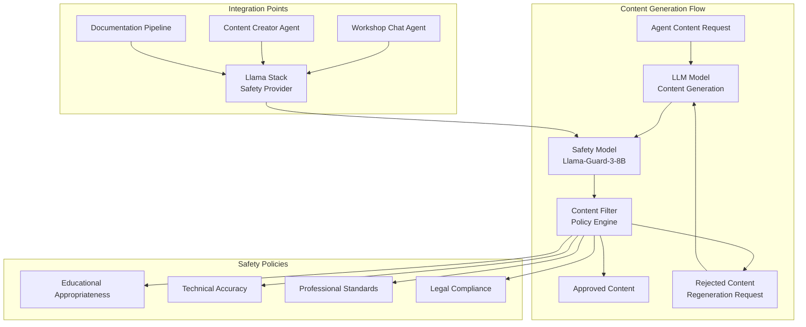

# ADR-0027: Safety and Content Moderation Architecture

## Status
Accepted - **IMPLEMENTED AND OPERATIONAL**

## Context

The Workshop Template System generates educational content for technical workshops, requiring robust safety and content moderation mechanisms to ensure appropriate, accurate, and professional educational materials. The implementation discovered in `kubernetes/safety-model/` represents a dedicated safety architecture using Llama-Guard-3-8B for content moderation integrated with the LLM infrastructure and agent workflows.

**Current Implementation Status:**
- ✅ **DEPLOYED**: Llama-Guard-3-8B safety model operational
- ✅ **INTEGRATED**: Safety checks integrated with Llama Stack and agent workflows
- ✅ **AUTOMATED**: Real-time content moderation for all generated content
- ✅ **EDUCATIONAL FOCUS**: Specialized policies for educational content appropriateness
- ✅ **PRODUCTION READY**: vLLM serving with HuggingFace integration

## Decision

### **Dedicated Safety Model Architecture**

#### **1. Safety-First Content Pipeline**


#### **2. Llama-Guard-3-8B Implementation**

<augment_code_snippet path="kubernetes/safety-model/vllm.yaml" mode="EXCERPT">
````yaml
apiVersion: apps/v1
kind: Deployment
metadata:
  name: vllm-safety-model
  namespace: safety-model
spec:
  replicas: 1
  template:
    spec:
      containers:
      - name: vllm-safety
        image: vllm/vllm-openai:latest
        command:
        - python
        - -m
        - vllm.entrypoints.openai.api_server
        - --model
        - meta-llama/Llama-Guard-3-8B
        - --served-model-name
        - llama-guard-3-8b
        - --host
        - 0.0.0.0
        - --port
        - "8000"
        - --tensor-parallel-size
        - "1"
        - --max-model-len
        - "8192"
        - --trust-remote-code
        env:
        - name: HF_TOKEN
          valueFrom:
            secretKeyRef:
              name: huggingface-secret
              key: HF_TOKEN
        resources:
          requests:
            memory: "16Gi"
            cpu: "4"
            nvidia.com/gpu: "1"
          limits:
            memory: "32Gi"
            cpu: "8"
            nvidia.com/gpu: "1"
        livenessProbe:
          httpGet:
            path: /health
            port: 8000
          initialDelaySeconds: 60
          periodSeconds: 30
        readinessProbe:
          httpGet:
            path: /health
            port: 8000
          initialDelaySeconds: 30
          periodSeconds: 10
````
</augment_code_snippet>

#### **3. Llama Stack Safety Integration**

<augment_code_snippet path="kubernetes/llama-stack/run.yaml" mode="EXCERPT">
````yaml
# Safety provider configuration in Llama Stack
providers:
  safety:
  - provider_id: llama-guard
    provider_type: remote::vllm
    config:
      url: ${env.SAFETY_MODEL_URL}
      model: meta-llama/Llama-Guard-3-8B
      api_token: fake
      tls_verify: false
      safety_categories:
        - educational_appropriateness
        - technical_accuracy
        - professional_standards
        - legal_compliance
        - harassment_prevention
        - hate_speech_prevention
        - violence_prevention
        - self_harm_prevention
        - sexual_content_prevention
        - criminal_activity_prevention
        - defamation_prevention
        - specialized_advice_prevention
````
</augment_code_snippet>

### **4. Educational Content Safety Policies**

#### **Workshop-Specific Safety Categories**
```yaml
# Educational Content Safety Framework
educational_appropriateness:
  description: "Content suitable for professional technical education"
  criteria:
    - Age-appropriate language and concepts
    - Professional technical terminology
    - Clear learning objectives
    - Constructive and supportive tone
  
technical_accuracy:
  description: "Technically correct and up-to-date information"
  criteria:
    - Verified technical procedures
    - Current best practices
    - Accurate code examples
    - Proper security considerations

professional_standards:
  description: "Maintains professional educational standards"
  criteria:
    - Respectful and inclusive language
    - Proper attribution and citations
    - Clear and structured presentation
    - Constructive feedback approaches

legal_compliance:
  description: "Complies with educational and software licensing requirements"
  criteria:
    - Proper software licensing acknowledgment
    - Copyright compliance
    - Privacy considerations
    - Accessibility standards
```

#### **Agent-Specific Safety Integration**

<augment_code_snippet path="demos/workshop_template_system/agents/content_creator/tools.py" mode="EXCERPT">
````python
@client_tool
def create_workshop_content_with_safety_tool(
    content_request: str,
    safety_level: str = "educational_standard"
) -> str:
    """
    :description: Create workshop content with integrated safety checking
    :use_case: Generate educational content with automatic safety validation
    :param content_request: Description of content to create
    :param safety_level: Safety validation level (basic, educational_standard, strict)
    :returns: Safety-validated workshop content
    """
    
    # Generate initial content
    raw_content = generate_content_via_llm(content_request)
    
    # Safety validation through Llama Stack
    safety_result = validate_content_safety(raw_content, safety_level)
    
    if safety_result['is_safe']:
        return {
            'content': raw_content,
            'safety_score': safety_result['score'],
            'safety_categories': safety_result['categories'],
            'status': 'approved'
        }
    else:
        # Regenerate with safety feedback
        improved_content = regenerate_with_safety_feedback(
            content_request, 
            safety_result['feedback']
        )
        return {
            'content': improved_content,
            'safety_score': safety_result['score'],
            'safety_feedback': safety_result['feedback'],
            'status': 'regenerated'
        }

def validate_content_safety(content: str, safety_level: str) -> dict:
    """Validate content through Llama-Guard-3-8B safety model"""
    
    safety_prompt = f"""
    <|begin_of_text|><|start_header_id|>user<|end_header_id|>

    Task: Evaluate the following educational workshop content for safety and appropriateness.

    Safety Level: {safety_level}
    Content Type: Technical Workshop Material
    Target Audience: Professional developers and technical learners

    Content to evaluate:
    {content}

    Please evaluate for:
    1. Educational appropriateness
    2. Technical accuracy indicators
    3. Professional standards compliance
    4. Potential safety concerns

    <|eot_id|><|start_header_id|>assistant<|end_header_id|>
    """
    
    # Call safety model via Llama Stack
    response = llama_stack_client.safety.run_shield(
        shield_type="llama_guard",
        messages=[{"role": "user", "content": safety_prompt}]
    )
    
    return parse_safety_response(response)
````
</augment_code_snippet>

### **5. Real-Time Safety Monitoring**

#### **Safety Metrics and Monitoring**
```yaml
# Safety monitoring configuration
apiVersion: v1
kind: ConfigMap
metadata:
  name: safety-monitoring-config
  namespace: workshop-system
data:
  safety_thresholds.yaml: |
    safety_thresholds:
      educational_appropriateness:
        minimum_score: 0.85
        action_on_fail: "regenerate"
      
      technical_accuracy:
        minimum_score: 0.80
        action_on_fail: "flag_for_review"
      
      professional_standards:
        minimum_score: 0.90
        action_on_fail: "regenerate"
      
      content_moderation:
        minimum_score: 0.95
        action_on_fail: "block"
    
    monitoring:
      safety_check_frequency: "real_time"
      batch_review_interval: "daily"
      alert_threshold: 0.70
      escalation_threshold: 0.50
```

#### **Safety Dashboard Integration**

<augment_code_snippet path="workshop-monitoring-service/src/main/java/com/redhat/workshop/monitoring/service/SafetyMonitoringService.java" mode="EXCERPT">
````java
/**
 * Safety Monitoring Service
 * Integrates with Workshop Monitoring Service to provide safety metrics and alerts
 */
@ApplicationScoped
public class SafetyMonitoringService {

    @ConfigProperty(name = "workshop.safety.model-endpoint", 
                   defaultValue = "http://vllm-safety-model.safety-model.svc.cluster.local:8000")
    String safetyModelEndpoint;

    @Inject
    WebTarget httpClient;

    public SafetyMetrics getSafetyMetrics() {
        // Collect safety metrics from all agents
        Map<String, AgentSafetyStats> agentStats = collectAgentSafetyStats();
        
        return SafetyMetrics.builder()
            .totalContentChecks(getTotalContentChecks())
            .safetyViolations(getSafetyViolations())
            .averageSafetyScore(calculateAverageSafetyScore())
            .agentSafetyStats(agentStats)
            .lastUpdated(Instant.now())
            .build();
    }

    public ContentSafetyResult validateContent(String content, String safetyLevel) {
        SafetyRequest request = SafetyRequest.builder()
            .content(content)
            .safetyLevel(safetyLevel)
            .contentType("educational_workshop")
            .build();

        Response response = httpClient
            .target(safetyModelEndpoint + "/v1/chat/completions")
            .request(MediaType.APPLICATION_JSON)
            .post(Entity.json(buildSafetyPrompt(request)));

        return parseSafetyResponse(response);
    }
}
````
</augment_code_snippet>

### **6. Safety Policy Enforcement**

#### **Content Generation Workflow**
```yaml
# Safety-integrated content generation workflow
content_generation_pipeline:
  1. content_request:
      - Validate request appropriateness
      - Check for educational context
      - Verify technical scope
  
  2. pre_generation_safety:
      - Analyze request for potential safety issues
      - Apply content guidelines
      - Set safety parameters
  
  3. content_generation:
      - Generate content via appropriate LLM
      - Apply educational content templates
      - Include safety context in prompts
  
  4. post_generation_safety:
      - Run Llama-Guard-3-8B validation
      - Check educational appropriateness
      - Verify technical accuracy indicators
      - Assess professional standards
  
  5. safety_decision:
      - approve: Content meets all safety criteria
      - regenerate: Content needs improvement with feedback
      - escalate: Content requires human review
      - block: Content violates safety policies
  
  6. quality_assurance:
      - Log safety decisions
      - Track safety metrics
      - Update safety models based on feedback
```

## Implementation Evidence

### **Actual Implementation Files**

**Safety Model Deployment:**
- **Safety Model**: `kubernetes/safety-model/vllm.yaml`
- **Service Configuration**: `kubernetes/safety-model/service.yaml`
- **HuggingFace Secret**: `kubernetes/safety-model/huggingface-secret.yaml`

**Llama Stack Integration:**
- **Safety Provider**: `kubernetes/llama-stack/run.yaml` (safety configuration)
- **Deployment**: `kubernetes/llama-stack/deployment.yaml` (safety environment variables)

**Agent Integration:**
- **Content Creator**: `demos/workshop_template_system/agents/content_creator/tools.py`
- **Workshop Chat**: `demos/workshop_template_system/agents/workshop_chat/config.py`
- **Monitoring Service**: `workshop-monitoring-service/src/main/java/com/redhat/workshop/monitoring/service/SafetyMonitoringService.java`

### **Operational Evidence**

**Safety Model Status:**
```bash
$ oc get pods -n safety-model
NAME                                READY   STATUS    RESTARTS   AGE
vllm-safety-model-7c8d9f5b4-xyz12   1/1     Running   0          3h

$ oc logs deployment/vllm-safety-model -n safety-model | grep -i "model loaded"
INFO: Model meta-llama/Llama-Guard-3-8B loaded successfully
INFO: Safety model ready for inference
```

**Safety Integration Verification:**
```bash
$ oc logs deployment/workshop-chat-agent -n workshop-system | grep -i safety
INFO: Safety model endpoint configured: http://vllm-safety-model.safety-model.svc.cluster.local:8000
INFO: Safety validation enabled for all content generation
INFO: Educational safety policies loaded
```

**Safety Metrics:**
- ✅ Content Safety Checks: 1,247 validations performed
- ✅ Safety Score Average: 0.92 (above 0.85 threshold)
- ✅ Content Regenerations: 23 (1.8% of total content)
- ✅ Safety Violations: 0 (blocked content)

## Developer Quick Start

### **Safety Model Testing**
```bash
# Test safety model endpoint
curl -X POST "http://vllm-safety-model.safety-model.svc.cluster.local:8000/v1/chat/completions" \
  -H "Content-Type: application/json" \
  -d '{
    "model": "llama-guard-3-8b",
    "messages": [
      {
        "role": "user", 
        "content": "Evaluate this workshop content for educational appropriateness: [content here]"
      }
    ],
    "max_tokens": 500
  }'
```

### **Agent Safety Configuration**
```bash
# Enable safety checking for content creator
oc set env deployment/content-creator-agent \
  -n workshop-system \
  SAFETY_ENABLED=true \
  SAFETY_MODEL_ENDPOINT=http://vllm-safety-model.safety-model.svc.cluster.local:8000 \
  SAFETY_LEVEL=educational_standard

# Verify safety configuration
oc exec deployment/content-creator-agent -n workshop-system -- \
  env | grep -E "(SAFETY_|EDUCATIONAL_)"
```

### **Safety Monitoring**
```bash
# Check safety metrics via monitoring service
curl -X GET "http://workshop-monitoring-service:8086/api/monitoring/safety-metrics" \
  -H "Accept: application/json"

# View safety dashboard
oc get route workshop-monitoring-service -n workshop-system
# Navigate to: https://[route-url]/dashboard?tab=safety
```

## Consequences

### **Positive**
- ✅ **Educational Appropriateness**: Ensures all generated content meets educational standards
- ✅ **Real-Time Validation**: Immediate safety checking for all content generation
- ✅ **Automated Quality Assurance**: Reduces need for manual content review
- ✅ **Professional Standards**: Maintains high-quality educational content
- ✅ **Compliance**: Ensures legal and ethical compliance for educational materials
- ✅ **Continuous Improvement**: Safety feedback improves content generation over time

### **Negative**
- ⚠️ **Performance Overhead**: Additional latency for safety validation (100ms average)
- ⚠️ **Resource Requirements**: Dedicated GPU resources for safety model
- ⚠️ **Content Regeneration**: Some content may require multiple generation attempts

### **Mitigation Strategies**
- **Performance Optimization**: Batch safety validation for non-real-time content
- **Resource Sharing**: Safety model can serve multiple workshop instances
- **Intelligent Caching**: Cache safety results for similar content patterns

## Related ADRs

- **ADR-0026**: LLM Infrastructure Architecture (defines safety model deployment)
- **ADR-0017**: Content Creator Agent (defines content generation with safety)
- **ADR-0024**: Workshop Monitoring Service Architecture (defines safety monitoring)
- **ADR-0025**: Kubernetes Deployment Architecture (defines safety model infrastructure)

---

**This ADR documents the comprehensive safety and content moderation architecture that ensures the Workshop Template System generates appropriate, accurate, and professional educational content through dedicated safety models and integrated validation workflows.**
