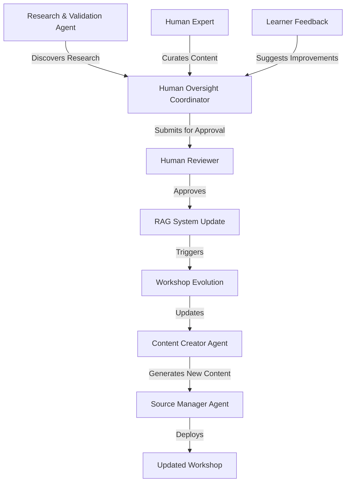

# Research: RAG-Enabled Human Oversight for Dynamic Workshop Evolution

**Research Date**: 2025-06-29  
**Status**: Enhanced Concept - Ready for Implementation  
**Impact**: Revolutionary - Transforms Static Workshops into Living Knowledge Systems

## Executive Summary

This research extends ADR-0002 Human-in-the-Loop Agent Integration with **RAG Knowledge Management** and **Workshop Evolution** capabilities. The enhanced Human Oversight Coordinator agent now manages dynamic knowledge updates, enabling workshops to evolve continuously based on new research, human expertise, and learner feedback.

## 🧠 **The Knowledge Evolution Problem**

### Current Limitations
1. **Static Workshop Content** - Workshops become outdated as technology and research evolve
2. **Manual RAG Updates** - No systematic way to incorporate new research into knowledge bases
3. **Human Knowledge Silos** - Expert knowledge not systematically captured in RAG systems
4. **Content Drift** - Workshops diverge from current best practices over time
5. **Research Integration Gap** - New findings don't automatically improve existing workshops

### The Vision: Living Knowledge Systems
Transform workshops from static content into **living knowledge systems** that:
- **Self-Update** based on AI-discovered research (with human approval)
- **Incorporate Human Expertise** through curated content injection
- **Evolve Continuously** to maintain relevance and accuracy
- **Track Knowledge Provenance** for transparency and trust

## 🚀 **Enhanced Human Oversight Coordinator Capabilities**

### **New Tool 1: RAG Update Management**
```python
submit_rag_update_for_approval_tool(
    update_type="ai_research",  # ai_research, human_curation, content_refresh, source_validation
    content_source="https://arxiv.org/abs/2024.12345",
    proposed_content="New research on transformer efficiency...",
    target_workshop="advanced-ml-workshop",
    research_context="Improves model training section",
    ai_confidence="high"
)
```

**Use Cases:**
- **AI-Discovered Research**: Research & Validation Agent finds new papers → Human approves RAG integration
- **Human Curation**: Experts add specialized knowledge → System validates and integrates
- **Content Refresh**: Outdated information identified → Human approves updates
- **Source Validation**: Verify and improve existing RAG content quality

### **New Tool 2: Workshop Evolution Management**
```python
submit_workshop_evolution_request_tool(
    workshop_name="kubernetes-fundamentals",
    evolution_type="technology_refresh",  # research_update, technology_refresh, feedback_integration, content_expansion
    proposed_changes="Update to Kubernetes 1.29, add Gateway API examples",
    research_basis="Kubernetes 1.29 released with significant Gateway API improvements",
    impact_assessment="Affects labs 3-5, requires new container images",
    urgency="high"
)
```

**Use Cases:**
- **Research Updates**: New research findings require workshop content changes
- **Technology Refresh**: Tool/framework updates need workshop modernization
- **Feedback Integration**: Learner feedback drives content improvements
- **Content Expansion**: Add new modules based on emerging topics

## 🔄 **Dynamic Workshop Lifecycle**

### **Phase 1: Continuous Research Monitoring**
1. **Research & Validation Agent** monitors academic papers, blogs, documentation
2. **AI Analysis** identifies content relevant to existing workshops
3. **Relevance Scoring** determines potential impact on workshop content
4. **Human Oversight Coordinator** submits high-relevance findings for approval

### **Phase 2: Human Knowledge Integration**
1. **Expert Identification** of valuable content for workshop enhancement
2. **Content Curation** by subject matter experts
3. **Human Oversight Coordinator** manages approval workflow
4. **Quality Validation** ensures content meets educational standards

### **Phase 3: Workshop Evolution**
1. **Impact Assessment** of proposed changes on existing content
2. **Version Planning** for backward compatibility and migration
3. **Human Approval** for workshop modifications
4. **Automated Integration** of approved changes

### **Phase 4: Continuous Improvement**
1. **Learner Feedback** collection and analysis
2. **Performance Metrics** tracking workshop effectiveness
3. **Iterative Enhancement** based on data and feedback
4. **Knowledge Base Optimization** for improved RAG performance

## 🎯 **Integration with Existing RAG System**

### **Current RAG Architecture**
Based on `demos/rag_agentic/notebooks/Level4_RAG_agent.ipynb`, the system uses:
- **Vector Database** for semantic search
- **Document Chunking** for content organization
- **Retrieval Augmentation** for context-aware responses
- **Agent Coordination** for complex queries

### **Enhanced RAG with Human Oversight**
```python
# Enhanced RAG workflow with human approval
def enhanced_rag_update_workflow(new_research_content):
    # Step 1: AI evaluates relevance
    relevance_score = research_validation_agent.evaluate_relevance(new_research_content)
    
    if relevance_score > 0.8:  # High relevance threshold
        # Step 2: Submit for human approval
        approval_id = human_oversight_agent.submit_rag_update_for_approval(
            update_type="ai_research",
            content_source=new_research_content.source,
            proposed_content=new_research_content.content,
            ai_confidence="high"
        )
        
        # Step 3: Wait for human decision
        decision = human_oversight_agent.wait_for_approval(approval_id)
        
        if decision.approved:
            # Step 4: Integrate into RAG system
            rag_system.add_content(new_research_content, approved_by=decision.reviewer)
            
            # Step 5: Update affected workshops
            affected_workshops = identify_affected_workshops(new_research_content)
            for workshop in affected_workshops:
                human_oversight_agent.submit_workshop_evolution_request(
                    workshop_name=workshop.name,
                    evolution_type="research_update",
                    proposed_changes=f"Integrate new research: {new_research_content.title}",
                    research_basis=new_research_content.source
                )
```

## 📊 **Value Proposition Analysis**

### **High-Value Scenarios**

#### **1. Rapid Technology Evolution**
- **Problem**: Kubernetes, AI/ML, cloud technologies change rapidly
- **Solution**: Automated detection of new versions/features → Human-approved workshop updates
- **Value**: Workshops stay current without manual monitoring

#### **2. Research Integration**
- **Problem**: New research papers don't reach workshop content
- **Solution**: AI monitors research → Human validates relevance → RAG integration
- **Value**: Workshops incorporate cutting-edge knowledge

#### **3. Expert Knowledge Capture**
- **Problem**: Expert knowledge remains in silos
- **Solution**: Structured process for experts to contribute to RAG
- **Value**: Democratizes expert knowledge across all workshops

#### **4. Learner-Driven Evolution**
- **Problem**: Workshop improvements based on ad-hoc feedback
- **Solution**: Systematic feedback integration with approval workflows
- **Value**: Data-driven workshop enhancement

### **ROI Analysis**
| Benefit Category | Current State | Enhanced State | Value Multiplier |
|------------------|---------------|----------------|------------------|
| **Content Freshness** | Manual updates, 6-12 month lag | Continuous updates, 1-2 week lag | **10x faster** |
| **Research Integration** | Ad-hoc, expert-dependent | Systematic, AI-assisted | **5x more comprehensive** |
| **Expert Knowledge** | Siloed, inconsistent | Systematically captured | **3x knowledge leverage** |
| **Workshop Quality** | Static, degrading | Dynamic, improving | **Continuous improvement** |

## 🏗️ **Implementation Architecture**

### **Enhanced Agent Coordination**


### **Data Flow Architecture**
1. **Input Sources**: Research papers, expert knowledge, learner feedback
2. **AI Processing**: Relevance analysis, content extraction, impact assessment
3. **Human Validation**: Expert review, approval workflows, quality gates
4. **Knowledge Integration**: RAG updates, workshop evolution, content deployment
5. **Feedback Loop**: Performance monitoring, effectiveness tracking, continuous improvement

## 🎉 **Revolutionary Benefits**

### **For Workshop Creators**
- **Reduced Maintenance Burden**: Automated research monitoring and integration
- **Enhanced Quality**: Continuous improvement based on latest research
- **Expert Collaboration**: Systematic way to incorporate expert knowledge
- **Data-Driven Decisions**: Evidence-based workshop evolution

### **For Learners**
- **Current Content**: Always learning from latest research and best practices
- **Improved Quality**: Workshops continuously refined based on feedback
- **Expert Insights**: Access to curated expert knowledge
- **Personalized Learning**: RAG-enhanced responses tailored to learning context

### **For Organizations**
- **Competitive Advantage**: Workshops reflect cutting-edge knowledge
- **Knowledge Management**: Systematic capture and sharing of expertise
- **Compliance**: Audit trails for all knowledge updates and decisions
- **Scalability**: Automated processes reduce manual overhead

## 📋 **Implementation Roadmap**

### **Phase 1: Enhanced Agent Deployment (1-2 weeks)**
- ✅ **Complete**: Enhanced Human Oversight Coordinator with RAG tools
- Deploy enhanced agent to existing infrastructure
- Test RAG update and workshop evolution workflows

### **Phase 2: RAG Integration (2-3 weeks)**
- Integrate with existing RAG system from `Level4_RAG_agent.ipynb`
- Implement approval-gated RAG updates
- Create content provenance tracking

### **Phase 3: Workshop Evolution Engine (3-4 weeks)**
- Build workshop content versioning system
- Implement automated impact assessment
- Create rollback and migration capabilities

### **Phase 4: Feedback Integration (2-3 weeks)**
- Implement learner feedback collection
- Create feedback analysis and prioritization
- Integrate feedback-driven evolution requests

### **Phase 5: Advanced Features (4-6 weeks)**
- Smart content recommendation engine
- Automated research monitoring pipelines
- Advanced analytics and optimization

## 🎯 **Success Metrics**

### **Knowledge Freshness**
- **Research Integration Rate**: New research incorporated per month
- **Content Update Frequency**: Workshop updates per quarter
- **Knowledge Lag Time**: Time from research publication to workshop integration

### **Quality Improvement**
- **Learner Satisfaction**: Workshop rating improvements
- **Content Accuracy**: Reduction in outdated or incorrect information
- **Expert Engagement**: Expert contribution frequency and quality

### **System Efficiency**
- **Approval Latency**: Time from submission to approval decision
- **Automation Rate**: Percentage of updates requiring minimal human intervention
- **Knowledge Reuse**: Cross-workshop knowledge sharing effectiveness

---

## 🚀 **Conclusion: The Future of Workshop Systems**

This enhanced Human-in-the-Loop approach transforms the Workshop Template System from a **static content generator** into a **living knowledge ecosystem**. By combining AI-powered research discovery with human expertise and systematic approval workflows, we create workshops that:

- **Never become outdated** - Continuous research integration
- **Leverage collective intelligence** - Systematic expert knowledge capture  
- **Improve continuously** - Data-driven evolution based on learner feedback
- **Maintain quality** - Human oversight ensures accuracy and relevance

**This is not just an enhancement - it's a paradigm shift toward intelligent, self-improving educational systems.** 🌟
