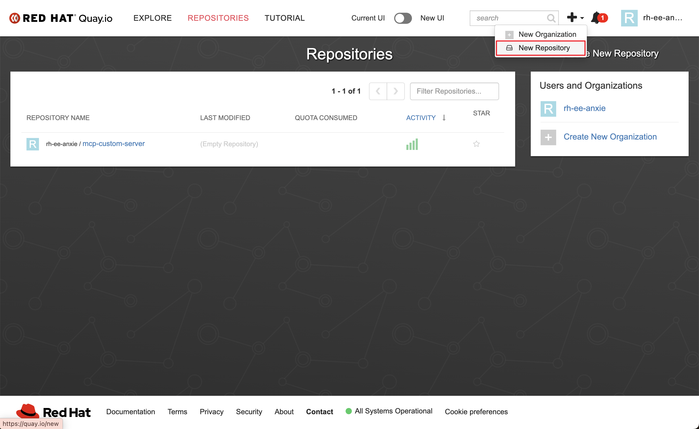
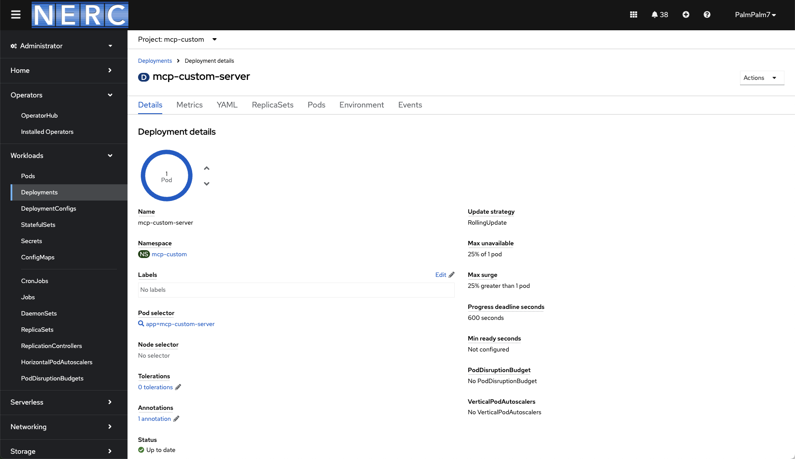

# Creating Custom Model Context Protocol (MCP) Server on OpenShift Container Platform (OCP)

This document is a quick walkthrough of deploying a custom MCP server on OCP
The guide follows these steps below:

1. Implementing custom tools with MCP tools
2. Containerizing by build a quay.io image.
3. Deploying image on OCP platform.

## MCP Tool Implementation
Custom tool use are built with one of the selected SDK from MCP. Quick reference and guides are located at:

* https://modelcontextprotocol.io/quickstart/server
* https://modelcontextprotocol.io/examples

`./mcp_tools.py` is a demonstration of its usage.

## Quay Image Containerization
Quay images are required to serve as a blue print on OCP deployment.

### Navigate to quay.io
Login through SSO

### Create Empty Repository

When creating new image, make sure to select to **public** to your images.

### Build and Push Quay Image through Podman
Building and pushing quay images are recommended with Podman and Podman Desktop. Download them here: https://podman-desktop.io/.

**Build Quay Image**

Building your image with:
`podman build -t custom_mcp_server:latest --platform="linux/amd64" <Directory where your Dockerfile is>`

Which will also output your image_id and tag, e.g. a hash looks like this `79c0c54d42801b9454daaf0f063552a58e99bf42e7ba94736e8c2fef1873cc94`

**[Optional] Quay Authentication through Podman**

If you haven't gone through the authentication process please proceed to create your login on Quay.io, then proceed with:

`podman login -u=<user_name> -p=<pass_word> quay.io`

You should be seeing:

`Login Succeeded!`

**Push Quay Image**

Pushing your image with:

`podman push <image id> quay.io/<your quay id>/<image_name>:latest`

You should be seeing:

`Writing manifest to image destination`

## OCP Deployment
Navigate to your Red Hat OpenShift Container Platform to proceed with deployments.

### Creating Deployment
Select or create the proper namespace/project for your deployment and proceed with creation.

Specify the pod managements and application workload. Make sure to select proper quay.io image.

### Deployment Status
After deployment, you should be able to see your deployment status here.

