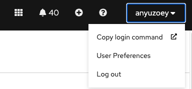
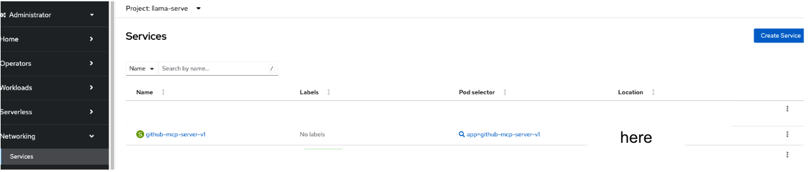
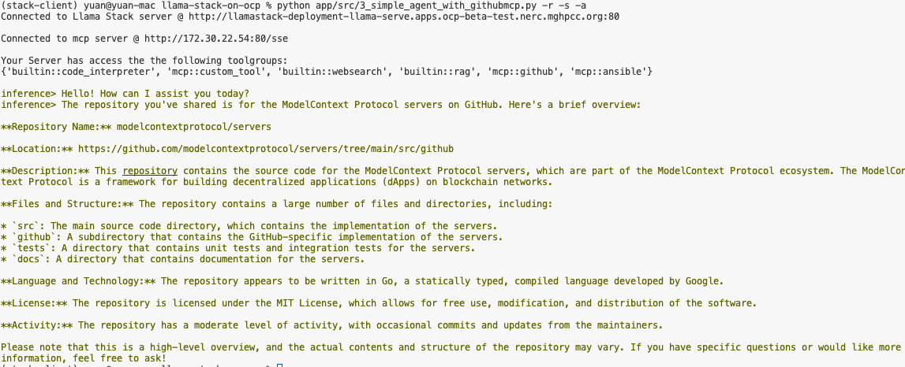

# Deploy GitHub MCP Server on OpenShift Container Platform

This document provides instructions for deploying the GitHub MCP server on the OpenShift Container Platform. You can find the official GitHub MCP server repository here: [GitHub MCP Server](https://github.com/modelcontextprotocol/servers/tree/main/src/github).

Additionally, this guide includes steps to test the integration of the GitHub MCP server with the Llama Stack agent.

## Deployment Steps via CLI or WebUI

## 🚀 Deploy via CLI

### 🛠️ Prerequisites
Ensure the OpenShift CLI (`oc`) is installed.

### Steps to Deploy

1. **Log in to OpenShift**:
     - Log in to the OpenShift web UI, click on your user ID in the top-right corner, and select "Copy Login Command."
     - 
     - Paste the copied command into your terminal to log in to OpenShift via CLI:
       ```bash
       oc login --token=... --server=https://your.openshift.cluster.url
       ```

2. **Create or Use an Existing Project**:
     - Create a new project or navigate to an existing one:
       ```bash
       oc project project_name
       ```

3. **Modify YAML Files**:
     - Update the provided YAML files to deploy the GitHub MCP server using the `oc` command.
     - **Steps to Modify**:
       1. Change the project name and MCP server name to your desired values.  
            Example:  
            - Project name: `llama-serve`  
            - MCP server name: `github-mcp-server-v1`
       2. Since the deployment uses community MCP servers published on GitHub, create a `secret.yaml` file to store your personal GitHub token for accessing the MCP server Docker image.

          > **Note:** Create a Personal Access Token in GitHub by navigating to **Settings > Developer settings > Personal access tokens**, assigning required scopes, and copying it securely into `secret.yaml`. Do not share it publicly.

       3. Ensure the secret name in `secret.yaml` matches the one in `deployment.yaml`.
       4. Update the `build_config.yaml` file with the GitHub MCP server repository and Docker path.
       5. Double-check all YAML files to ensure they are correctly configured.

4. **Deploy the MCP Server**:
     - Apply the secrets:
       ```bash
       oc apply -f secret.yaml
       ```
     - Apply the ImageStream and BuildConfig:
       ```bash
       oc apply -f build_config.yaml
       ```
     - Start the build:
       ```bash
       oc start-build github-mcp-server-v1
       ```
     - Deploy the application:
       ```bash
       oc apply -f deployment.yaml
       ```

5. **Verify Deployment**:
     - Check the OpenShift web console to confirm that the `github-mcp-server-v1` pod is up and running.

## 🚀 Deploy via OpenShift Web Console
*TBD*

## Test if the GitHub MCP Server is Correctly Configured

1. Navigate to `0_simple_agent.py` and 
     - copy MCP endpoint and add it to "REMOTE_MCP_URL" environment. REMOTE_MCP_URL="http://ip:port/sse"
          > **Note:** how to find mcp ip and port? go to openshift web console 
     - register the GitHub MCP tools:
       ```
       if "mcp::github" not in registered_toolgroups:
               # Register MCP tools
               client.toolgroups.register(
                     toolgroup_id="mcp::github",
                     provider_id="model-context-protocol",
                     mcp_endpoint={"uri": mcp_url},
               )
               logger.info(f"Successfully registered MCP tool group: mcp::github")
       mcp_tools = [t.identifier for t in client.tools.list(toolgroup_id="mcp::github")]
       ```

     - Confirm that the Llama Stack agent has the GitHub MCP tools configured with `tools=["mcp::github"]`.

     - Example user prompt: 
       ```
       Describe https://github.com/modelcontextprotocol/servers/tree/main/src/github repository
       ```

2. Verify the output:
     - run modified simple agent script `python app/src/0_simple_agent.py -r -s -a`
     - Example output:
       

### How to Unregister MCP Tool Groups

To unregister MCP tool groups, use the following code snippet:
```
client.toolgroups.unregister(toolgroup_id="mcp::github")
print(f"Successfully unregistered MCP tool group: mcp::github")
```